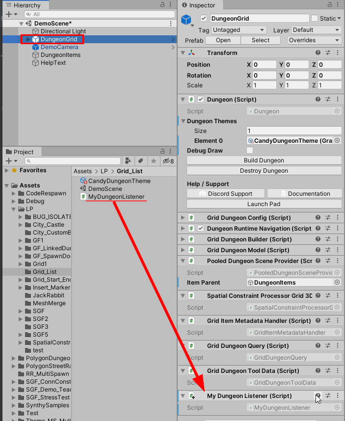

Hook on to the various dungeon events (like PreBuild, PostBuild events) using a custom script. 
Attach this script to the dungeon game object to automatically receive the notifications 


## Setup

Create a new C# script and inherit it from `DungeonEventListener` like below

```c#
using UnityEngine;
using DungeonArchitect;

public class MyDungeonListener : DungeonEventListener
{
    public override void OnPostDungeonBuild(Dungeon dungeon, DungeonModel model)
    {
        Debug.Log("Dungeon build complete");
        
        // Write your logic here
    }
}
```

> Since this is a `MonoBehaviour`, Unity requires the filename of the script to be the same as the class name

Next, drop this script on the dungeon game object.  Whenever the dungeon get fully built, the `OnPostDungeonBuild` function gets automatically called




Get the full list of events from the API docs [here](http://coderespawn.github.io/dungeon-architect-api-doc-unity/class_dungeon_architect_1_1_dungeon_event_listener.html)


## Event Functions

Here are a list of all the functions you can override to hook on to the various build events.  

While building, the following events are called in this order:

* **Pre Build** `(OnPreDungeonBuild)` - Called before the dungeon is built
* **Post Layout Build** `(OnPostDungeonLayoutBuild)` - The layout is built in memory but nothing in spawned in the scene
* **Markers Emitted** `(OnDungeonMarkersEmitted)` - The layout markers are emitted in the scene for the theme engine to pick up. Nothing is spawned in the scene yet, it gives you an opportunity to modify the marker list before it is sent to the theme engine
* **Post Build** `(OnPostDungeonBuild)` - The dungeon is fully built

While destroying the dungeon, the following events are called in this order:
* **Pre Destroy** `(OnPreDungeonDestroy)` - Called before the dungeon is destroyed
* **Destroyed** `(OnDungeonDestroyed)` - Called after the dungeon is destroyed

---

### Pre Build

Called before the dungeon is about to be built

```c#
public override void OnPreDungeonBuild(Dungeon dungeon, DungeonModel model)
{
    // Write your logic here
}
```


### Post Layout Build

This is called after the dungeon layout has been built in memory, but before the prefabs have spawned.
The dungeon would not have spawned anything at this stage, but the dungeon model would contain the layout data

```c#
public override void OnPostDungeonLayoutBuild(Dungeon dungeon, DungeonModel model)
{
    // Write your logic here
}
```

### Markers Emitted

The layout markers are emitted in the scene for the theme engine to pick up. Nothing is spawned in the scene yet, it gives you an opportunity to modify the marker list before it is sent to the theme engine

```c#
public override void OnDungeonMarkersEmitted(Dungeon dungeon, DungeonModel model, LevelMarkerList markers)
{
    // Modify the markers list to add/remove/modify the markers in the scene before they are sent to the theme engine
}
```

### Post Build

Called after the dungeon is fully built

```c#
public override void OnPostDungeonBuild(Dungeon dungeon, DungeonModel model)
{
    // Write your logic here
}
```

### Pre Destroy

Called before the dungeon is destroyed

```c#
public override void OnPreDungeonDestroy(Dungeon dungeon)
{
    base.OnPreDungeonDestroy(dungeon);
}
```

### Destroyed

Called after the dungeon is destroyed

```c#
public override void OnDungeonDestroyed(Dungeon dungeon)
{
    base.OnDungeonDestroyed(dungeon);
}
```
