Dungeon Architect supports non-destructive landscape transformations around the generated dungeon

To see this in action, clone the Landscape transformer sample from the launchpad

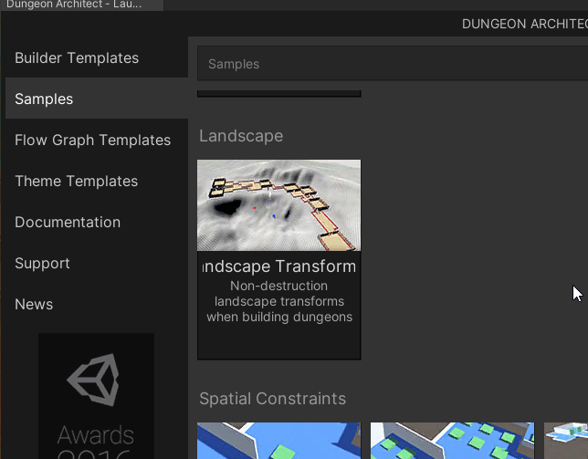

You can build your dungeons on top of an existing landscape that has painted textures and foliage

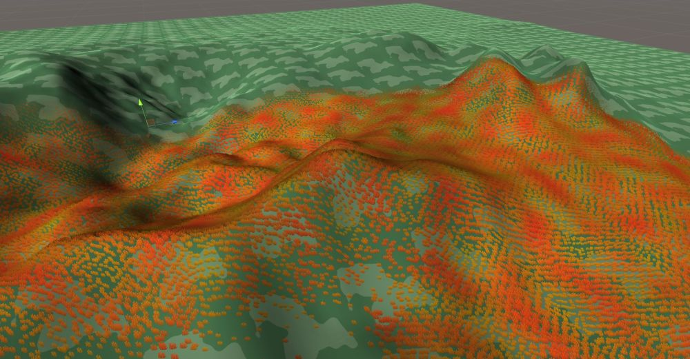

The heightfield, paint and foliage around the dungeon would be modified

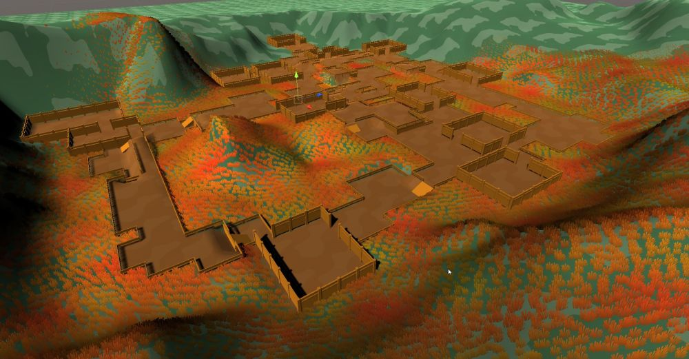

This is non destructive, so when you destroy your dungeon, the original landscape data (height, paint, foliage etc) in that area is restored 

Right now, the Grid Builder and City builder support landscape transformations

## Setup Landscape Transformer

To add support for landscape transformations, perform the following,

1. Move your dungeon game object to the location where you'd like to build your dungeon

   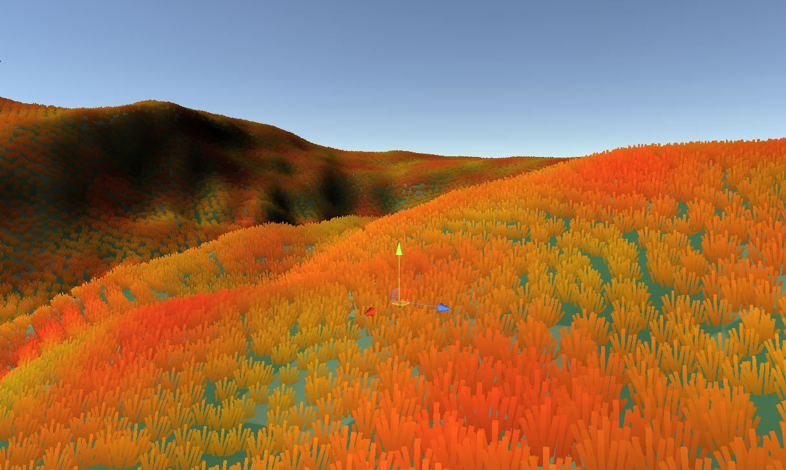

2. Add the `LandscapeTransformerGrid` or the `LandscapeTransformerCity` component to your dungeon game object, depending on the builder

   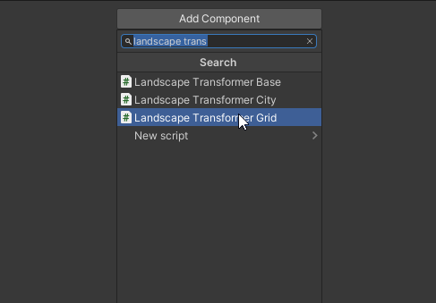

   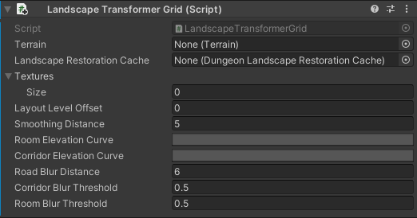

3. This script requires the terrain game object reference so it can modify it.

   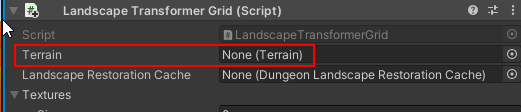

   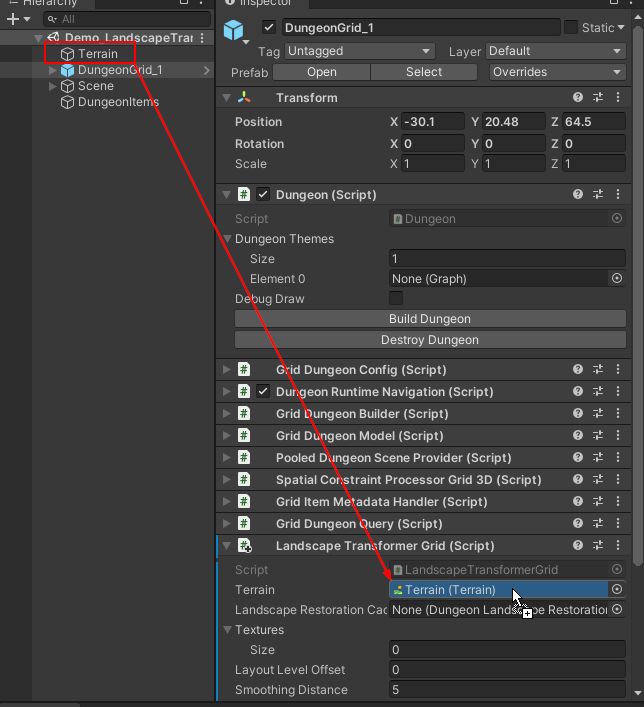

4. To support non-destructive landscape modification, Dungeon Architect needs to save the state of the landscape in the area where it modifies it, so that it can restore it later on (when the dungeon is destroyed or modified)

   Create a landscape restoration cache asset

   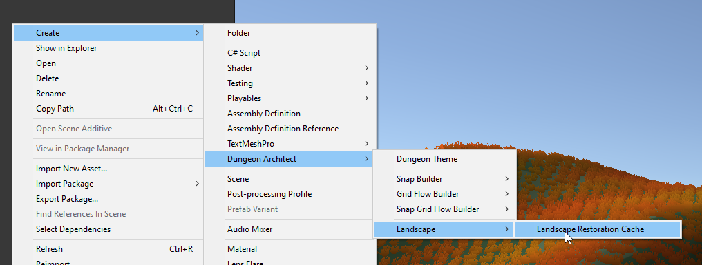

   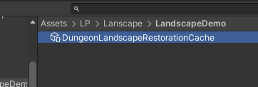

5. Assign this to the Lanscape Transformer script

   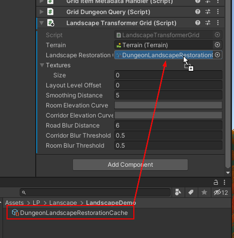

6. Assign the Elevation curves so we have a smooth transition from the existing terrain to the dungeon
   
   > Unity will leave this blank by default and you need to assign it some value for it to work
   {style="note"}

   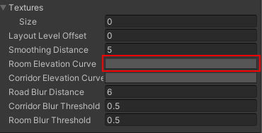

   Click on blank area to open up the curve editor.   Choose one of the values highlighted below
   
   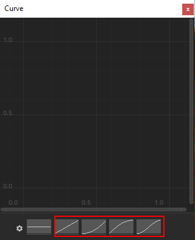

   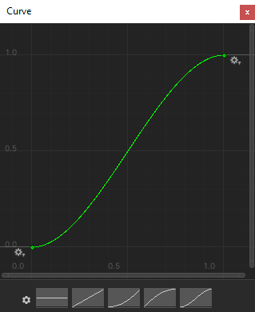

   Close the curve editor

   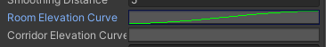

   Do the same for Corridor Elevation Curves

   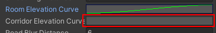

   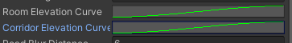

7. Build the dungeon
   
   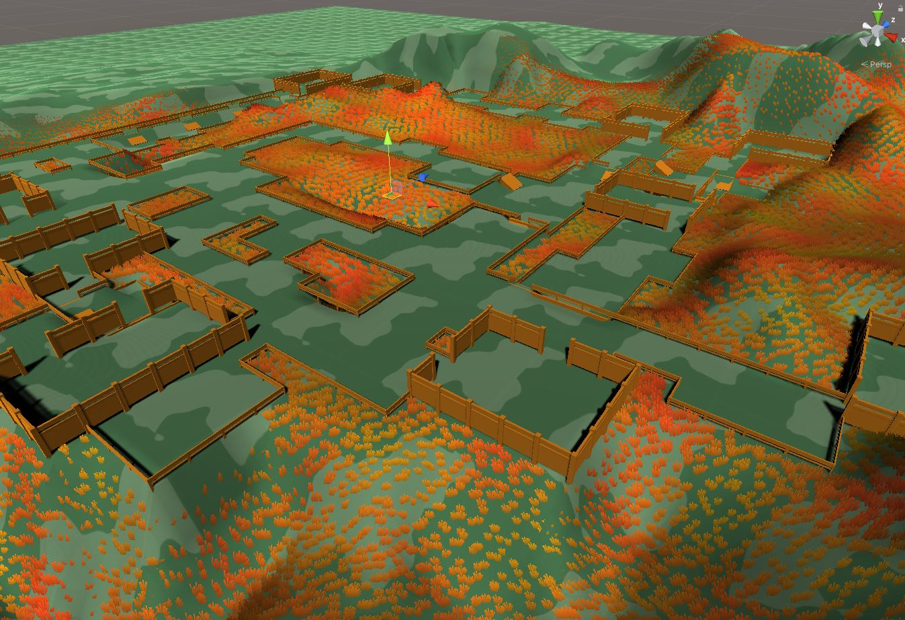

   Destroy the dungeon to restore the terrain back
   
   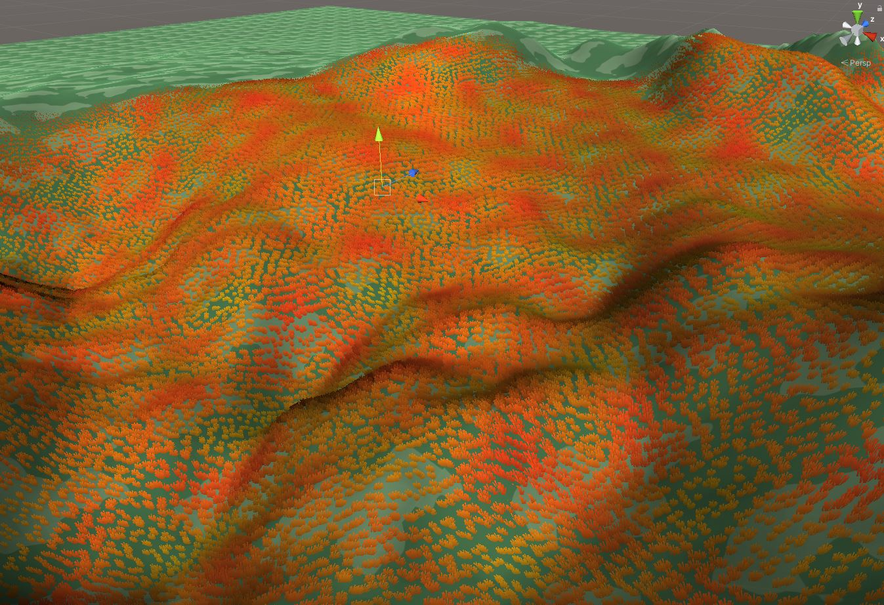

## Setup Paint Support

You may paint your terrain around the rooms, corridor and cliffs by applying your existing terrain layers.   Since you already have a terrain, you would have setup terrain layers to paint your terrain.   If not, find more info about Terrain Layers [here](https://docs.unity3d.com/Manual/class-TerrainLayer.html).   We'll paint the rooms with a certain terrain layer

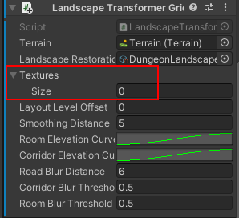

Create a new Texture entry and add an existing Terrain Layer

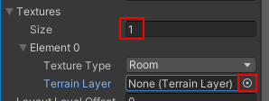

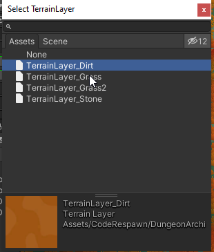

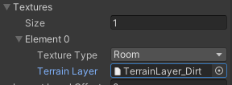

Set the *Texture Type* to `Room` or `Corridor`.  

> `Cliff` Texture Type is not supported for the time being and should not be used 

Set the *Road Blur Distance* to `1`

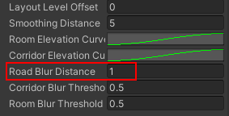

Now build your dungeon

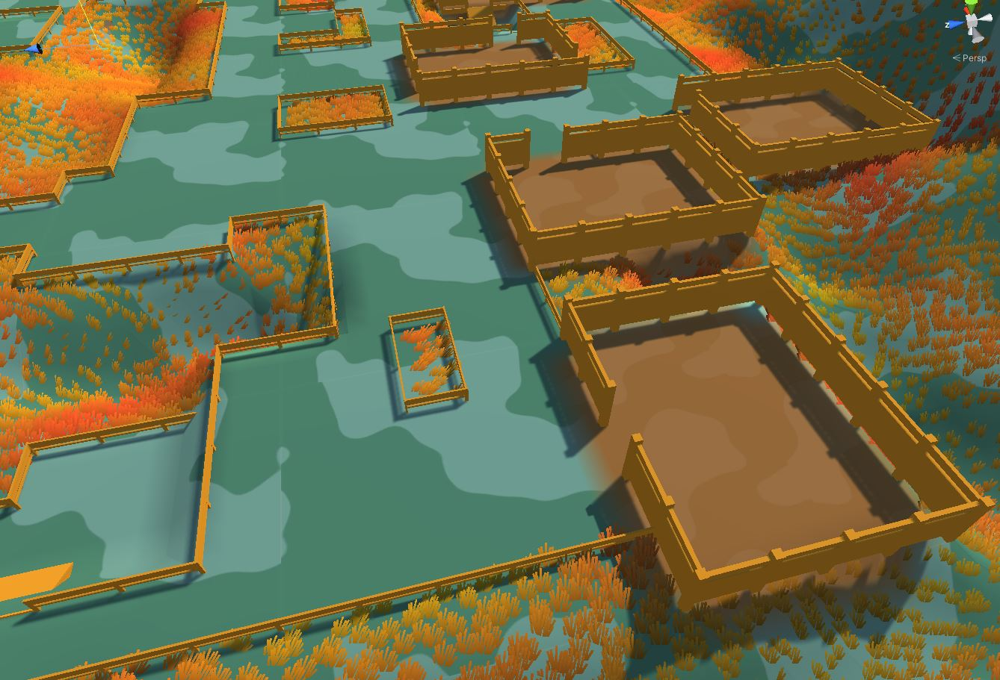

Add a corridor texture

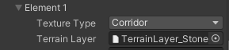

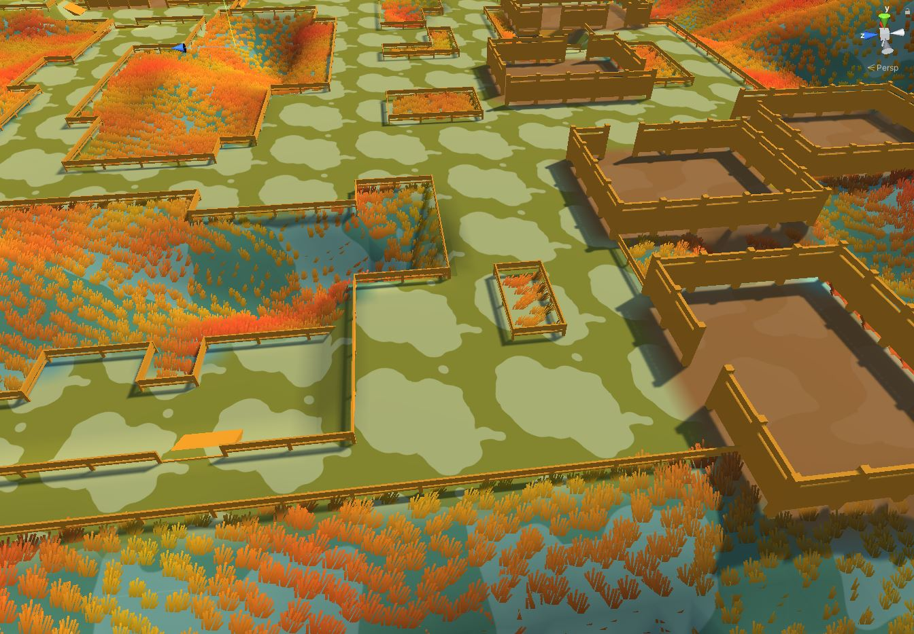
