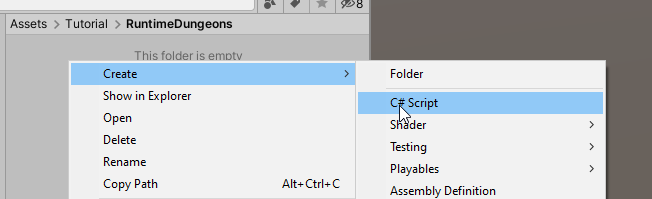
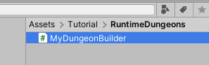
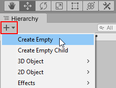
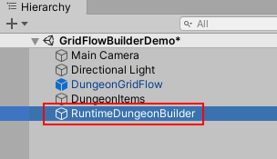
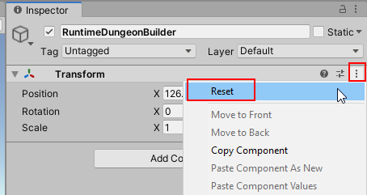
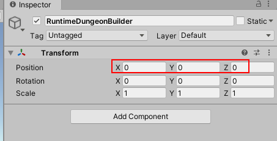
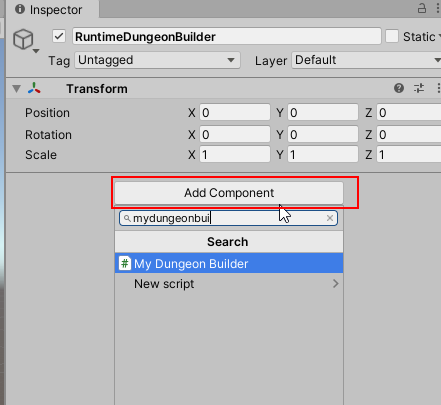
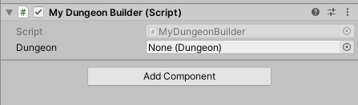
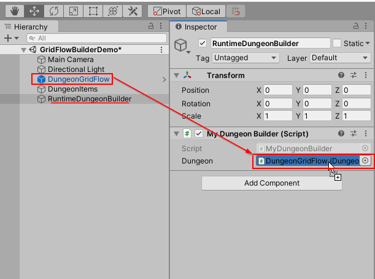
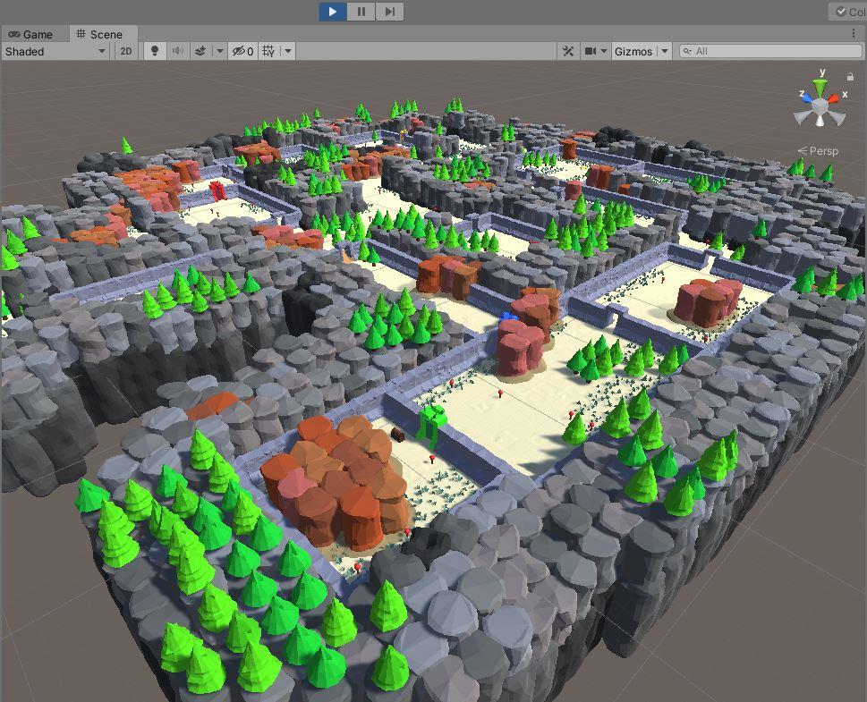

## Setup Runtime Build Script

Dungeon Architect can build dungeons at runtime, so you can have a new dungeon everytime you play

You do this by calling the `Build()` function on the Dungeon component

Create a new C# script anywhere in the project window







Open the script for editing

```c#
using DungeonArchitect;
using UnityEngine;

public class MyDungeonBuilder : MonoBehaviour
{
    public Dungeon dungeon;

    void Start()
    {
        if (dungeon != null)
        {
            dungeon.Build();
        }
    }
}
```

Here, we've provided a public attribute named `dungeon` of type `Dungeon`. You'll need to import the
DungeonArchitect namespace `using DungeonArchitect;`

Create a new GameObject and rename it to something appropriate

   

   


Reset the transform





Add our script to this game object





Notice the `Dungeon` parameter is exposed. This is because we made a public attributed named `dungeon` in our code

```c#
public Dungeon dungeon;
```

Assign your dungeon reference here.




When you hit play, this dungeon will be built (since we call `dungeon.Build()` in the `Start` method)





> If you build runtime dungeons, make sure the dungeon hasn't already been built in the editor.   Due to the way 
> unity optimizes static game objects, the prefabs that were spawned in the editor won't be removed at runtime while building a new dungeon
{style="warning"}

## Randomize Dungeon

You might want to have a different dungeon everytime you play

You do this by setting the seed parameter in the dungeon configuration before calling Build()

```c#
dungeon.Config.Seed = (uint)(Random.value * int.MaxValue);
```

```c#
using DungeonArchitect;
using UnityEngine;

public class MyDungeonBuilder : MonoBehaviour
{
    public Dungeon dungeon;

    void Start()
    {
        if (dungeon != null)
        {
            dungeon.Config.Seed = (uint)(Random.value * int.MaxValue); 
            dungeon.Build();
        }
    }
}
```
