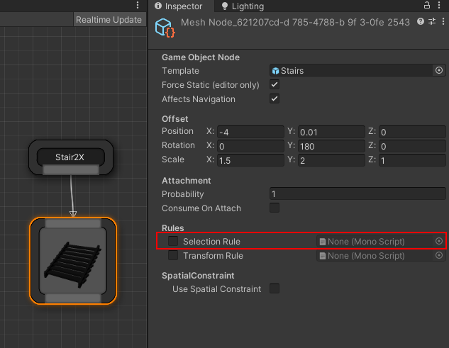
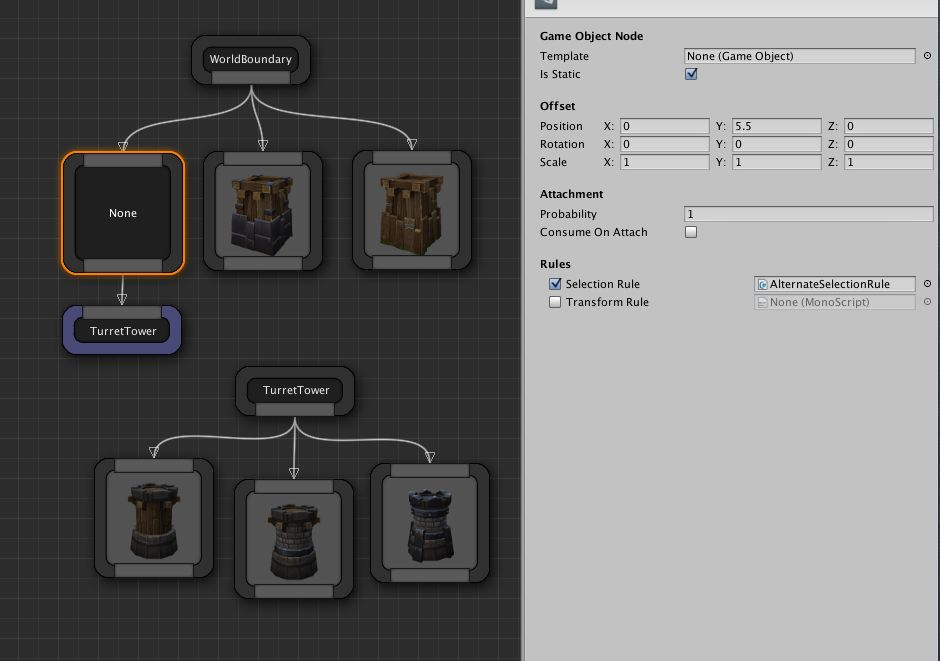

## Overview

We use the probability parameter to decide if we want to select and insert a certain object into the scene.   If you need more control, you could write your own selection rules scripts



## API

Create a C# script that inherits from `DungeonArchitect.SelectorRule`

Override the following method 

```c#
bool CanSelect(PropSocket socket, Matrix4x4 propTransform, DungeonModel model, System.Random random)
```

| Parameter     | Description                                                                                                                              |
|---------------|------------------------------------------------------------------------------------------------------------------------------------------|
| socket        | The information about the marker                                                                                                         |
| propTransform | The final transform of the object that will be inserted                                                                                  |
| model         | The dungeon model object.  You'll want to cast it to the approprirate model (e.g. `GridDungeonModel` and read the layout info if needed) |
| random        | The random stream.  If you rely on any randomness, this object should be used to create consistent results in the dungeon                |

## Example

In this example the towers are too crowded and close to each other.


A selector rule is created to select alternate cells





```c#
using UnityEngine;
using System.Collections;
using DungeonArchitect;

public class AlternateSelectionRule : SelectorRule {
    public override bool CanSelect(PropSocket socket, Matrix4x4 propTransform, DungeonModel model, System.Random random) {
        return (socket.gridPosition.x + socket.gridPosition.z) % 2 == 0;
    }
}
```
	
