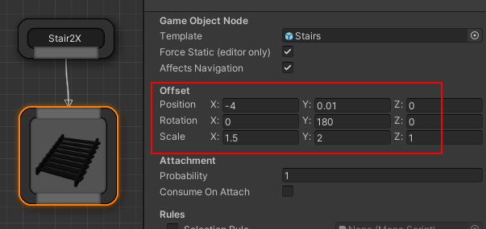
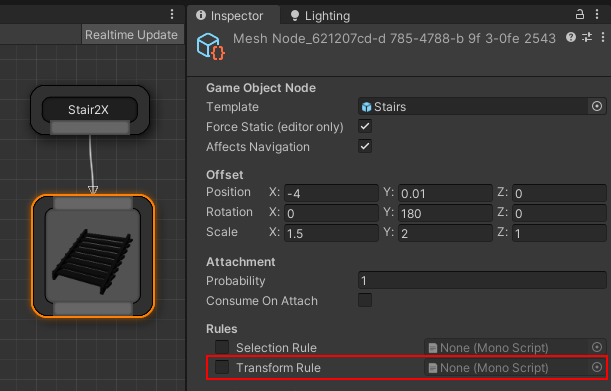
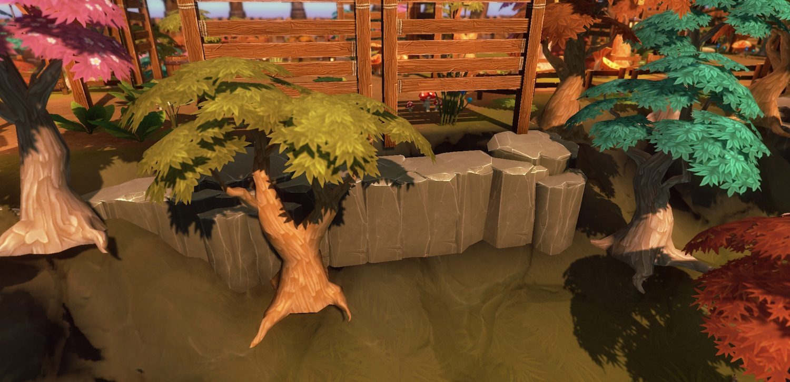
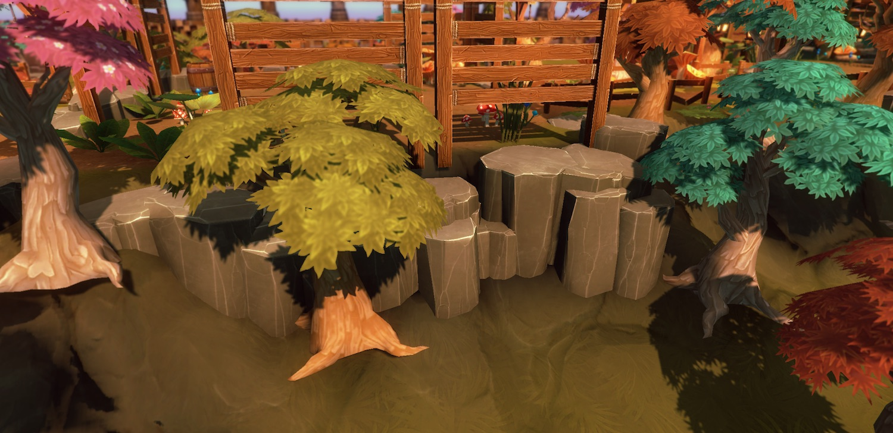
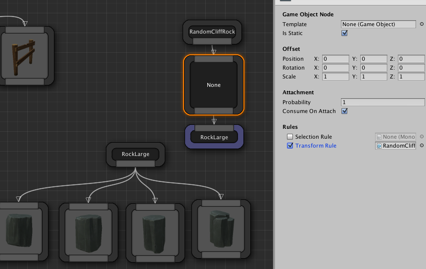
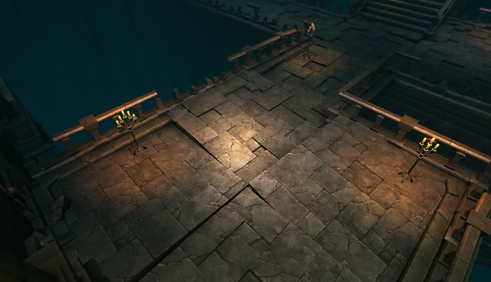
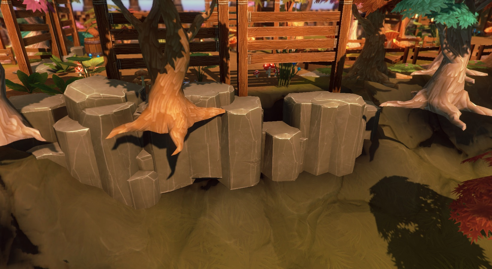
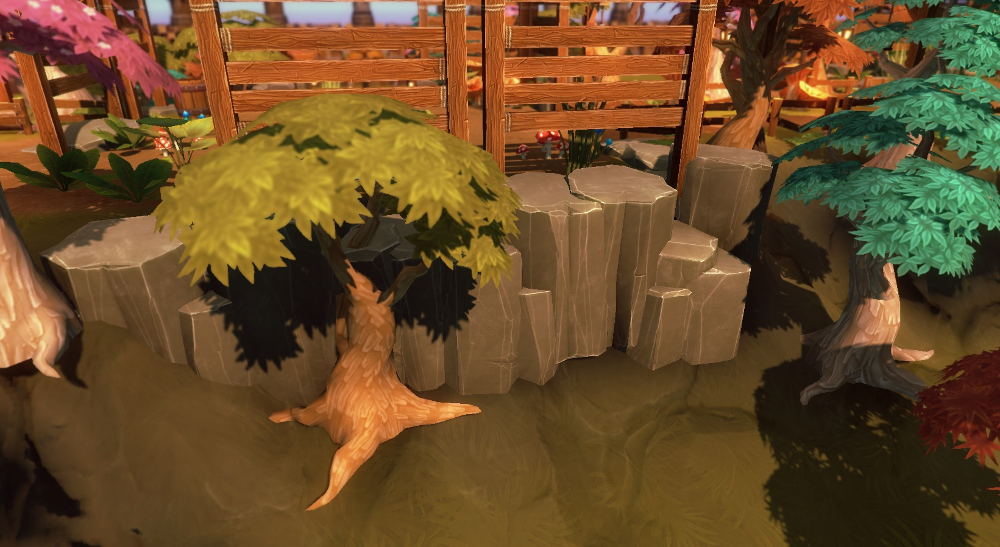

Dungeon Architect lets you specify offsets to your visual nodes to move/scale/rotate them from their relative marker locations.



However, if you want a more dynamic way of applying offsets (based on scripts), you can do so with a *Transform Rule*. This can be very useful for adding variations to your levels for certain props

You can create new transform rules by implementing the TransformationRule class under the DungeonArchitect namespace

```c#
using UnityEngine;
using System.Collections;
using DungeonArchitect;
using DungeonArchitect.Utils;

public class RandomRotYTransformRule : TransformationRule {
    
    public override void GetTransform(PropSocket socket, DungeonModel model, Matrix4x4 propTransform, System.Random random, out Vector3 outPosition, out Quaternion outRotation, out Vector3 outScale) {
        base.GetTransform(socket, model, propTransform, random, out outPosition, out outRotation, out outScale);

        // Your transform logic here. 
        // Update the outPosition, outRotation or outScale if necessary
    }
}
```

Attach this script to the theme node



## Example #1

In this example, the cliff rocks are facing the same direction and do not look organic




After applying the transform script to the rock node, it looks much better





```c#
using UnityEngine;
using System.Collections;
using DungeonArchitect;
using DungeonArchitect.Utils;

public class RandomCliffTransformRule : TransformationRule {
    public override void GetTransform(PropSocket socket, DungeonModel model, Matrix4x4 propTransform, System.Random random, out Vector3 outPosition, out Quaternion outRotation, out Vector3 outScale) {
        base.GetTransform(socket, model, propTransform, random, out outPosition, out outRotation, out outScale);
        
        // Randomly rotate along the Y-axis
        var angle = random.NextFloat() * 360;
        var rotation = Quaternion.Euler(0, angle, 0);
        outRotation = rotation;

        // Slightly translate the node
        var variation = new Vector3(0.25f, -1, 0.25f);
        outPosition = Vector3.Scale (random.OnUnitSphere(), variation);
    }
}
```

## Example #2

In this example a small random rotation is applied to ground tiles. This might be useful while creating ruins when laying down broken tile meshes



```c#
using UnityEngine;
using System.Collections;
using DungeonArchitect;
using DungeonArchitect.Utils;

public class BrokenTilesTransformRule : TransformationRule {

    public float maxAngle = 5;

    public override void GetTransform(PropSocket socket, DungeonModel model, Matrix4x4 propTransform, System.Random random, out Vector3 outPosition, out Quaternion outRotation, out Vector3 outScale) {
        base.GetTransform(socket, model, propTransform, random, out outPosition, out outRotation, out outScale);
        
        var rx = random.Range(-maxAngle, maxAngle);
        var ry = random.Range(-maxAngle, maxAngle);
        var rz = random.Range(-maxAngle, maxAngle);
    
        outRotation = Quaternion.Euler(rx, ry, rz);
    }
}
```

## Example #3

In this example, the outer trees are spawned in the same height as the dungeon layout




We have a terrain that Dungeon Architect modifies and its steepness value is controlled by the user using a curve.

So, we would like to clamp this tree’s base on the dynamic terrain.



This is done by finding the height of the terrain at that location, and creating an offset such that the tree would move up or down to properly clamp on it

```c#
using UnityEngine;
using System.Collections;
using DungeonArchitect;
using DungeonArchitect.Utils;

public class ClampToTerrainTransformRule : TransformationRule {
    
    public override void GetTransform(PropSocket socket, DungeonModel model, Matrix4x4 propTransform, System.Random random, out Vector3 outPosition, out Quaternion outRotation, out Vector3 outScale) {
        base.GetTransform(socket, model, propTransform, random, out outPosition, out outRotation, out outScale);

        var terrain = Terrain.activeTerrain;
        if (terrain == null) {
            return;
        }

        var position = Matrix.GetTranslation(ref propTransform);
        var currentY = position.y;
        var targetY = LandscapeDataRasterizer.GetHeight(terrain, position.x, position.z);

        // Apply an offset so we are touching the terrain
        outPosition.y = targetY - currentY;
    }
}
```
