## Install Dungeon Architect

Install and import [Dungeon Architect](https://u3d.as/nAL) from the Asset Store. You should see the following folders:

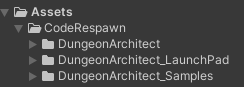

## Setup Dungeon Prefab

Create a new Scene

Navigate to `CodeRespawn > DungeonArchitect > Prefabs` and drop in the `DungeonGrid` prefab on to the scene

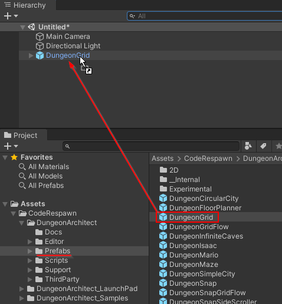

Select the dungeon game object and inspect the properties. We'll need to assign a new theme before we can build the dungeon

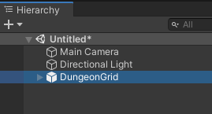

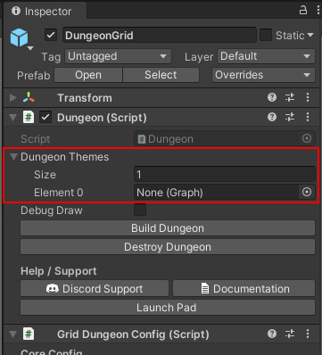

## Assign Theme

Assign an existing theme to the dungeon actor

* Navigate to `Assets\DungeonArchitect_Samples\Demo_Theme_Candy\Themes`
* Assign theme file named `CandyDungeonTheme` as shown in the image below

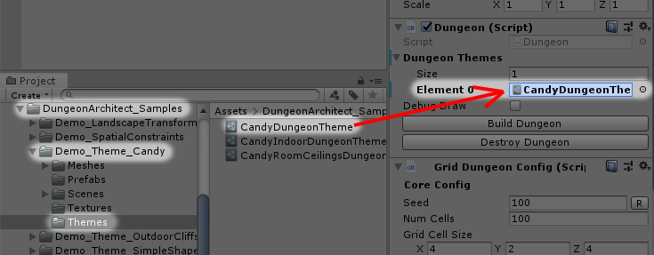

## Build Dungeon

Select the `DungeonGrid` game object and click the `Build Dungeon` button in the Inspector window

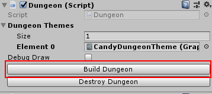

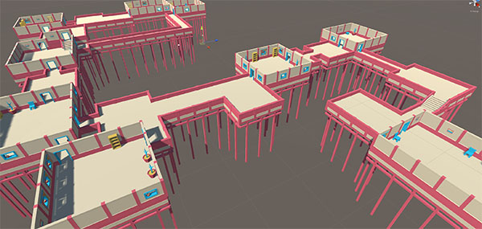

## Randomize Dungeon

Select the `DungeonGrid` game object and change the Seed value in the configuration.  Changing this value will create a dungeon with a different layout

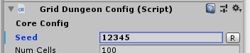

Click `Build Dungeon` button to rebuild the dungeon with the new seed

## Organization

All the dungeon objects are created on the root hierarchy and makes it difficult to organize.   We'll configure it so all objects are spawned under a certain game object

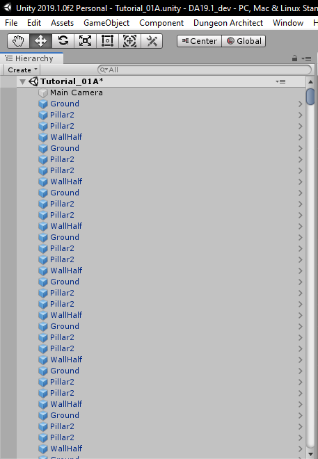

Lets destroy this current dungeon, configure it for better organization and then rebuild

### Destroy Existing Dungeon

Search for `dungeon` on the hierarchy search box

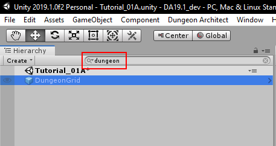

Select the DungeonGrid game object and click the `Destroy Dungeon` button

Clear out the search text box in the hierarchy.  Your hierarchy should now look like this

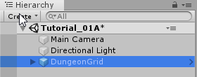

### Configure Parent Object

Create an empty Game Object.  All our dungeon items will go inside this parent object

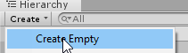

Rename the parent object (e.g. `Dungeon Items`)

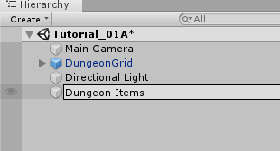

Select the parent object and **Reset the transform**

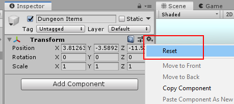

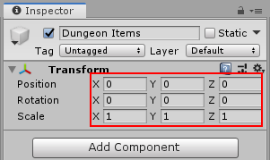

Select the parent object and set it to **static**

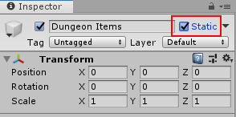

Assign the parent object to the GridDungeon game object

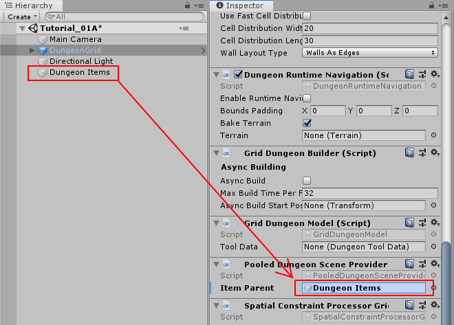

### Rebuild Dungeon

Select the GridDungeon game object and click `Build Dungeon`

All your dungeon game objects will be organized under the parent object

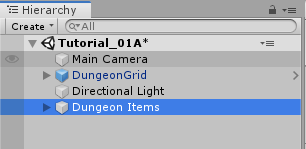
