Use the Launch Pad window to setup new dungeon scenes, browse the samples, clone from templates and much more

## Open Launch Pad

From the Main menu, open the Launch Pad window ``Dungeon Architect > Launch Pad``

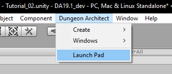

## Navigation

Select the various sections from the left.

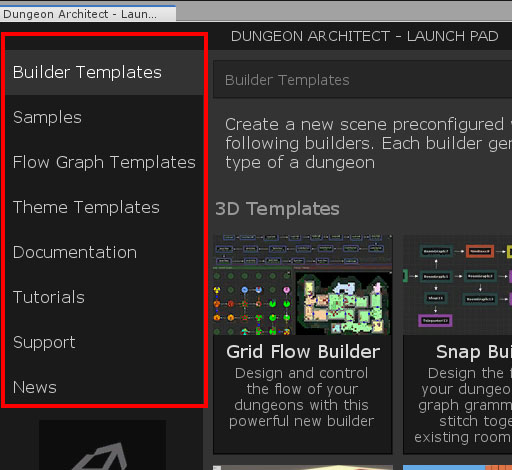

Use the navigation bar on the top to go back to a previous page. This is useful for retaining the scroll positions of the previous page (especially for larger pages like the Samples section)

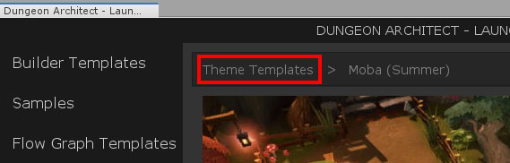

## Builder Templates

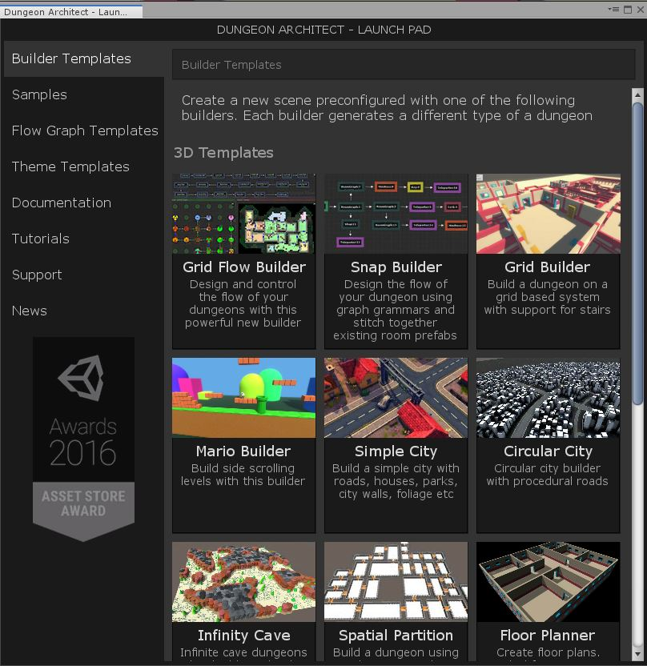

Dungeon Architect supports many different types of dungeon layout methods and is designed in a way that new layout methods can be easily added in the future

These layout methods are called `Dungeon Builders` or **Builders** in short

This section lets you create a new scene preconfigured with one of the builder templates.  Click on any of the builders. In the next screen, click the ``Clone Scene`` button

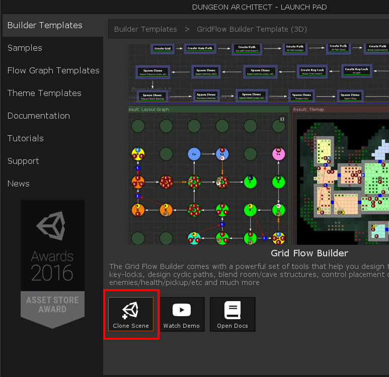

This will create a new scene based on the template, fully configured with the appropriate dungeon.  It will also clone a starting theme file (and any other flow graph assets) and set everything up.

Choose a folder to saved your scene file.  Once saved, the launcher would do the following:

* Open the new scene
* Open any theme editor windows associated with the referenced assets (Theme Editor, Flow Graph Editors etc)
* Select the dungeon game object (so you see the properties in the inspector by default)

## Samples

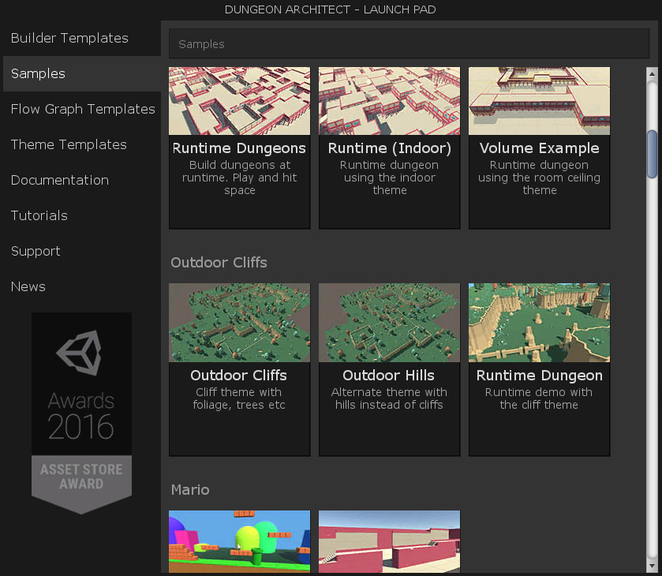

There are tons of samples to explore.  Select a sample you like and perform one of the following actions

* **Open Scene**: Opens the sample scene (usually under DungeonArchitect_Samples folder)
* **Open Folder**: Opens the folder containing the scene
* **Clone Scene**: Clone a scene and also clone over the referenced assets (themes, flow graphs etc) so you can modify them without affecting the sample scene
* **Watch Demo**: Watch a video, if it exists

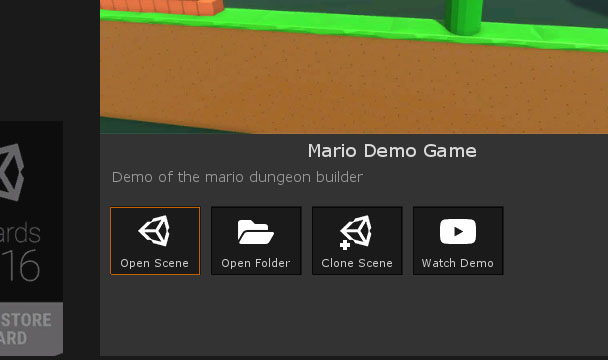

## Flow Graph Templates

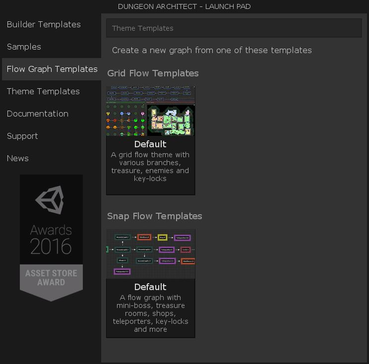

Flow graphs allow you to control the flow of your dungeon (more on this in the later tutorial sections).   This section contains a list of flow graph templates you can use as a starting point for your project

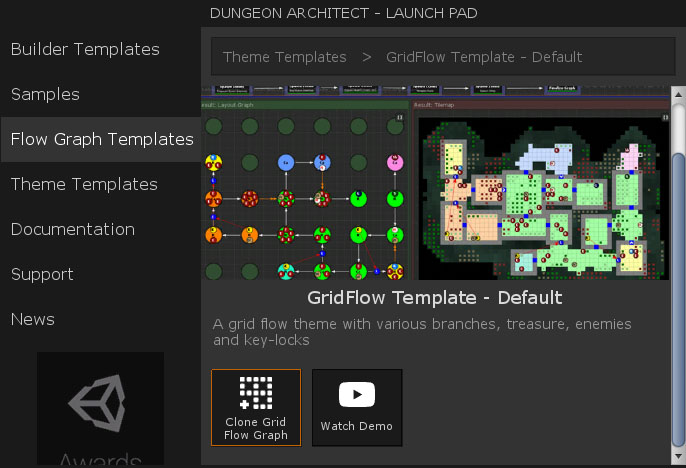

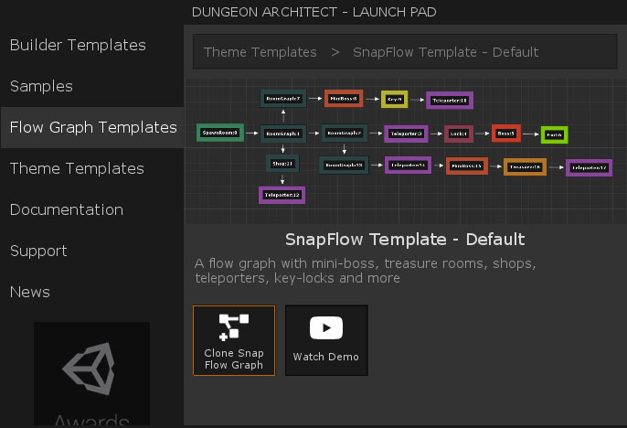

## Theme Templates

Clone one of the many themes and use it in your project or as a starting point for a new theme

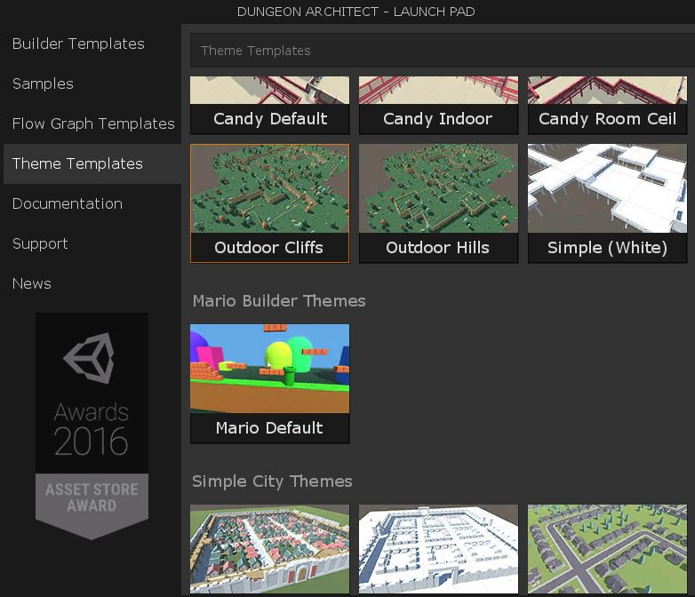

Select a theme and clone it

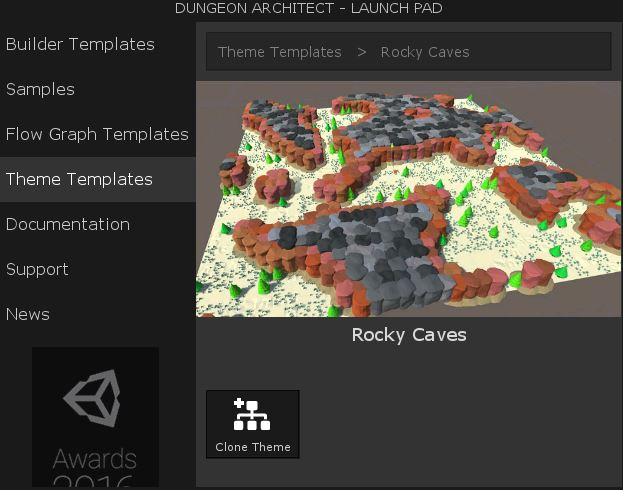

There's also a category on `External Themes`, the ones that use external paid art assets from the Asset Store.  You can use these themes if you also own the art asset.

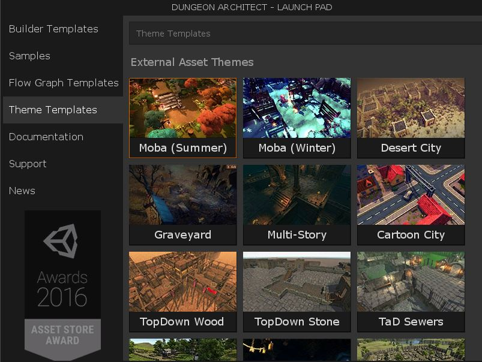

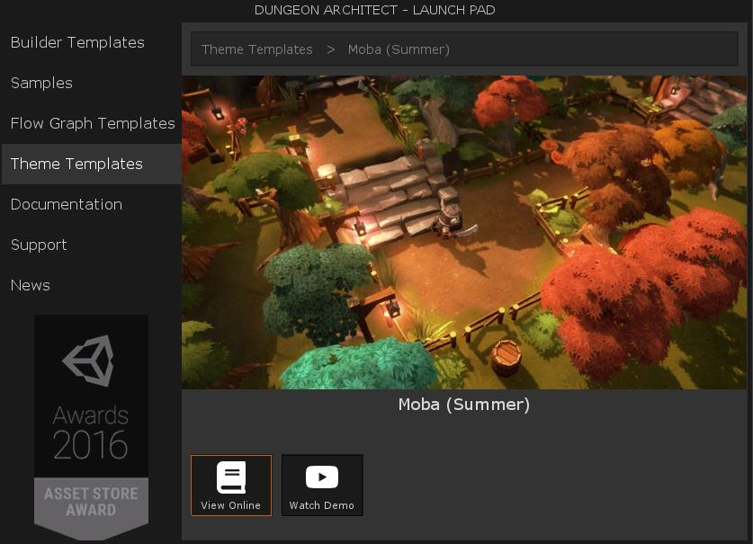

## Documentation

Links to various online documentation, including this one

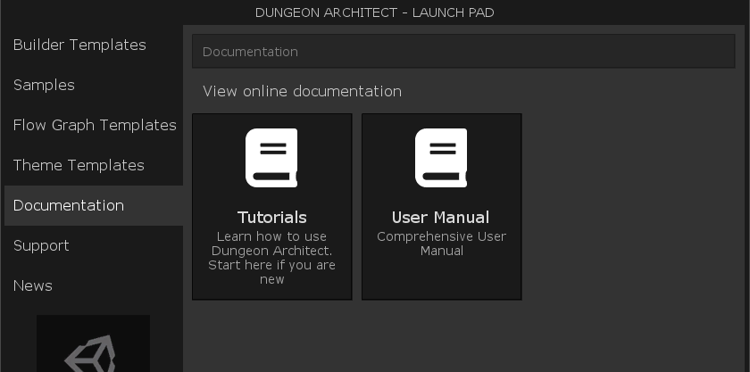

## Support

Reach the developers through any one of these channels. Interact with the community and the devs in Discord chat and forums or reach directly through email

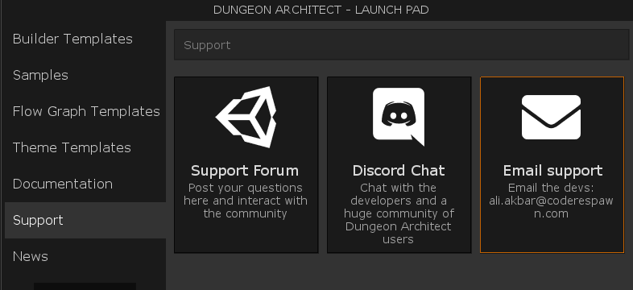

## News

Dungeon Architect News!  Find out whats new since the last update

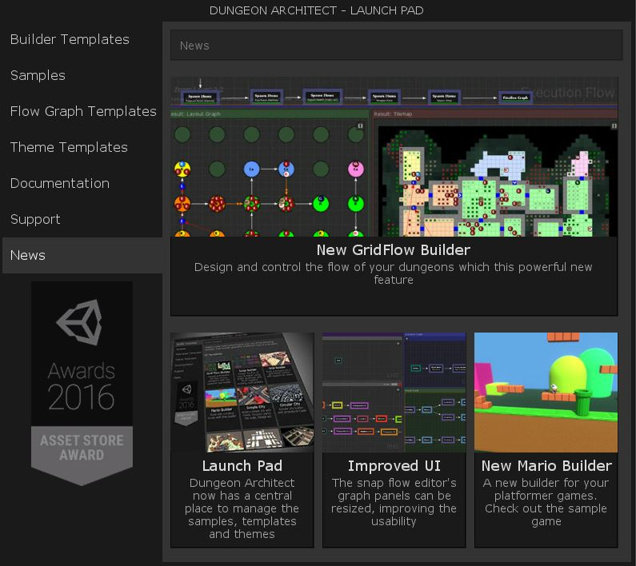
