The Grid Flow Builder offers a rich set of tools to control the flow of your dungeons and item placement

## Setup Dungeon Prefab

Create a new scene.  Navigate to ``Assets/DungeonArchitect/Prefabs`` and drop in the DungeonGridFlow prefab on to the scene

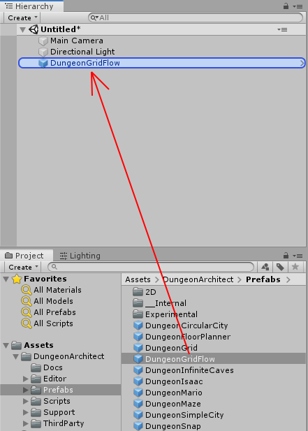

Select the DungeonGridFlow game object you just dropped and reset the transform

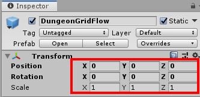

## Setup Parent Object

Create a new Parent object where all the spawned dungeon items will go in.

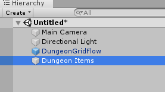

Reset the parent object's transform and set it to static

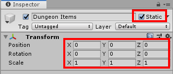

Assign the parent object

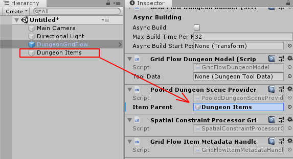

This makes sure all the spawned dungeon objects are placed under this parent object

## Setup Theme

There's a theme available in the samples folder which we'll use for this tutorial section

Navigate to ``Assets\DungeonArchitect_Samples\DemoBuilder_GridFlow\Theme`` and assign the theme ``ThemePrehistoric`` to the DungeonGridFlow game object

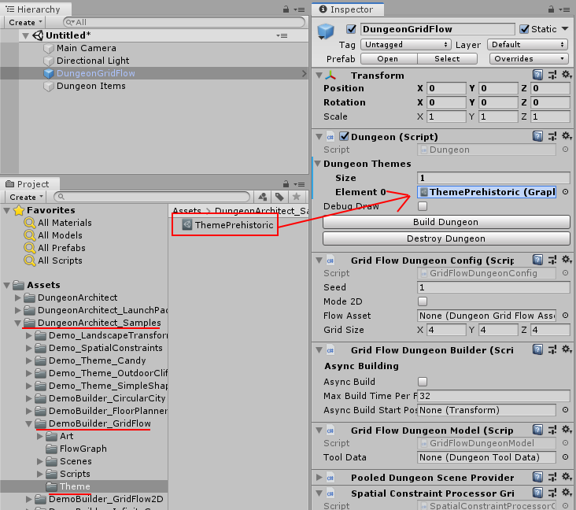

## Setup GridFlow Graph

This builder requires another asset called the `Grid Flow Graph`.   This is a graph that helps you  control the flow of your dungeon. In this section, we'll use an existing graph from the samples folder

Navigate to ``Assets\DungeonArchitect_Samples\DemoBuilder_GridFlow\FlowGraph`` and assign the graph ``DemoGridFlow`` to the `DungeonGridFlow` game object's ``Flow Asset`` property

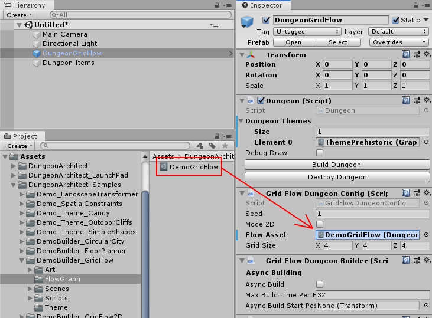

## Build Dungeon

Select the ``DungeonGridFlow`` game object and click ``Build Dungeon`` button from the inspector window

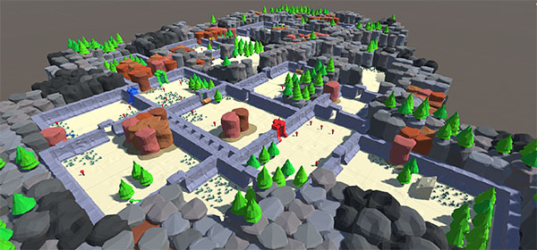

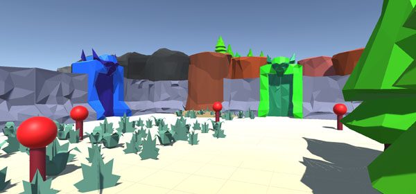

## Open Grid Flow Editor

Let's open the GridFlow asset in the editor:

Navigate to ``Assets\DungeonArchitect_Samples\DemoBuilder_GridFlow\FlowGraph`` and double click on ``DemoGridFlow``.

Dock the editor window so you see both the scene view and the grid flow editor

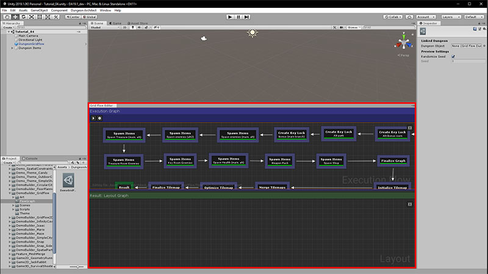

Click the `Build` button on the top left of the flow editor to build a new dungeon in the Grid Flow Editor

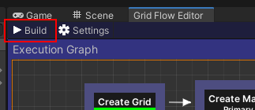

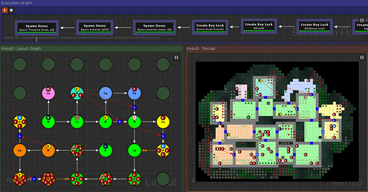

## Link Editor with Dungeon

We are going to link up the dungeon we have on the scene (`DungeonGridFlow` game object) with the Grid Flow Editor so when we generate a new dungeon in the editor, it syncs up the dungeon on the scene

Click an empty space (grey area) in the Execution Graph

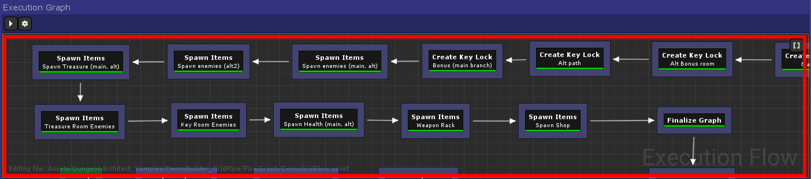

This will show up the execution graph properties in the Inspector window

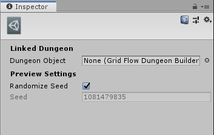

Assign the dungeon game object by dragging the DungeonGridFlow over

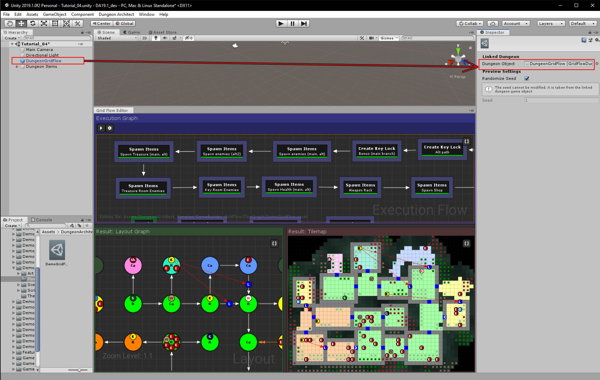

Now build the dungeon again by clicking the `Build` button in the Execution Graph Window

This will recreate the dungeon in the scene view.  The dungeon in the editor window is now synchronized with the dungeon in the scene view

If you double click on any of the tiles in the Tilemap window,  the scene view should focus on that tile/item

Double click on the Bonus Item (``B``) in the tilemap.

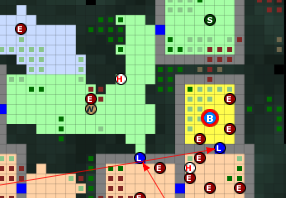

The scene view should zoom in on the treasure chest

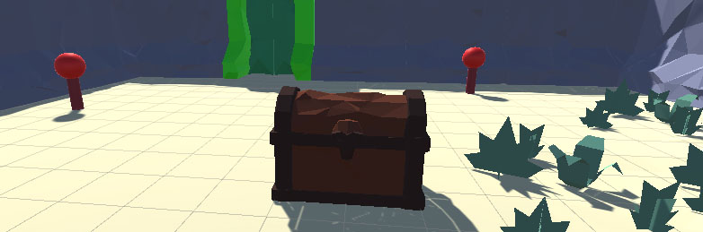

## Explore Grid Flow Graph

After you've built a dungeon in the editor (by hitting the build button on the top left), you can select each node and see how the dungeon layout was built, as shown in the lower preview panels

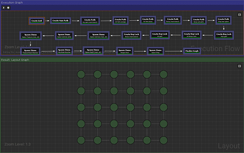
