In the previous section, we used an existing Grid Flow graph. In this section, we'll design one ourselves.

## Setup

Destroy the existing dungeon and clear out the Flow Asset that we assigned earlier

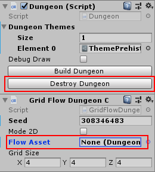

Create a new Grid Flow asset from either the Create menu or the Main Menu

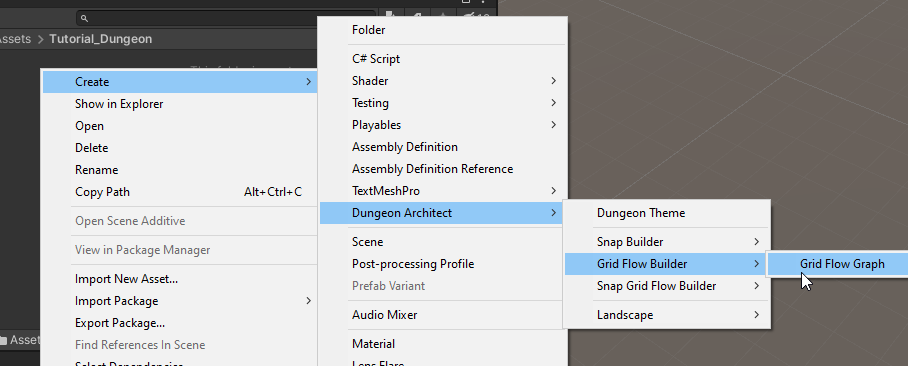

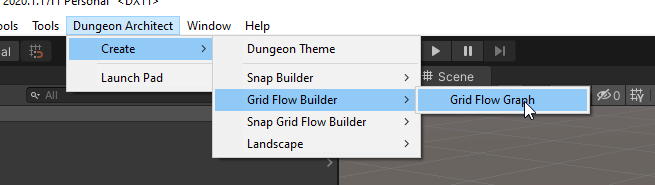

Rename to something appropriate and double click the grid flow asset to open it in the editor

We won't be needing the scene view for some time.  Dock the editor so we have more working area

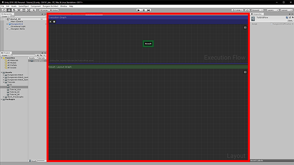

Notice that there is only one node in the Execution graph, the ``Result`` node.   Our final output should be connected to this node

## Create Grid

Right click on an empty area in the Execution Graph and from the context menu select ``Layout Graph > Create Grid``

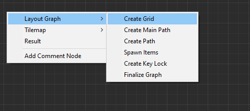

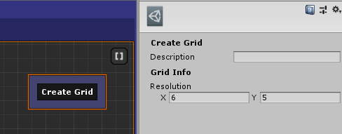

Connect this node to the ``Result`` node and hit build

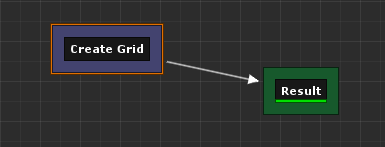

This node creates an initial grid to work with

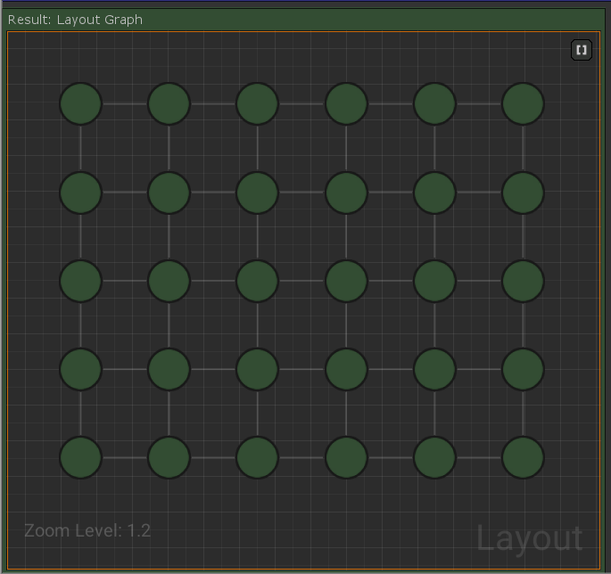

In this builder, you first design your level in an abstract layout graph like this and then move the final result to a tilemap

## Create Main Path

We'll next create a main path within this grid. The main path has a spawn point and goal

Create a new node ``Layout Graph > Create Main Path``

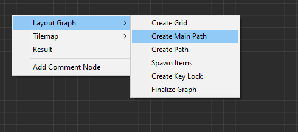

Unlink the ``Create Grid`` node from the ``Result`` node (do this by right clicking on the node's orange border)

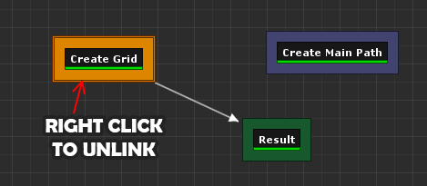

Link the nodes up like below and click Build

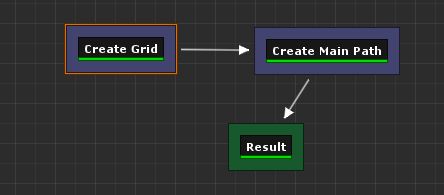

This node creates a main path in the grid.  Keep clicking the build button for different result

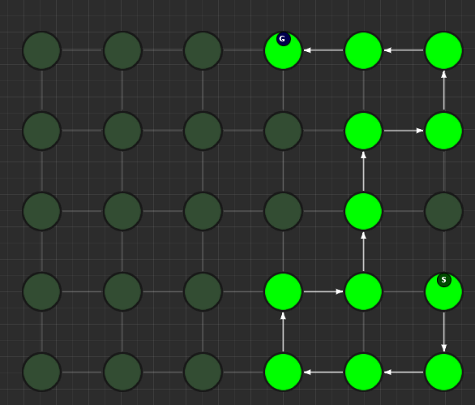

> If you do not see random results when you click build, make sure randomize is enabled.  Enable this by clicking on an empty area in the Execution Graph to show the properties. In the inspector, select ``Randomize Seed``

Select the ``Create Main Path`` node and inspect the properties

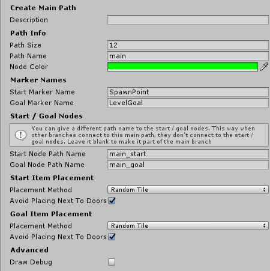

We'll leave everything to default for now

Notice the `Path Name` parameter is set to ``main``   This is the name of the path and we will be referencing this path in the future nodes with this name

You can adjust the size of the path.   ``Start Marker Name`` and ``Goal Marker Name`` lets you specify a name for the markers. You can then create these markers in the theme file and add any object you like.    In the `Prehistoric` theme, there's a marker already created with these names and a player controller is placed under ``SpawnPoint`` marker and a level goal handler prefab is placed under ``LevelGoal`` marker

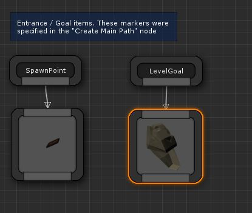

## Create Alternate Path

We'll next create an alternate path pathing off the main path so the player has another way of reaching the goal

Create a new node ``Layout Graph > Create Path``

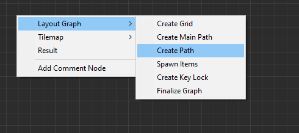

Connect the nodes together like below

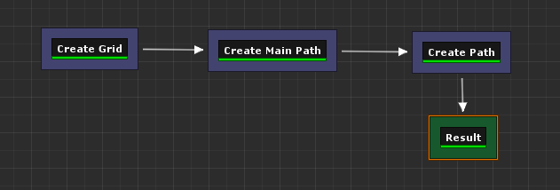

Leave all the properties as default and click build

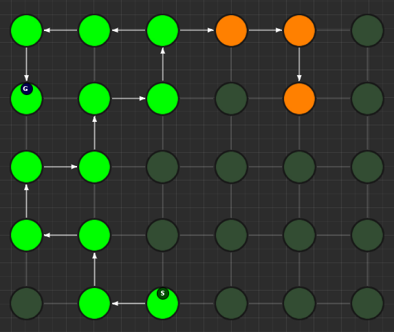

Select the ``Create Path`` node and inspect the properties

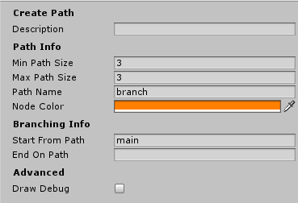

Change the `Path Name` to ``alt``.  We will be referencing this path as ``alt`` in the future

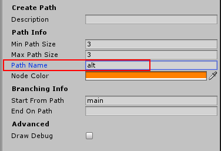

You can specify the paths from which this path should start and end.    The `Start From Path` parameter is set to ``main``, referencing the main path we created in the previous section

The `End On Path` is left empty, so the end of this path doesn't connect back to anything.   We'd like this path to connect back to the main path.

Set the `End On Path` parameter to ``main``

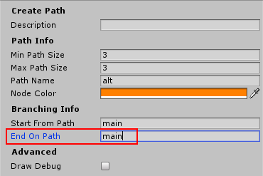

| Parameter           | Value  |
|---------------------|--------|
| **Min Path Size**   | 3      |
| **Max Path Size**   | 3      |
| **Path Name**       | alt    |
| **Node Color**      | orange |
| **Start From Path** | main   |
| **End On Path**     | main   |

This will make the alternate path (orange) connect back to the main path (green)

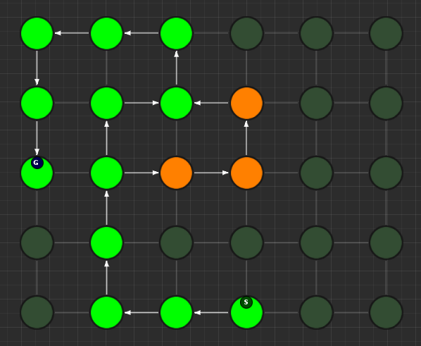

Keep clicking build for different results

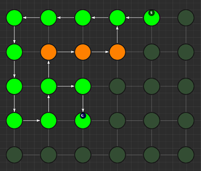

## Create Treasure Room (Main)

We'll add a treasure room connected to the main path

Add a new node ``Layout Graph > Create Path`` and set it up as follows:

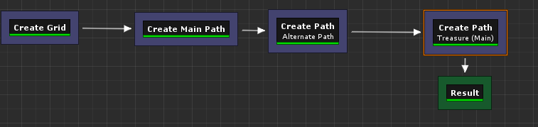

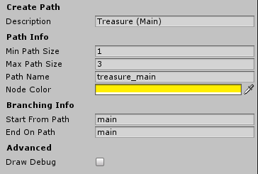

| Parameter           | Value         |
|---------------------|---------------|
| **Min Path Size**   | 1             |
| **Max Path Size**   | 3             |
| **Path Name**       | treasure_main |
| **Node Color**      | yellow        |
| **Start From Path** | main          |
| **End On Path**     | main          |

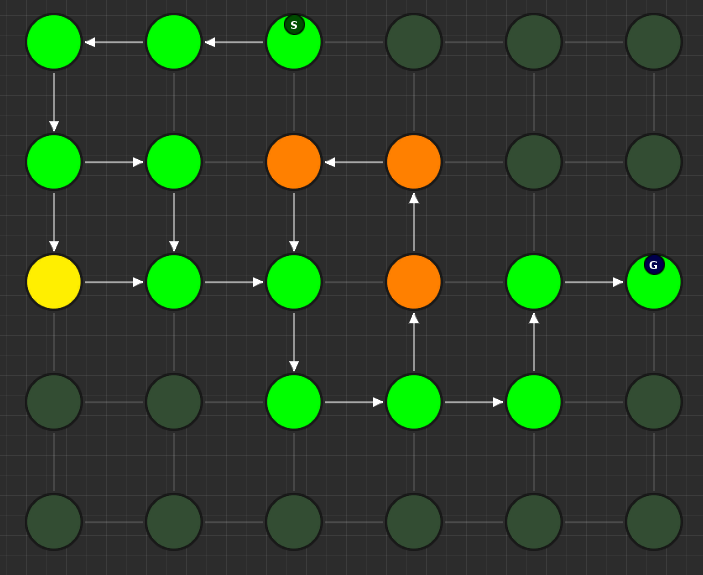

## Create Treasure Room (Alt)

We'll add another treasure room connected to the ``alt`` path but keep the ``End On Path`` parameter empty so it doesn't connect back to anything:

Add a new node ``Layout Graph > Create Path`` and set it up as follows:

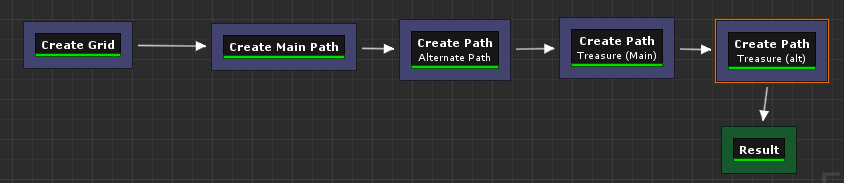

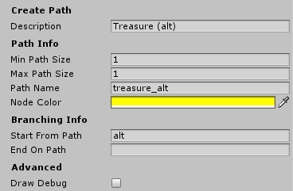

| Parameter           | Value        |
|---------------------|--------------|
| **Min Path Size**   | 1            |
| **Max Path Size**   | 1            |
| **Path Name**       | treasure_alt |
| **Node Color**      | yellow       |
| **Start From Path** | alt          |
| **End On Path**     |              |

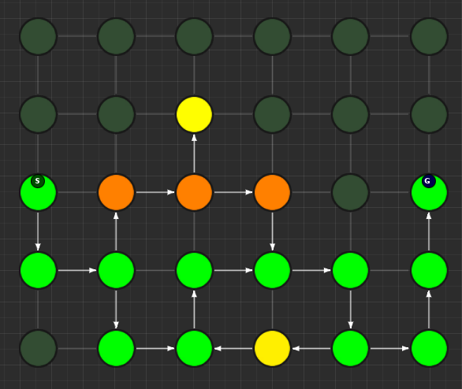

## Create Key Room

We'll create a room connected to the main path which will act as the key room. We'll later configure this room to have a key that opens up a lock in the main path. It will also have a NPC (key guardian) guarding the key

Add a new node ``Layout Graph > Create Path`` and set it up as follows:

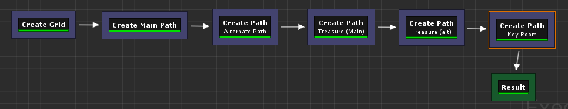

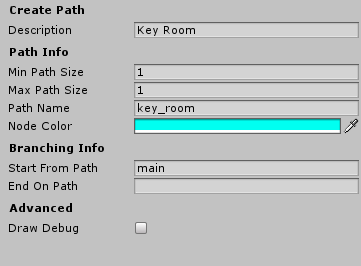

| Parameter           | Value    |
|---------------------|----------|
| **Min Path Size**   | 1        |
| **Max Path Size**   | 1        |
| **Path Name**       | key_room |
| **Node Color**      | cyan     |
| **Start From Path** | main     |
| **End On Path**     |          |

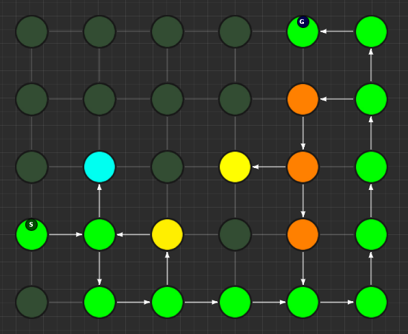

> We've named this path ``key_room``. It will be referenced later on when creating the key locks

## Create Key-Lock (Main)

We'll next create a key-lock system on the main path.  Our key will go on the Key Room we created earlier (``key_room`` path) and the lock will be somewhere in the main branch (``main`` path)

Add a new node ``Layout Graph > Create Key Lock`` and set it up as follows:

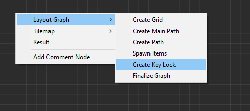

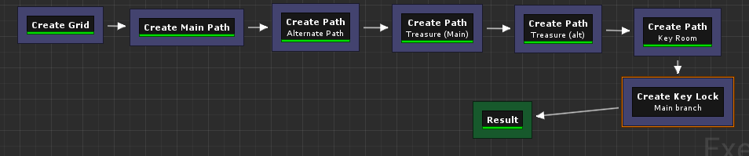

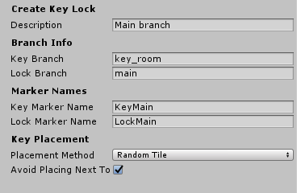

| Paramter             | Value    |
|----------------------|----------|
| **Key Branch**       | key_room |
| **Lock Branch**      | main     |
| **Key Marker Name**  | KeyMain  |
| **Lock Marker Name** | LockMain |

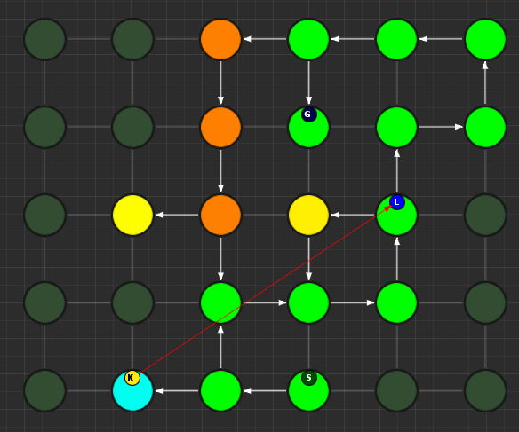

Specify the `Key Branch` as ``key_room`` and `Lock Branch` as ``main``

Set marker name for the key as ``KeyMain`` and lock as ``LockMain``.    Then in the theme file, you'd create marker nodes with these names and add your key and locked gate prefabs.

The prehistoric theme already has these setup

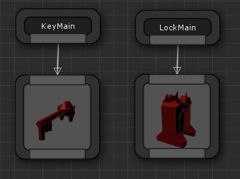

## Create Key-Lock (Treasure Main)

We need a key-lock to guard the treasure room in the main branch

Add a new node ``Layout Graph > Create Key Lock`` and set it up as follows:

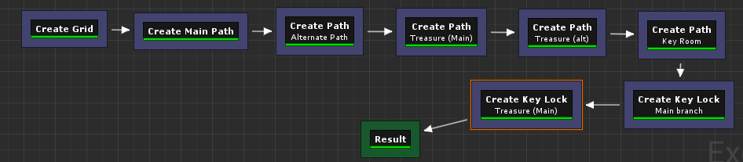

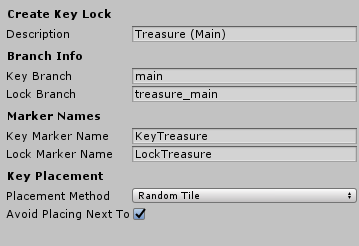

| Parameter            | Value         |
|----------------------|---------------|
| **Key Branch**       | main          |
| **Lock Branch**      | treasure_main |
| **Key Marker Name**  | KeyTreasure   |
| **Lock Marker Name** | LockTreasure  |

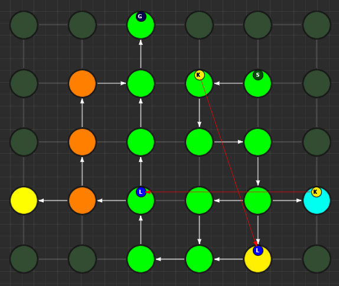

Set marker name for the key as ``KeyTreasure`` and lock as ``LockTreasure``.    Then in the theme file, you'd create marker nodes with these names and add your key and locked gate prefabs.

The prehistoric theme already has these setup

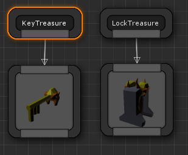
## Spawn Enemies (Main, Alt)

We'll use the ``Spawn Items`` node to spawn enemies on the ``main`` and ``alt`` paths

Create a new node ``Layout Graph > Spawn Items`` and set it up as follows:

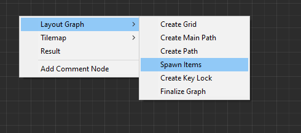

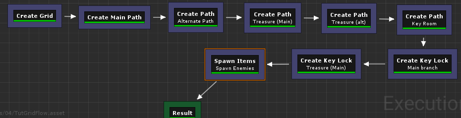

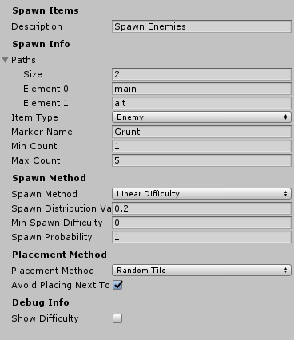

| Parameter       | Value     |
|-----------------|-----------|
| **Paths**       | main, alt |
| **Item Type**   | Enemy     |
| **Marker Name** | Grunt     |
| **Min Count**   | 1         |
| **Max Count**   | 5         |

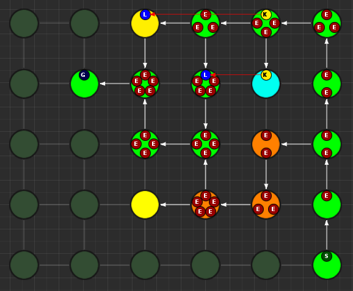

This will spawn enemies in the nodes, gradually increasing the number of enemies based on the difficulty. The difficulty increases as we get closer to the goal. You can control this from the `Spawn Method` properties. Leave it to default for now

We've specified the marker name as ``Grunt`` and an appropriate marker node should be created in the theme file so we can spawn prefabs under it.  The pre-historic theme already has this marker

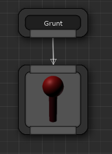

You can control the placement of items (in the tilemap) from the `Placement Method` property section. Leave it to default for now

## Spawn Bonus (Treasure Chests)

Spawn treasure chests in your bonus rooms using the `Spawn Items` node

Create a new node ``Layout Graph > Spawn Items`` and set it up as follows:

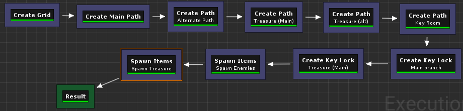

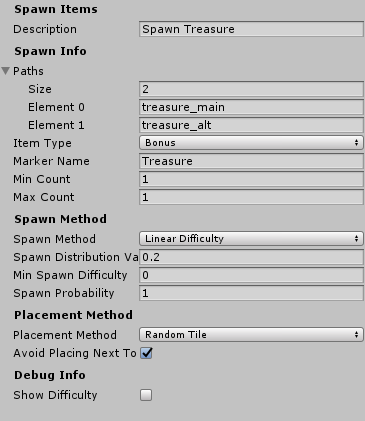

| Parameter                | Value                       |
|--------------------------|-----------------------------|
| **Paths**                | treasure_main, treasure_alt |
| **Item Type**            | Bonus                       |
| **Marker Name**          | Treasure                    |
| **Min Count**            | 1                           |
| **Max Count**            | 1                           |
| **Min Spawn Difficulty** | 1                           |

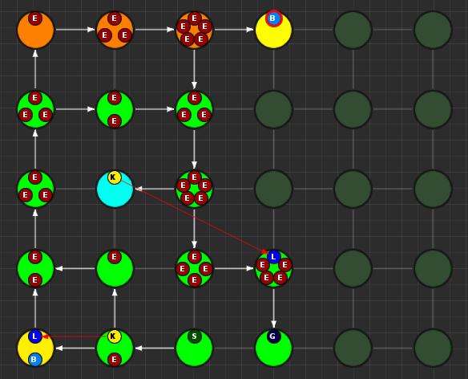

We've specified the marker name as ``Treasure`` and an appropriate marker node should be created in the theme file so we can spawn prefabs the treasure chest under it.  The pre-historic theme already has this marker

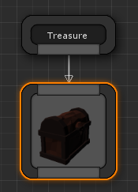

The `Min Spawn Difficulty` is set to ``1``.   The first node in the branch will have a difficulty of ``0`` and the last node ``1``.  Sometimes, the yellow branch may be 3 nodes long.  Since we want the chest to occur only on the last node, we've set this value to ``1``

## Spawn Key Guardian

We'll add an NPC in the Key room guarding the key

Create a new node ``Layout Graph > Spawn Items`` and set it up as follows:

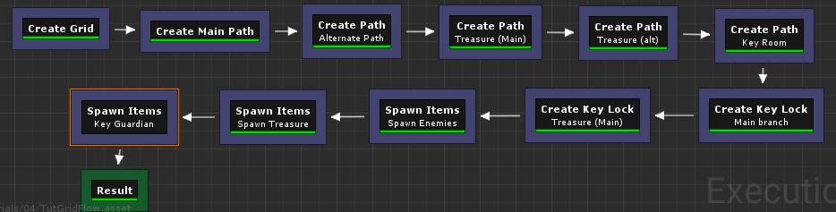

| Parameter       | Value       |
|-----------------|-------------|
| **Paths**       | key_room    |
| **Item Type**   | Enemy       |
| **Marker Name** | KeyGuardian |
| **Min Count**   | 1           |
| **Max Count**   | 1           |

You'll need to create a marker named ``KeyGuardian`` in the theme file and place your NPC prefab under it.   This marker doesn't exist in the `Prehistoric` theme and you'll need to create it yourself if you want to visualize it

## Spawn Health Pack

We'll use the `Spawn Items` node to spawn a few health pickups along the `main` and `alt` paths

This section also shows you how to use the `Custom` Item Type

Create a new node ``Layout Graph > Spawn Items`` and set it up as follows:

| Parameter                               | Value         |
|-----------------------------------------|---------------|
| **Paths**                               | main, alt     |
| **Item Type**                           | Custom        |
| **Marker Name**                         | HealthPickup  |
| **Min Count**                           | 0             |
| **Max Count**                           | 1             |
| **Spawn Probability**                   | 0.5           |
| Custom Item Info > **Item Type**        | health_pickup |
| Custom Item Info > **Text**             | Health        |
| Custom Item Info > **Text Color**       | [Red]         |
| Custom Item Info > **Background Color** | [White]       |

> You'll need to create a marker named ``HealthPickup`` in your theme file and add your health pack prefab

## Finalize Layout Graph

After we are done designing the layout graph, we'll need to finalize it with the `Finalize Graph` node.    This node does a few things:

* Move the locks from the nodes on to the links
* Create one way doors (so we don't go around locked doors)
* Assign room types (Room, Corridor, Cave)

Create a new node ``Layout Graph > Finalize Graph`` and set it up as follows:

Leave all the properties to default

We are now ready to create a tilemap from this

## Initialize Tilemap

Create a new node ``Tilemap > Initialize Tilemap`` and set it up as follows:

You can control the thickness of the caves from the `Cave Thickness` parameter.   Each node on the layout graph gets converted into rooms in the tilemap.

The parameter `Tilemap Size Per Node` controls how many tiles are used to generate a room from the node. Bump this number up if you want more space in your rooms

If you want a more uniform grid like look on your rooms, bring the `Perturb Amount` close to ``0``

`Layout Padding` adds extra tiles around the dungeon layout.   Set to ``5`` so we can apply some decorations outside the dungeon bounds

When you select a node on the layout graph, the tiles that belong to the node light up.  This is controlled by the `Color Settings` parameters

### Wall Generation Method

There are two ways of generating the walls, which depends on the asset you use for the dungeon.  
* **Walls as Tiles:** The walls will take up a full tile in the tilemap.    Use this if your wall prefab are as thick as the size of a ground tile. In the image below, walls tiles are grey
  
* **Walls as Edges** The walls do not take up any tiles and are aligned on the edges of a tile.  Use this if your wall prefab is thin. In the image below, walls are red lines
  

> If your walls don't align correctly while designing the theme, come back to this property and make sure it is set correctly

## Add Background Elevation

We are going to create overlays and merge them with the original tilemap.   Create the following two nodes:

* Create a node ``Tilemap > Create Tilemap Elevations``
* Create a node ``Tilemap > Merge Tilemaps``

Link them up like below:

Update the properties

| Parameter           | Value |
|---------------------|-------|
| **Noise Frequency** | 0.1   |
| **Num Steps**       | 8     |
| **Min Height**      | 0.5   |
| **Max Height**      | 3.5   |
| **Sea Level**       | -1    |

We've specified the marker name as ``Rock``.   If you place objects under the specified marker node in the theme editor, they will show up on these tiles at the given height

> The Min/Max height is logical and will be mulitplied by the dungeon config's Grid Size Y value.  If the GridSize is ``(4, 2, 4)`` in the DungeonGridFlow game object's config and the tile height happens to be ``2.5``, the actual placement will be on ``2.5 * 2 = 5``

## Add Tree Overlays

We'll overlay trees on our dungeon using a noise parameter. These overlays will be placed such that they will not block the main path

Create a node ``Tilemap > Create Tilemap Overlay``

**Noise Settings**

| Parameter               | Value |
|-------------------------|-------|
| Noise Frequency         | 0.2   |
| Noise Max Value         | 1.5   |
| Noise Threshold         | 0.75  |
| Min Dist From Main Path | 1     |

**Merge Config**

| Parameter  | Value |
|------------|-------|
| Max Height | 1     |

## Finalize Tilemap

Finalize the tilemap to complete the grid flow graph

Create a node ``Tilemap > Finalize Tilemap``

Finalize Tilemap node places all the items on to the tilemap (enemies, keys, bonus etc)

## Build Dungeon

Assign this grid flow graph to your DungeonGridFlow game object and click `Build Dungeon`

## Optimize Tilemap

When the tilemap based level is generated, there are many tiles that the player might never see, as they are far away from the dungeon layout

The `Optimize Tilemap` removes tiles that are away from the specified distance from the dungeon layout bounds

Create a node ``Tilemap > Optimize Tilemap``

Connect it before the `Finalize Tilemap` node like below:

Rebuild the dungeon in the scene view

