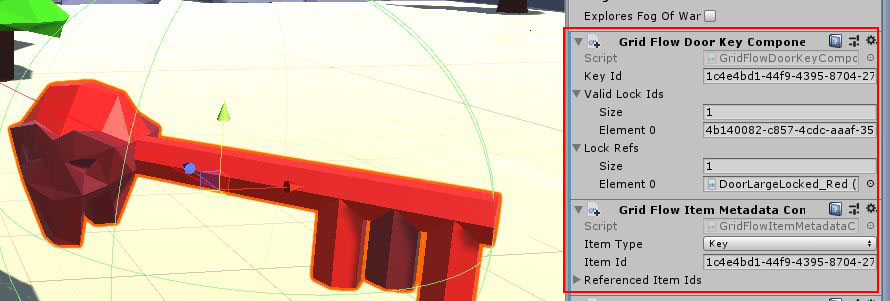
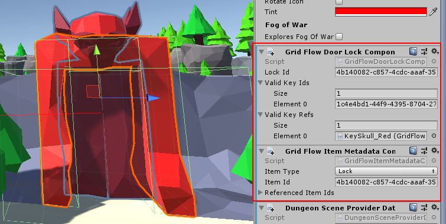
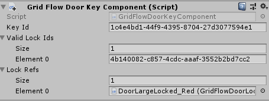
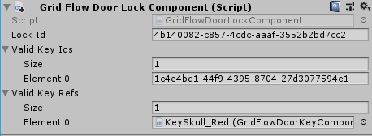

The spawned Key and Lock game objects will have the following components attached to it by Dungeon Architect








## Key Component

The builder will attach a new component ``GridFlowDoorKeyComponent`` to the spawned key prefab




This component contains the KeyId and a reference to all the locks that this key can open

| Parameter          | Value                                                                      |
|--------------------|----------------------------------------------------------------------------|
| **Key Id**         | The Key Id                                                                 |
| **Valid Lock Ids** | List of Lock Ids that can be opened by this key                            |
| **Lock Refs**      | References to the spawned lock game objects that can be opened by this key |

## Lock Component

The builder will attach a new component ``GridFlowDoorLockComponent`` to the spawned lock prefab



This component contains the LockId and a reference to all the keys that open this lock

| Parameter          | Value                                                          |
|--------------------|----------------------------------------------------------------|
| **Lock Id**        | The Lock Id                                                    |
| **Valid Key Ids**  | List of Key Ids that open this lock                            |
| **Valid Key Refs** | References to the spawned key game objects that open this lock |

## Sample

Game Sample Scene: ``Assets/DungeonArchitect_Samples/DemoBuilder_GridFlow/Scenes/GridFlowBuilderDemo_Game``

The GridFlow game sample contains a working example of how you can implement a key lock system. There are many ways of implementing this, this sample shows one such way.

The Sample has the following scripts:

* Inventory: Saves the picked up keys in the inventory
* LockedDoor: A script that implements the door opening logic. This script is added to the locked door prefab. When something collides with the door trigger, it checks if it has an inventory.  If it does, it checks if the inventory contains any of the valid keys that can open this door


LockedDoor script location: ``Assets/DungeonArchitect_Samples/DemoBuilder_GridFlow/Scripts/DemoGame/Door/LockedDoor.cs``

```c#
	bool CanOpenDoor(Collider other)
	{
		var inventory = other.gameObject.GetComponentInChildren<Inventory>();
		if (inventory != null)
		{
			// Check if any of the valid keys are present in the inventory of the collided object
			foreach (var validKey in validKeys)
			{
				if (inventory.ContainsItem(validKey))
				{
					return true;
				}
			}
		}
		return false;
	}
```
