Display a 2D minimap with fog of war 

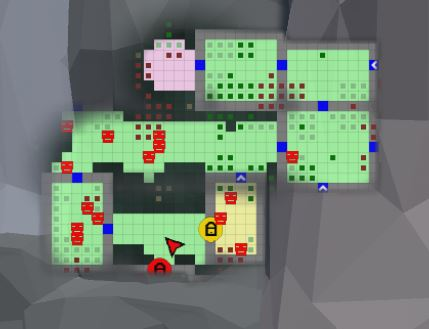
   

The ``DungeonGridFlow`` prefab already comes pre-configured with the minimap.  This is done with the ``GridFlowMinimap`` component: 

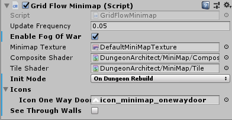
   

| Parameter             | Description                                                                                                       |
|-----------------------|-------------------------------------------------------------------------------------------------------------------|
| **Update Frequency**  | Control the frequency of minimap updates. The updates can run at a lower fps for better performance               |
| **Enable Fog of War** | Hides parts of the map that is not explored yet                                                                   |
| **See Through Walls** | If this is disabled, unexplored area behind a wall will not be made visible.  This works if Fog of War is enabled |
| **Minimap Texture**   | The Render Target texture that the minimap will be rendered on                                                    |
| **Icons**             | The icons to overlay on special tiles                                                                             |

**Init Mode** values:

| Parameter              | Description                                                                         |
|------------------------|-------------------------------------------------------------------------------------|
| **On Dungeon Rebuild** | The minimap layout texture is regenerated when the dungeon rebuilds                 |
| **On Play**            | The minimap layout texture is generated when you start play                         |
| **Manual**             | The minimap layout texture is generated only when you manually build it from script |

## Setup

The minimap requires you to provide a Render Texture asset in the `Minimap Texture` property.  The minimap will be rendered in this texture.  You can then apply this texture anywhere (in your UI elements, in a mesh etc)

Create a new Render Texture asset. Use the Create menu in the Project window: ``Create > Render Texture``

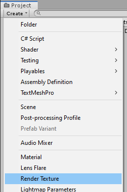

Select the Render Texture asset and inspect the properties

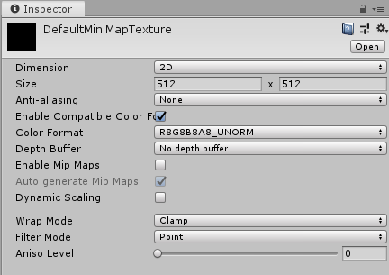

Change the following:

| Parameter        | Description                                                  |
|------------------|--------------------------------------------------------------|
| **Size**         | Change to 512x512 (or the quality you are comfortable with)  |
| **Depth Buffer** | No Depth buffer (we don't need it here)                      |
| **Filter Mode**  | Point (so we get sharp tile edges instead of a blurry image) |

Assign this `Render Texture` asset to your DungeonGridFlow game object's minimap component

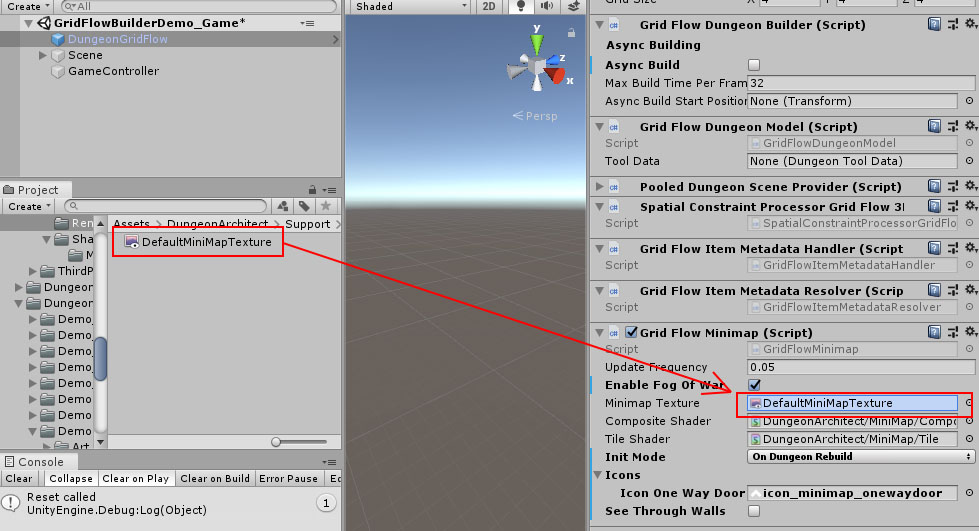

Dungeon Architect will automatically update this texture based on the specified `Update Frequency`. You can assign this texture anywhere on your UI. You can also attach it on a mesh

## Show in UI

Open the game sample scene: ``Assets/DungeonArchitect_Samples/DemoBuilder_GridFlow/Scenes/GridFlowBuilderDemo_Game``

There's a UI canvas in the hierarchy. Expand and inspect it:

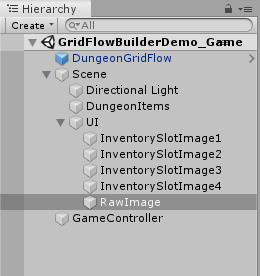

There is a `RawImage` Canvas Item in there. It was created like this:

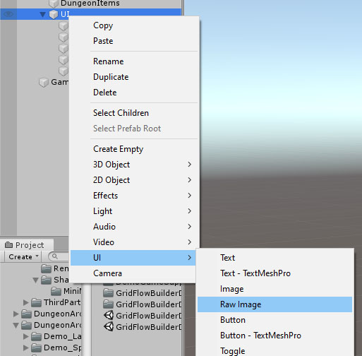

Select the RawImage item and configure it like this:

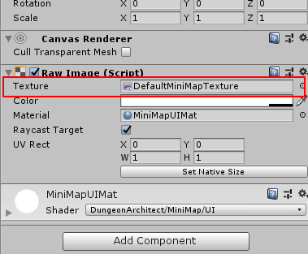

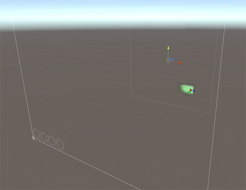

The Render Texture was assigned there so it will show our minimap

## Add to a Material

While playing the sample game, if you look down, you notice the player holding a map in the hand (like in Minecraft).   This map shows the minimap in realtime

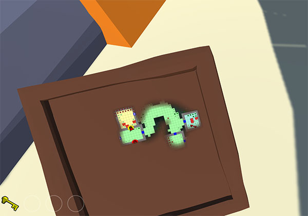

The texture was simply added to an unlit material, and the material was then applied to that mesh

Create a Material as below:

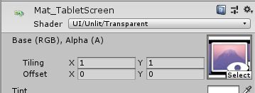

* Set the Shader to ``UI/Unlit/Transparent``
* Set the texture to your Render Texture asset

You can now apply this material anywhere (e.g. in a large billboard in your world, a small map that the player holds,  dashboard of a vehicle etc)

> See Also
> Check the sample game to see how this was done
>
> | Asset             | Path                                                                                  |
> |-------------------|---------------------------------------------------------------------------------------|
> | **Tablet Prefab** | *Assets/DungeonArchitect_Samples/DemoBuilder_GridFlow/Art/Prefab/Tablet_Map*          |
> | **Material**      | *Assets/DungeonArchitect_Samples/DemoBuilder_GridFlow/Art/Materials/Mat_TabletScreen* |

## Minimap Tracked Objects

The minimap can track any object in the scene.  You do this by adding the `GridFlowMinimapTrackedObject` component to the desired prefab

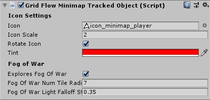
   
   
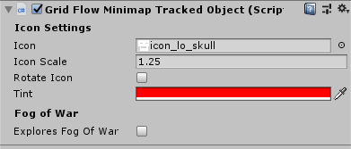

It has the following features:

* The tracked object can explore the minimap (e.g. player and allies)
* Specify an icon, color and scale of the object in the minimap
* the icon can rotate to indicate the game object's Y rotation (good for player game objects)

You'd want to turn on `Explores Fog of War` only for the player and other relavant objects.   The icon can be greyscale and you can apply a tint on it with different colors (e.g. on key icon but different colors applied to the red key prefab, blue key prefab and so on)

> See Also
> Check the sample game prefabs to see how the component was configured
>
> | Asset             | Path                                                                                                                |
> |-------------------|---------------------------------------------------------------------------------------------------------------------|
> | Player Controller | `Assets/DungeonArchitect_Samples/DemoBuilder_GridFlow/Scenes/DemoGameSupportFiles/Prefabs/GridFlowPlayerController` |
> | Grund NPC         | `Assets/DungeonArchitect_Samples/DemoBuilder_GridFlow/Scenes/DemoGameSupportFiles/Prefabs/Enemy`                    |
> | Key (Red)         | `Assets/DungeonArchitect_Samples/DemoBuilder_GridFlow/Art/Prefab/KeySkull_Red`                                      |
> | Key (Blue)        | `Assets/DungeonArchitect_Samples/DemoBuilder_GridFlow/Art/Prefab/KeySkull_Blue`                                     |
> | Door (Yellow)     | `Assets/DungeonArchitect_Samples/DemoBuilder_GridFlow/Art/Prefab/DoorLargeLocked_Yellow`                            |
> | Door (Green)      | `Assets/DungeonArchitect_Samples/DemoBuilder_GridFlow/Art/Prefab/DoorLargeLocked_Green`                             |
