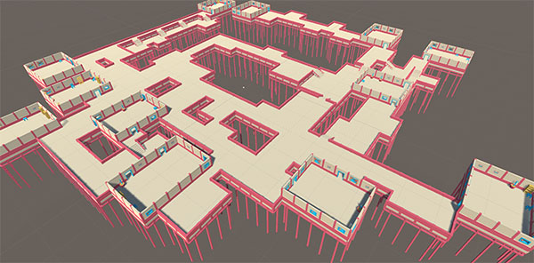

The `Grid Builder` generates a dungeon by scattering rooms across the map and connecting them with corridors.  The builder supports height variations (stairs)

We've used this dungeon builder in the previous section [Create your first Dungeon](create-first-dungeon.md) and [Design your first Theme](design-first-theme.md)

In the following sections, we'll explore more about this builder
