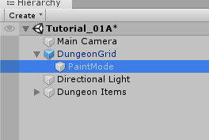
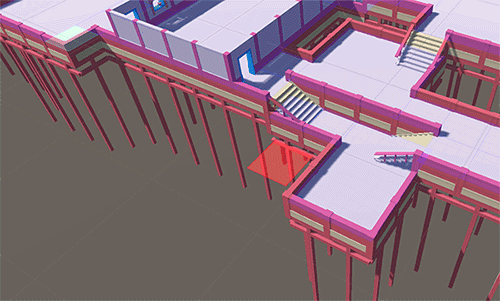

You can paint your own dungeon layout on top of the procedural dungeon

Select the DungeonGrid prefab and expand it.   Select the ``PaintMode`` game object.  This will activate the `Paint Mode`

``Left click`` and drag to draw dungeon cells.   ``Shift + Left click`` to delete cells.   ``Scroll wheel`` to move the cursor up/down

   

