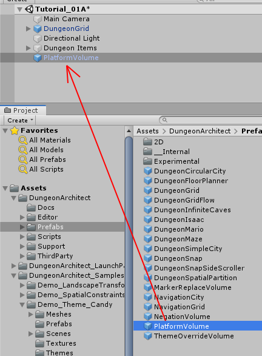
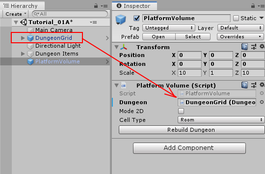
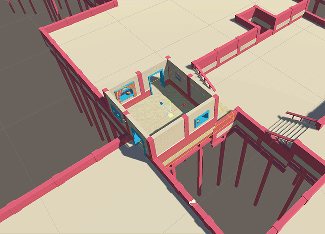

Platform Volumes let you control the placement of the rooms or corridors.   You do this dropping in a platform volume on to the scene and resizing  / positioning it on the scene and you room will be built around it.

Navigate to ``Asset/DungeonArchitect/Prefabs`` and drag drop the ``PlatformVolume`` prefab on to the scene

Select the PlatformVolume game object and set the Dungeon reference

Click the button ``Rebuild Dungeon``

Move the `Platform Volume` and scale it to control the position and size of your room. You can have multiple platform volumes in the scene. Check the samples in the Launch Pad for more examples
