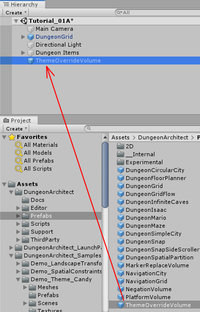
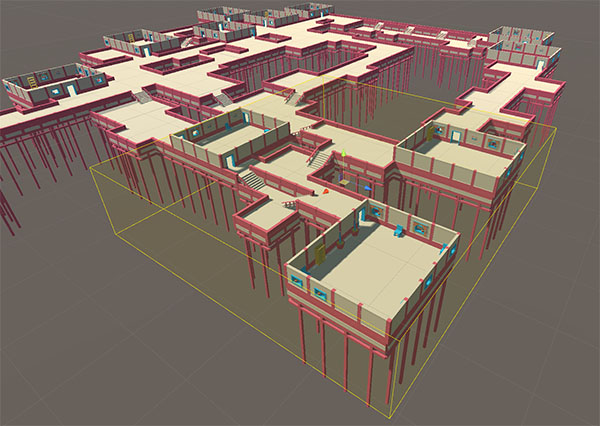
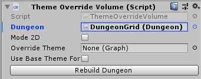
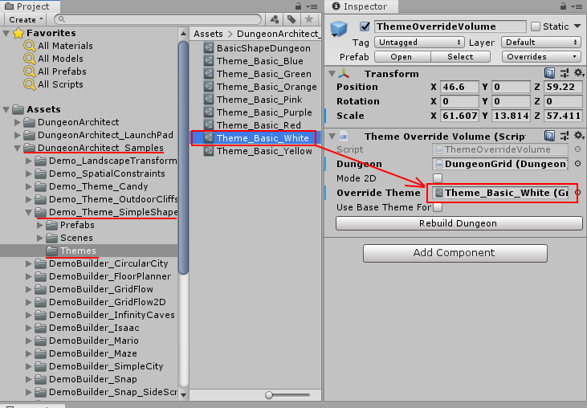
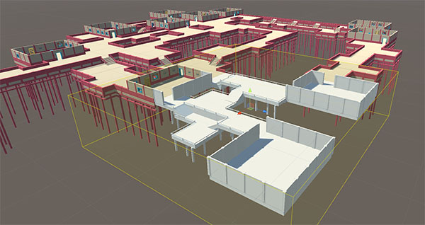

Theme Override Volumes let you apply another theme on certain portions of your dungeons that are covered by this volume.  These are useful for adding variations to your dungeons.

Navigate to ``Asset/DungeonArchitect/Prefabs`` and drag drop the ``ThemeOverrideVolume`` prefab on to the scene

Move and scale it to cover a certain portion of the dungeon

Select the theme override volume you just dropped and inspect the properties and assign the DungeonGrid reference

Navigate to ``Assets/DungeonArchitect_Samples/Demo_Theme_SimpleShapes/Themes`` and assign the theme ``Theme_Basic_White`` to the Theme Override Volume

Click ``Rebuild Dungeon``

   

