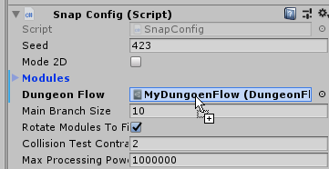
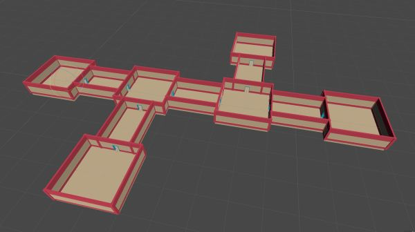
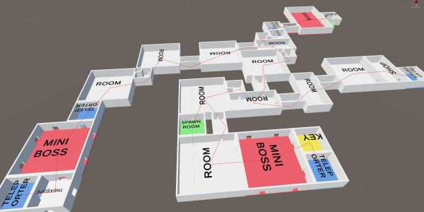
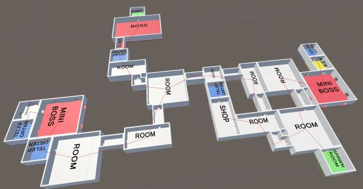
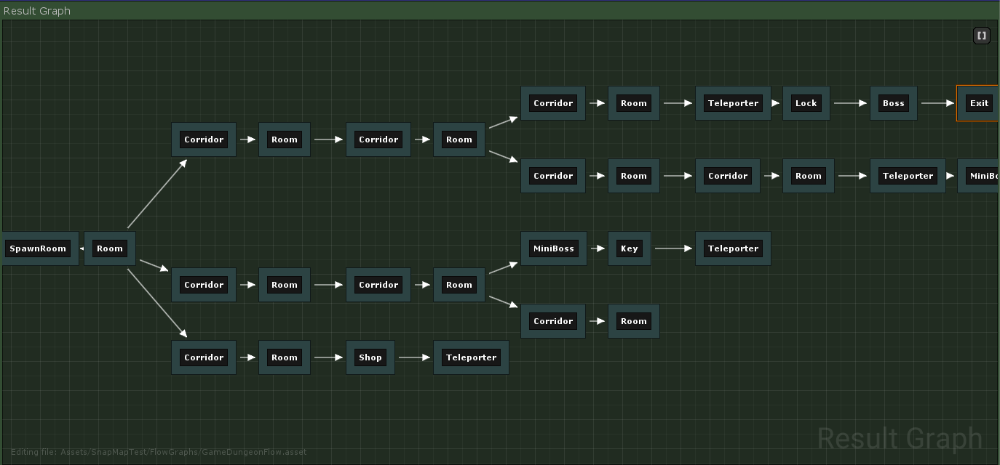

Assign the `Dungeon Flow` assets to the DungeonSnap game object

Hit `Build Dungeon`.  Randomize the seed and get different configurations that satisfy the layout graph you defined in the flow asset.  Change the Dungeon Flow graph and experiment further

Explore the Sample for a more complex and complete dungeon map with multi key-lock system, treasure rooms guarded by miniboss, exit guarded by a Boss room which requires a key to unlock

Location: `DungeonArchitect_Samples\DemoBuilder_Snap\Scenes\DemoScene`

