A Snap Connection tells DA how to stitch the room modules together.  They are usually the Door Entry / Exits.

The connection also contains references to two assets, a references to a Door prefab and a reference to a Wall prefab.

If DA stitches another module through that connection point, it would place the specified Door prefab in that place. Otherwise it would fill up the gap with the specified Wall prefab

Design a new Connection prefab by creating an emtpy Game Object

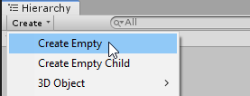

Reset the transform of the newly created emtpy Game Object and rename it

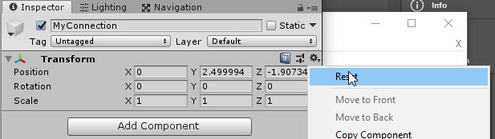

Add a SnapConnection script to it

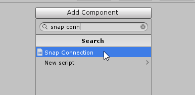

This script takes references to the above two mentioned prefab references, one for door and another for wall

Drop your Door and Wall prefabs under the Connection prefab

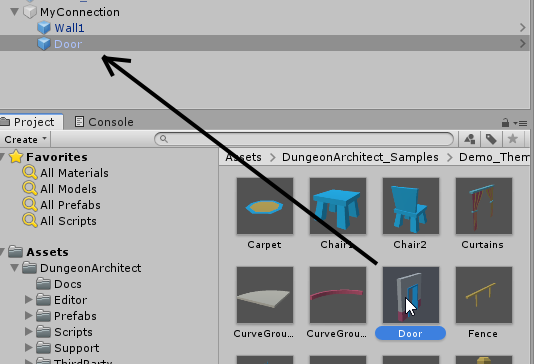

Align the door and wall prefabs so the Red line is perpendicular to it

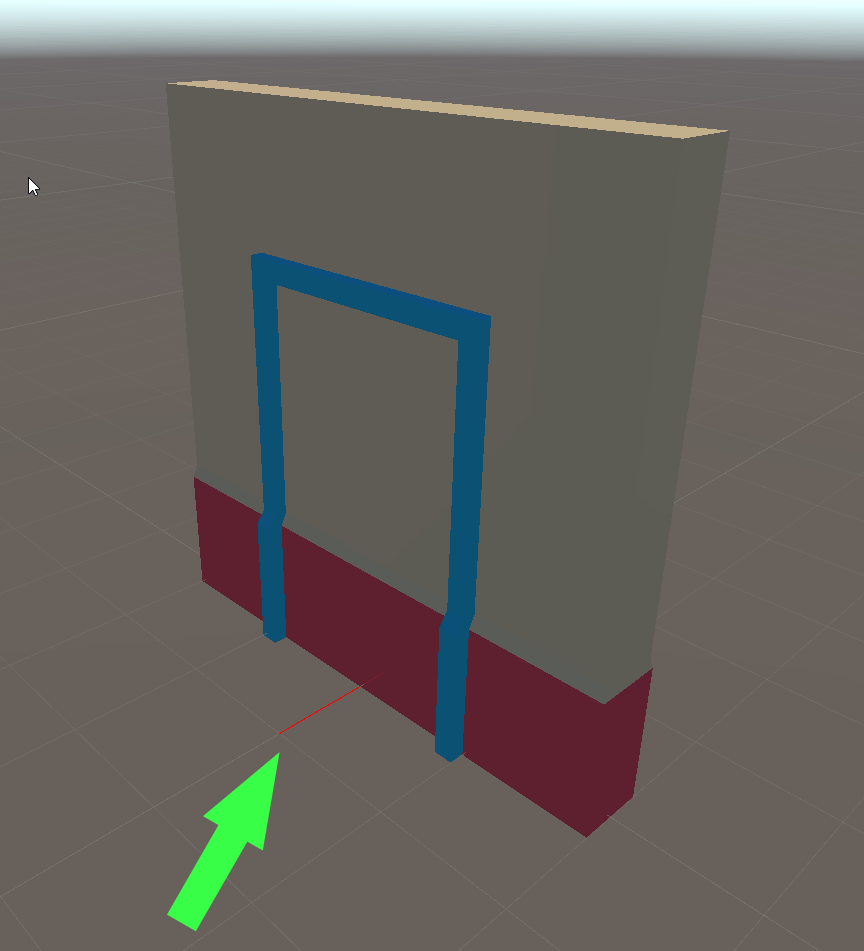

Now set these child door / wall prefab references on the SnapConnection script

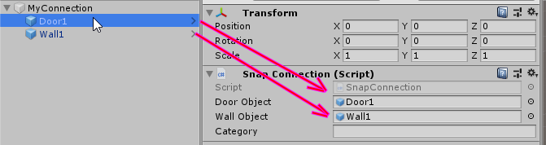

Your connection is ready.  Turn this into a prefab so we can reuse this in our modules

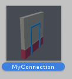

Drag and drop the connection prefab on your previously generated modules. Make sure the red line points outwards from the opening

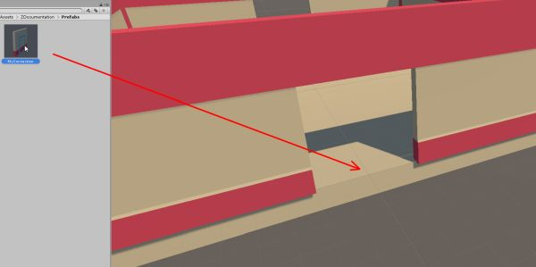

Make sure the red line is pointing outwards and is on the edge of the module bounds

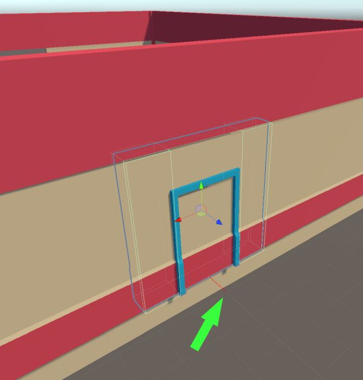

> It is a good practice to design with the snap settings (Edit > Snap Settings > Snap All Axis)

Repeat by drag-dropping on all the door openings.   Do this for all the other modules as well (like the corridor module)

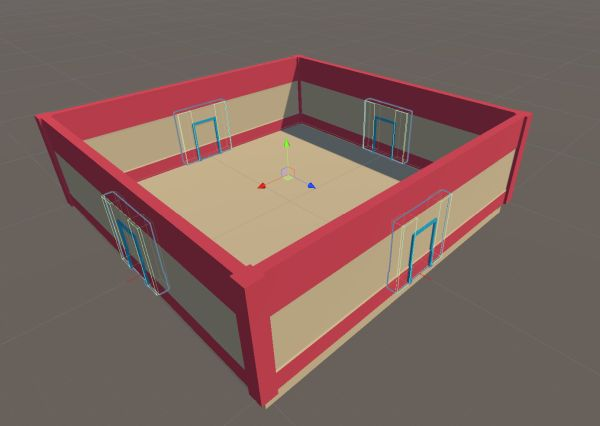

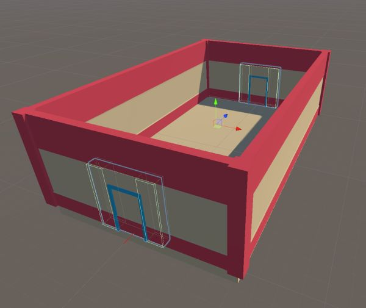

Save/Update your module prefab
