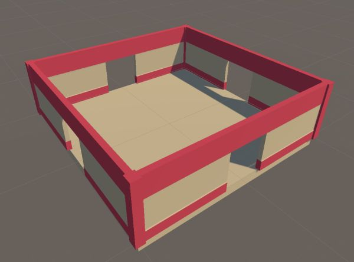
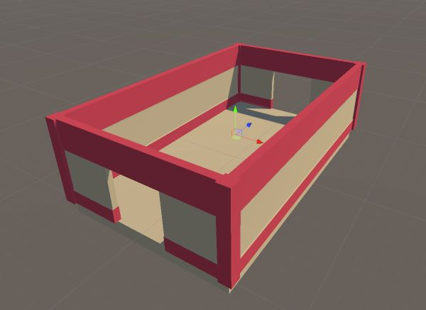

A module is a prebuilt prefab of a area (like room, corridor etc)

Design a room in the editor so we can turn it into a prefab for use with the snap builder

We've left holes at places where we want a possible door.   We'll place a special Connection prefab later at these places to let Dungeon Architect know that it can stitch the rooms from these points

Go ahead and create a few more module prefabs. We've created one for a corridor below

