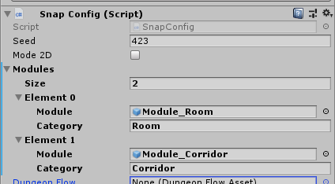

Register your modules in the `DungeonSnap` game object so Dungeon Architect can use it to build the dungeon

Inspect the DungeonSnap Game Object

Here we've registered the two modules and assigned a Category to them (e.g. Room, Corridor, TreasureRoom,
MiniBoss, MainBoss, SpawnRoom, Exit etc).

You can have multiple module prefabs assigned to the same category.    These categories are used in the Dungeon Flow
graph to design a procedural layout graph for your dungeon
