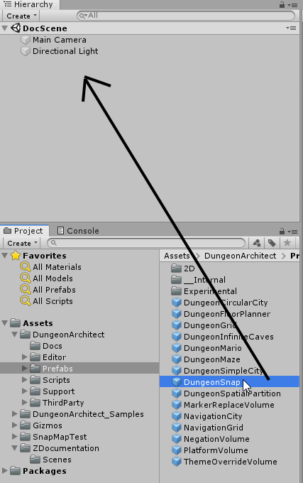

# Setup Snap Dungeon

The Snap Builder generates a dungeon by stitching together pre-built rooms prefabs.   The rules for stitching them is controlled by Graph Grammars

In this page, we'll walk through the creation process.

## Preparing the Scene

Create a new scene and drop in a Dungeon Snap game object.  This will allow you to build snap dungeons

