A `Connection` is a stitching point that the Snap framework uses to join rooms together.  A connection contains a reference to a Door asset and a Wall asset.  

If two rooms are stitched together through this stitching point, a door will be displayed in that position,  otherwise the empty space will be walled off by the specified Wall asset

## Create a Connection Asset

Create a new `Snap Connection` asset in a folder 

`Create > Dungeon Architect > Snap Grid Flow Builder > Snap Connection`

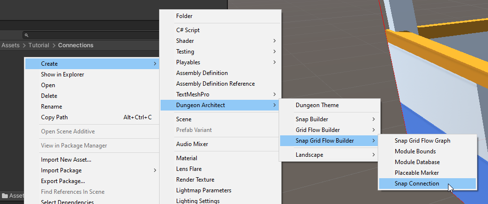

This will create a snap connection prefab asset that you can open and customize

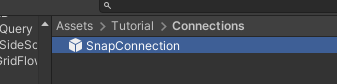

## Customize Connection Asset

Select the newly created snap connection asset and click `Open Prefab` from the inspector tab

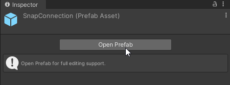

After you've opened the snap connection prefab, you'll see that it is setup like this:

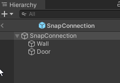

You will place your wall assets under the `Wall` game object and the door assets under the `Door` game object

Dungeon Architect will take care of automatically showing the appropriate game object (wall or door) and hide the other one

### Setup Wall Asset

In this example, we'll use a simple cube as a wall.   Create a new cube mesh from the create menu

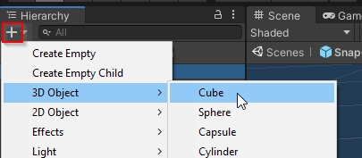

Parent this cube under the `Wall` game object.  

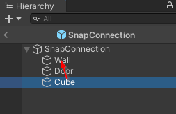

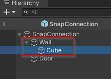

We need the wall to be 4 units wide and 5 units tall (to cleanly cover up the gap we created in our modules previously)

Select the cube mesh and set the scale to `(4, 5, 1)`

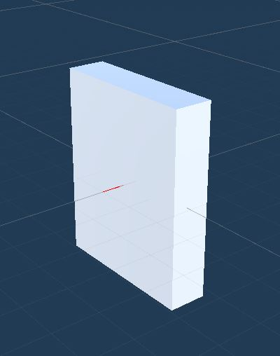

The wall should be moved appropriately so that:
* The red line is at the bottom-center of the wall
* The wall should be behind the red line's origin point

Move the wall up and a bit back by setting the location to `(0, 2.5, -0.5)`

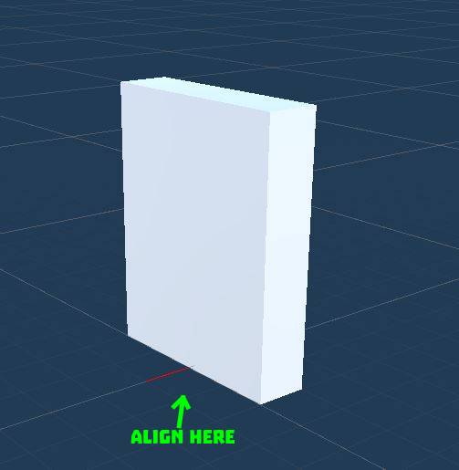

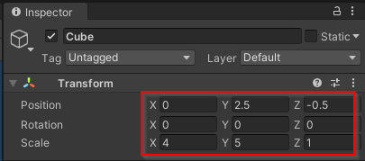

### Setup Door Asset

There's a simple Door prefab that comes bundled with the samples.   We'll use that here, however, feel free to use your own door prefabs

Navigate to `Assets\CodeRespawn\DungeonArchitect_Samples\DemoBuilder_GridFlow\Art\Prefab` and drop in the `DoorLarge` prefab under the `Door` game object

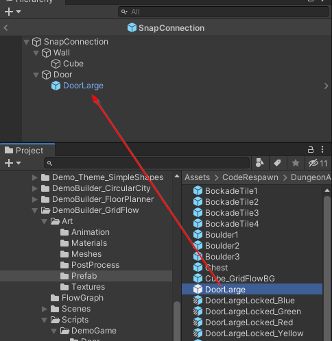

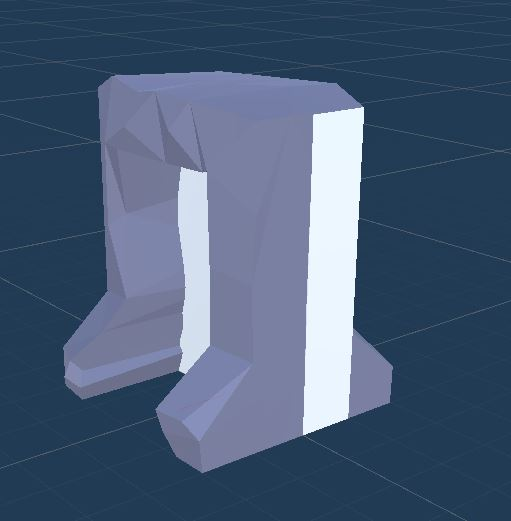

Go ahead and hide the `Wall` game object. Dungeon Architect will take care of making it visible where needed

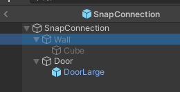

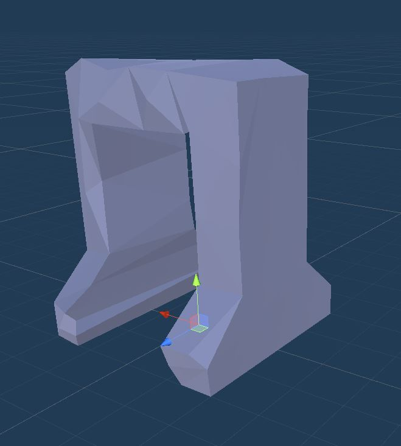

:::warning
You may safely hide the main `Wall` or `Door` game objects but do not hide what is underneath it.   For example, do not hide the `Cube` or the `DoorLarge` game objects
:::

The rules for aligning the door with the red line are a bit different 

You should move the door asset so that:
* The red line is at the bottom-center of the door
* The origin point of the red line should be at the center of the door

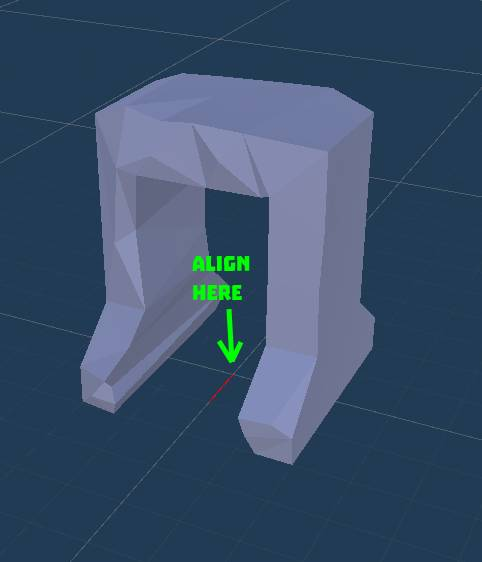

Our door prefab is already of the correct size (5 units tall and 4 units wide) and the pivot is in the right position.  So reset the transform of the `DoorLarge` game object

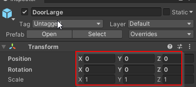

You'd want your door asset to be twice as thick as the walls.  This is because when two adjacent modules are stitched together, we have two walls from each modules and a door that is twice as thick as the walls will cleanly fill up the gap

### Setup One-way Door Asset

Some doors will be promoted to one-way doors.  This is done so that the player doesn't bypass a locked door and
enter through another nearby door.  You'll need to provide a door prefab that opens only from one way

Right now, the snap connection is setup to support a `Door` and a `Wall`.    We are going to add support for a one-way door.   

1. Create a new game object and name it `OneWayDoor`.  This should stay alongside the `Door` and the `Wall` prefabs

   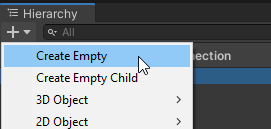

   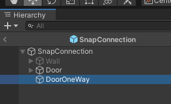

2. Select the `DoorOneWay` game object and reset the transform

   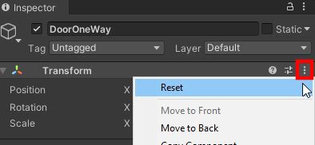
   
   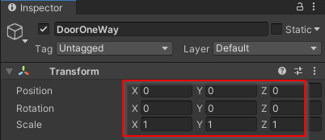

3. Let the SnapConnection know that this game object represents a one-way door.   Select the root SnapConnection game object and inspect the properties

   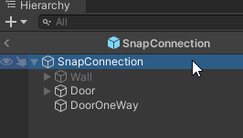

   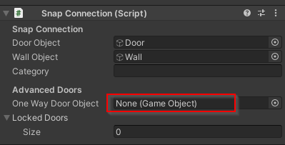

   We'll assign our newly created `DoorOneWay` game object here

   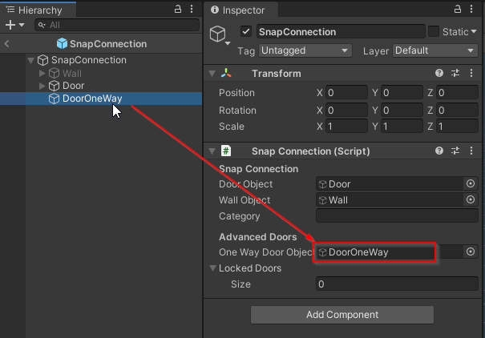

We can now place our one-way door assets under this.  Navigate to `Assets\CodeRespawn\DungeonArchitect_Samples\DemoBuilder_GridFlow\Art\Prefab` and drop in `DoorLargeOneWay` prefab as shown below

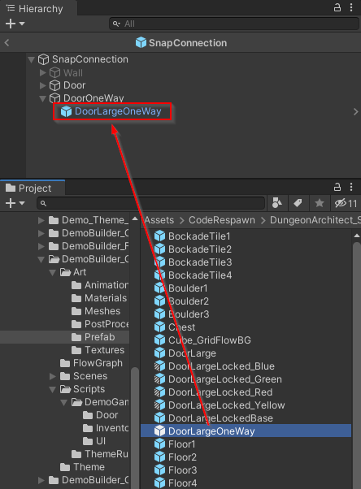

The alignment rule of a one-way door is similar to a door.  The direction in which we are allowed to go through the door should follow the red line outwards

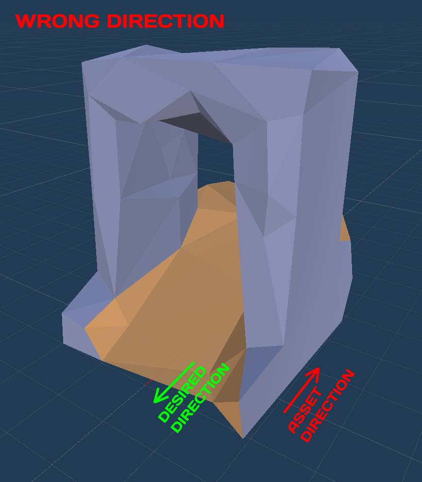

Reset the transform of the asset and rotate it along Y by `180` degrees since it is facing the wrong way

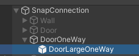

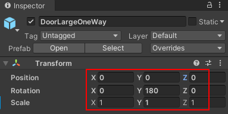

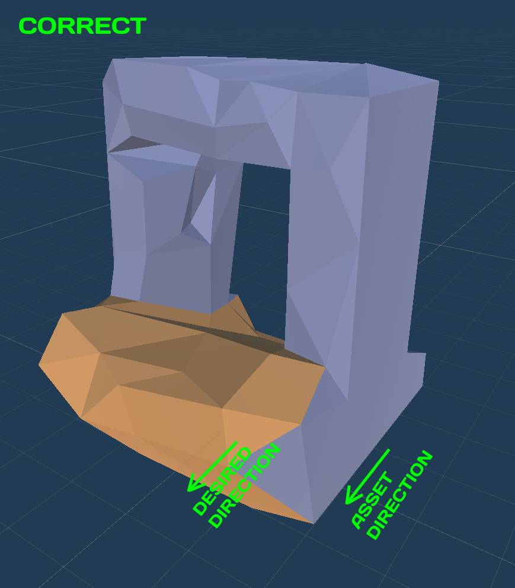

Hide the `Door` and `DoorOneWay` game objects

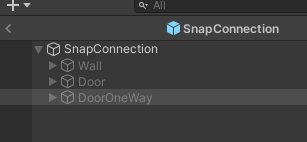

> Make sure you hide the outermost object, namely `Wall`, `Door` and `DoorOneWay`

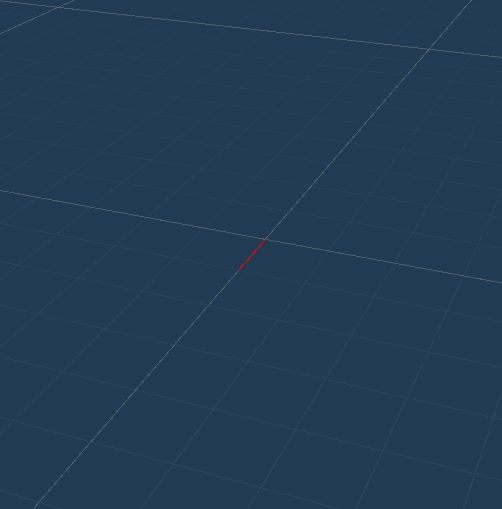

Our snap connection is now complete and we are ready to place them in our snap modules

Exit out of the snap connection prefab and return to the scene by clicking the `Scene` button on the viewport

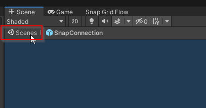

## Place Connections on Modules

It's now time to use this snap connection on our modules

Open up the `Room_1x1A` module prefab we created earlier

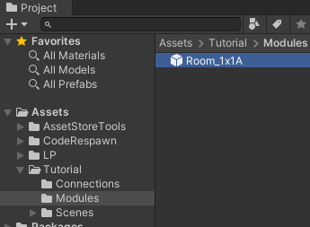

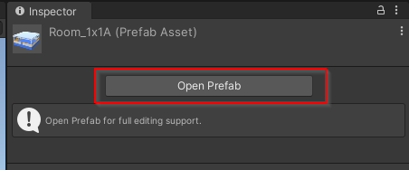

Open the `Grid and Snap` window so we can align our snap connections correctly. Navigate to `Edit > Grid and Snap Settings`

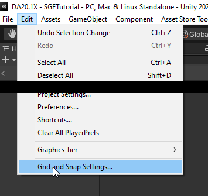

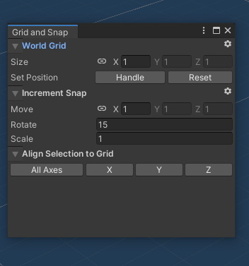

Move over to one of the doors in the module prefab

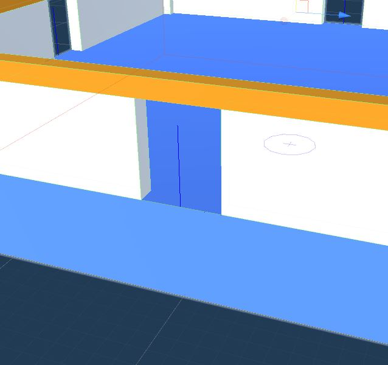

Drag and drop the snap connection and align the snap connection origin point in the blue door position.   Make sure the red line points outward

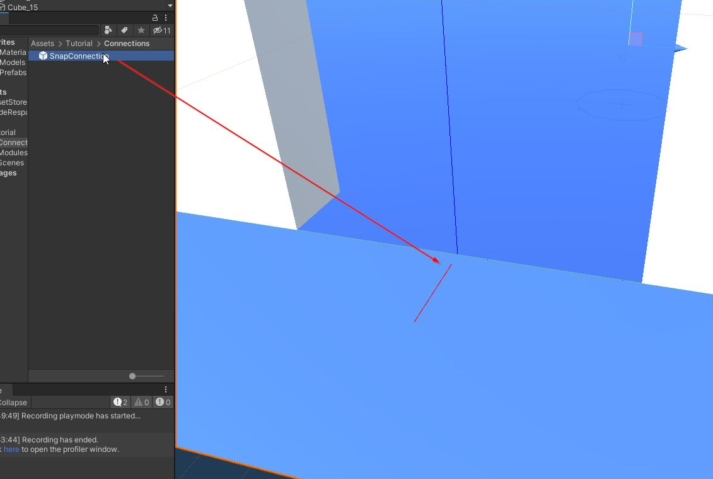

The position and rotation might be off by a slight margin.   Select the snap connection actor and click `All Axes` button on the Grid and Snap window and it should cleanly snap at the door position

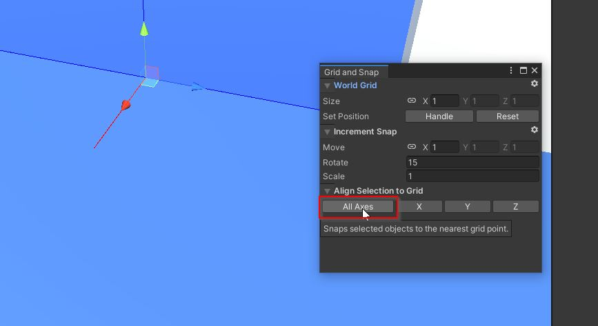

Repeat this for all the 4 door openings

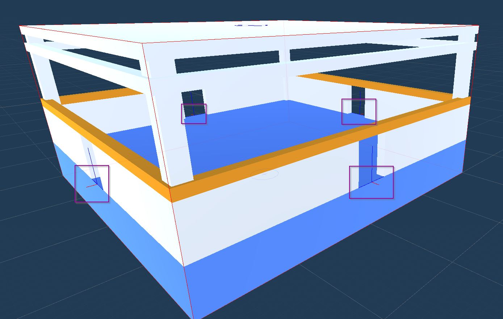
