We're going to create a spawn room and place a marker there to spawn our player prefab

## Spawn Room

Create a spawn room module like before and leave a few connection points open

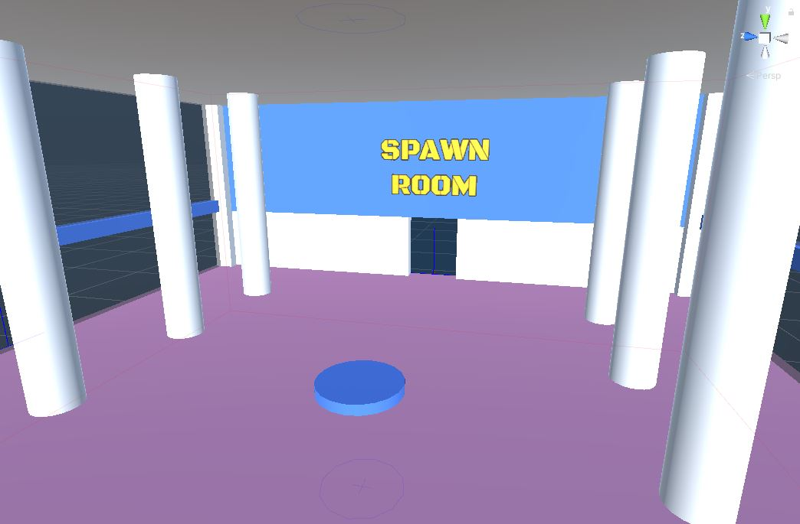

In this example, we've created a `1x1x1` spawn room with a single connection point

### Create SpawnPoint Marker

We want the theme engine to spawn our player prefab in the spawn room.  Create a placeable actor asset named 
`PM_SpawnPoint`

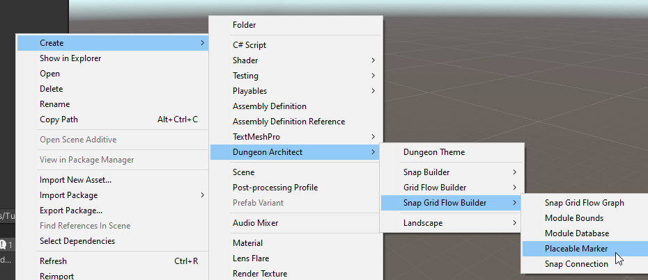

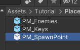

Select the `PM_SpawnPoint` asset and inspect the properties. 

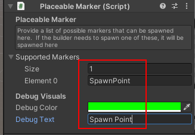

* Add a marker named `SpawnPoint` in the *Supported Markers* array
* Change the debug color to green
* Set the debug text to something descriptive, like `Spawn Point`

> We set the marker name to `SpawnPoint` because this is what was specified in the flow graph's `Create Main Path` node
> 
> 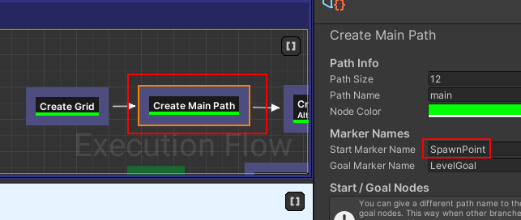

Save and placeable marker prefab

### Add SpawnPoint Marker

Open the Spawn Room module prefab and drop this placeable marker asset somewhere appropriate

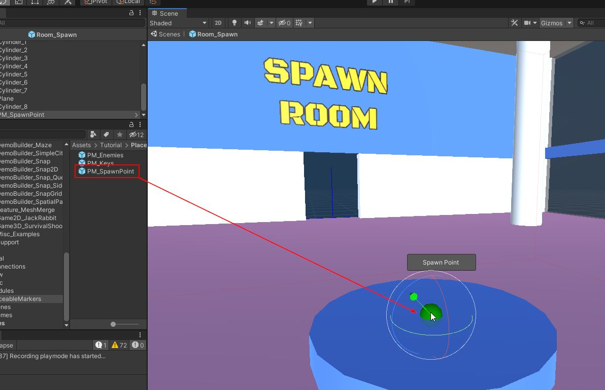

Close the prefab and return to the scene

### Add Player prefab

Open the theme file we created previously.

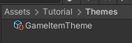

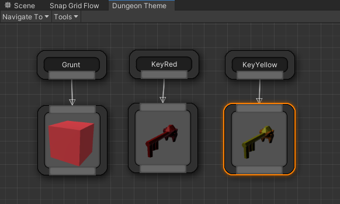

Create a new Marker node and rename it to `SpawnPoint`

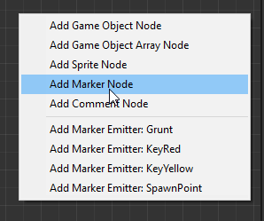

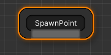

Add a player prefab. We already have a player prefab setup with some fps controls.  Drop it from the samples folder
Navigate to `Assets > CodeRespawn > DungeonArchitect_Samples > DemoBuilder_SnapGridFlow > Art > Prefabs > Player` and drag-drop `SGFDemoPlayer` on to the theme editor

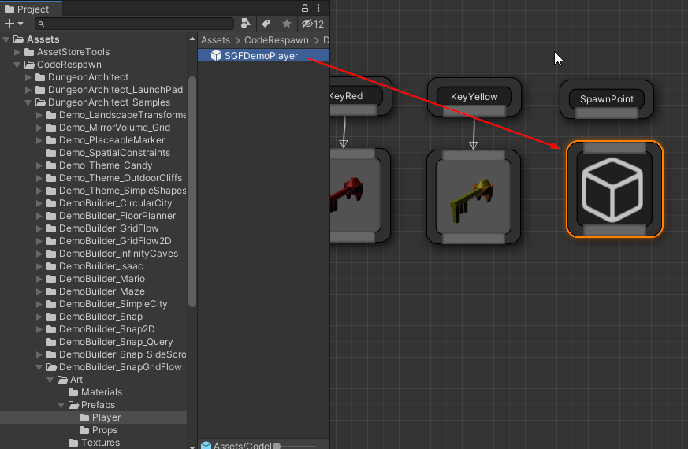

We want the player prefab to spawn 1 unit high (since the placeable markers was placed on the ground)

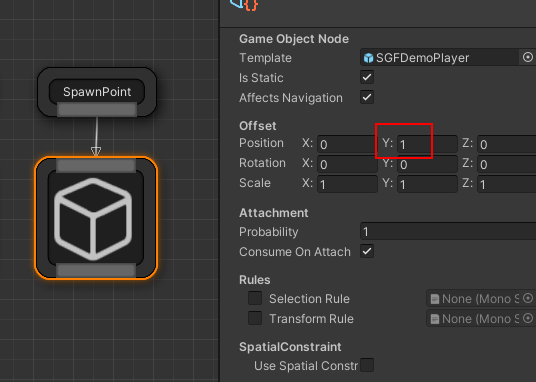

Save and close the theme editor

### Register Spawn Module

Open up the module database and register this spawn room module

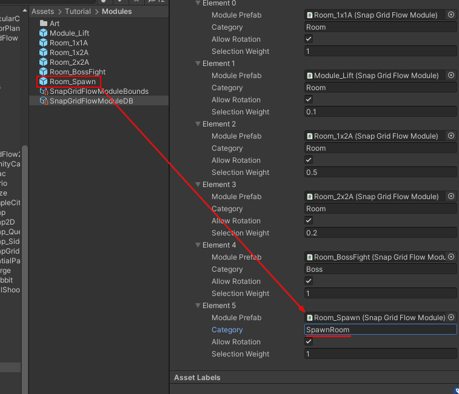

Set the category name to `SpawnRoom`.    We'll use this category name in the flow graph shortly, to force it to
use our spawn room while building the main path

Recompile the module database cache

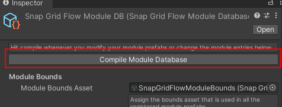

Save the module database

### Update Flow Graph

Open up our flow graph editor and reassign the Module database in the Editor Settings as before

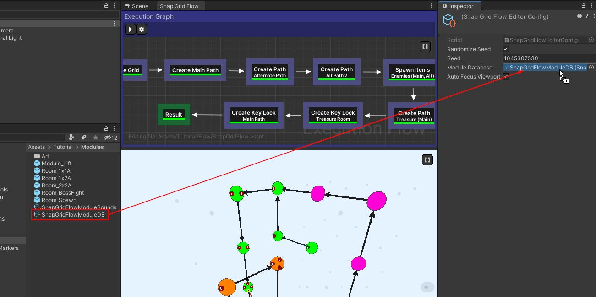

Select the `Create Main Path` node and inspect the properties

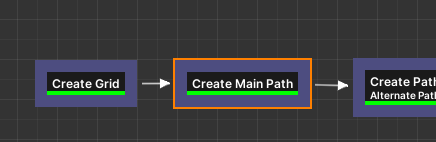

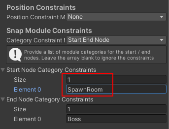

Add an entry to *Start Node Category Constraints* and set it to `SpawnRoom`.

This will make the flow editor choose the start room registered in the module database with the specified category. As 
of now, we have only one spawn room, feel free to register more modules with the same name to have 
it randomly pick one spawn room

Hit build in the flow editor and make sure it generates a flow graph correctly

## Goal Room

Open up the Goal room prefab we created earlier

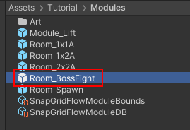

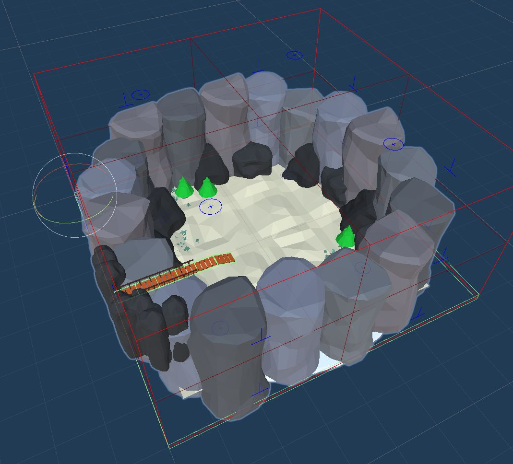

We'll create a placeable marker prefab that supports the marker name `LevelGoal`.   We'll then use the theme engine to spawn our level goal prefab (e.g. it could be an artifact that takes you to another dungeon)

> This step is optional and you can skip this section if you don't want to spawn the Level Goal prefab from the theme engine. You may directly place  the level goal object inside the goal room module

### Create LevelGoal Marker

Create a Placeable Marker asset and name it `PM_LevelGoal`

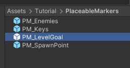

Inspect the properties.  Add `LevelGoal` as a *Supported Marker*

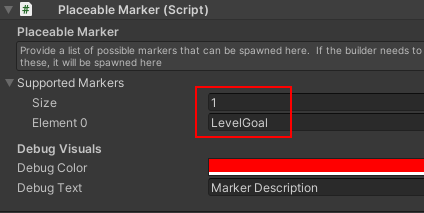

Change the *Debug Text* to something descriptive 

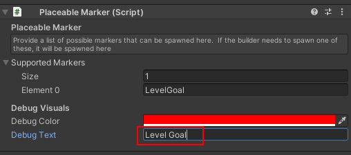

> We created a marker with the name `LevelGoal` since this is what we specifed in the flow graph's *Create Main Path* node
> 
> 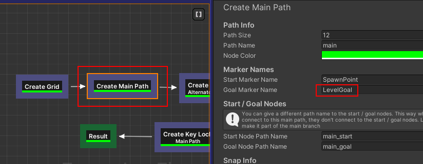

### Add LevelGoal Marker

Add the `PM_LevelGoal` marker to the goal module. Drag and drop it somwhere appropriate in your goal module

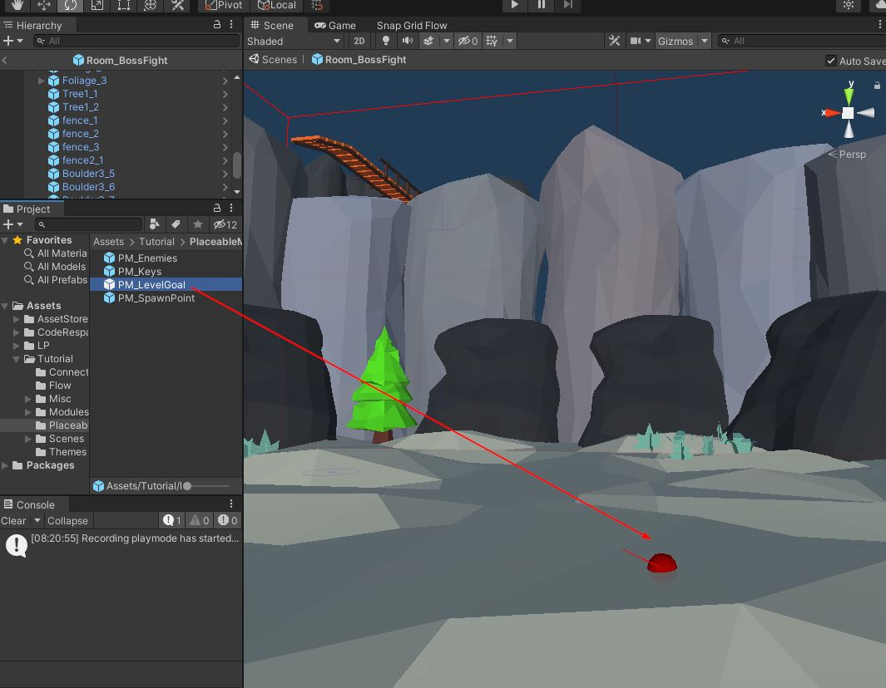

Close the goal room prefab and return back to the scene

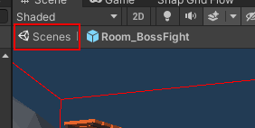

Since we've modified the markers in the module prefab, we'll need to recompile the module database cache

Open the module database and click `Compile Module Database` button

### Add LevelGoal Prefab

Open the theme file we created previously.

Create a new Marker node and rename it to `LevelGoal`

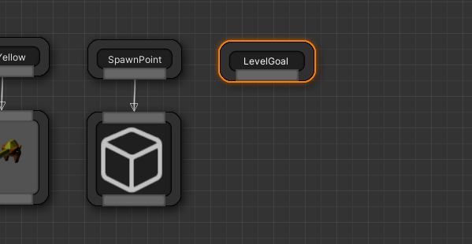

Add your level goal prefab here. We'll use a simple cube for this example that will represent the final boss

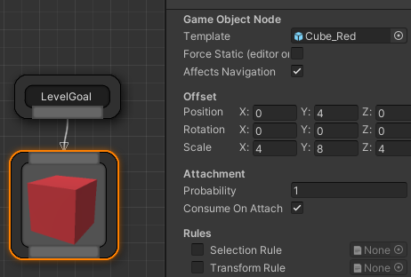

## Build dungeon

Open the scene where we previously [set up](sgf-build-dungeon.md) our dungeon.  Rebuild the dungeon

You should see the spawn room, and a `PlayerStart` actor spawned at the correct place

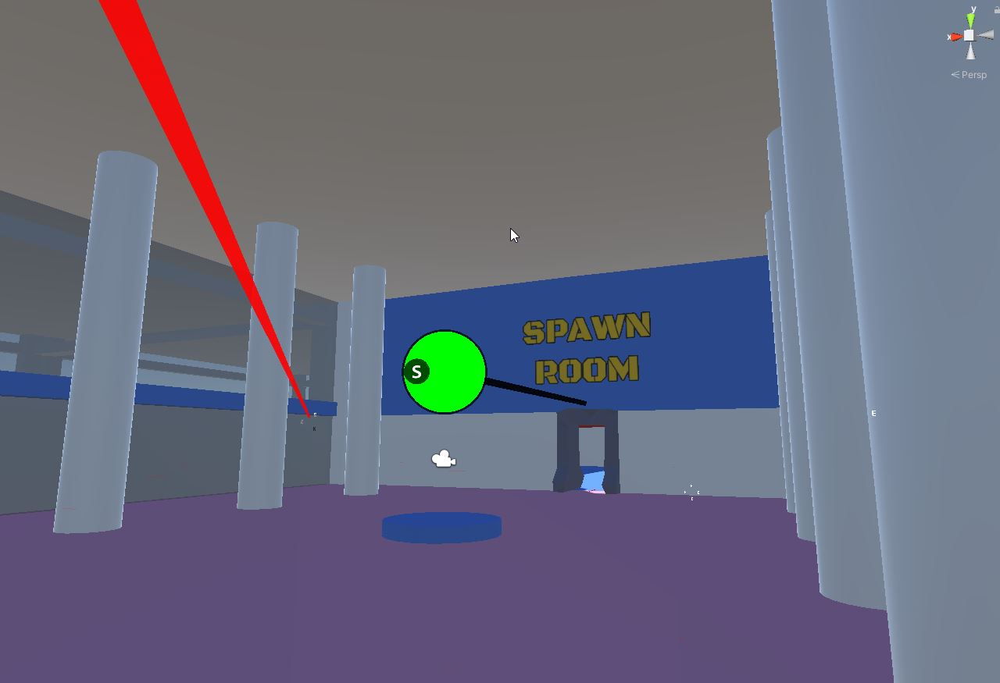

You should be able to play your game and move around with the player prefab

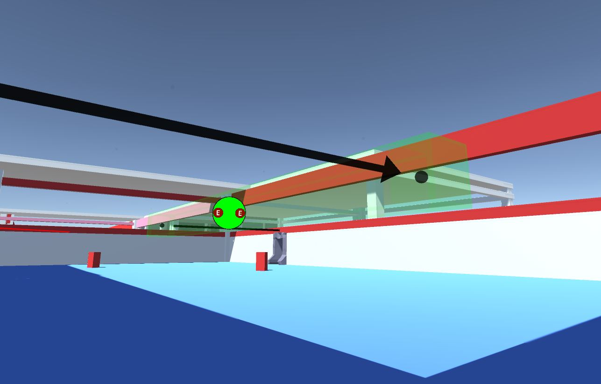

Level Goal prefab:

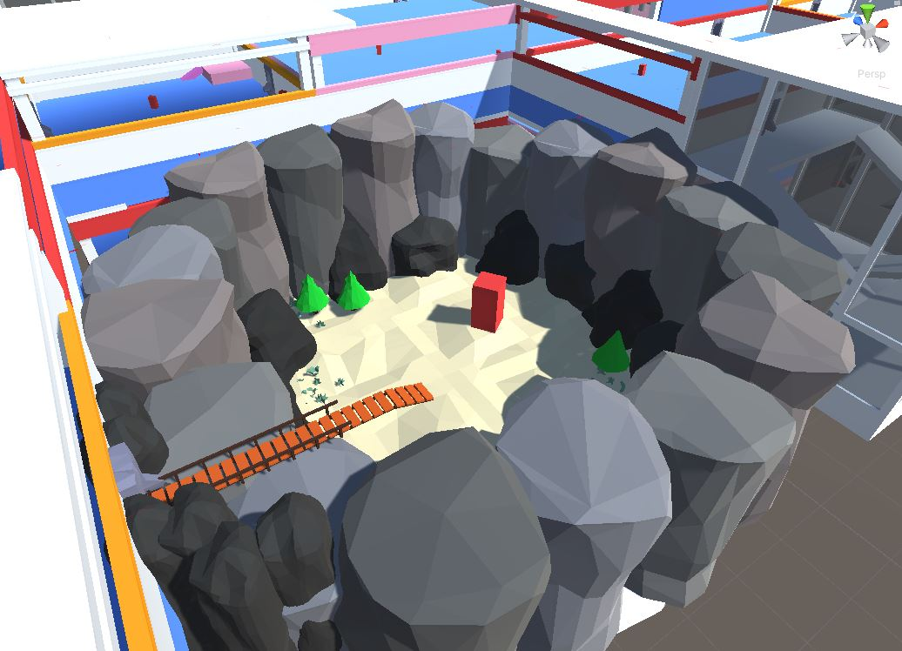
