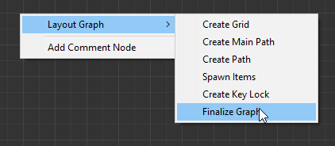
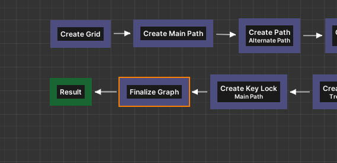
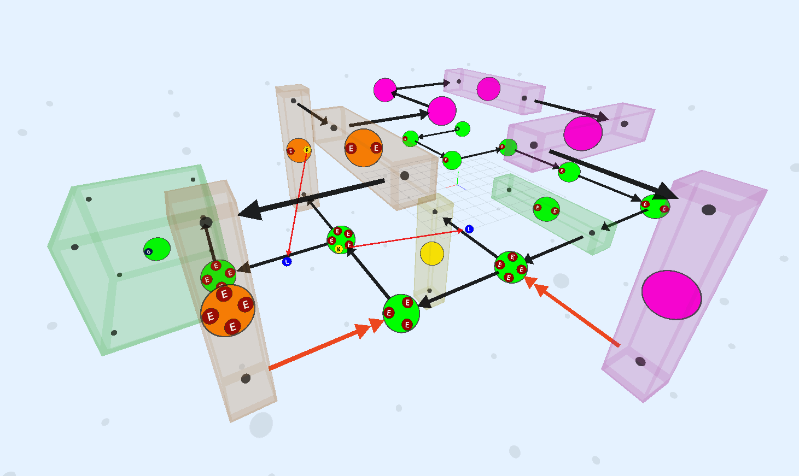
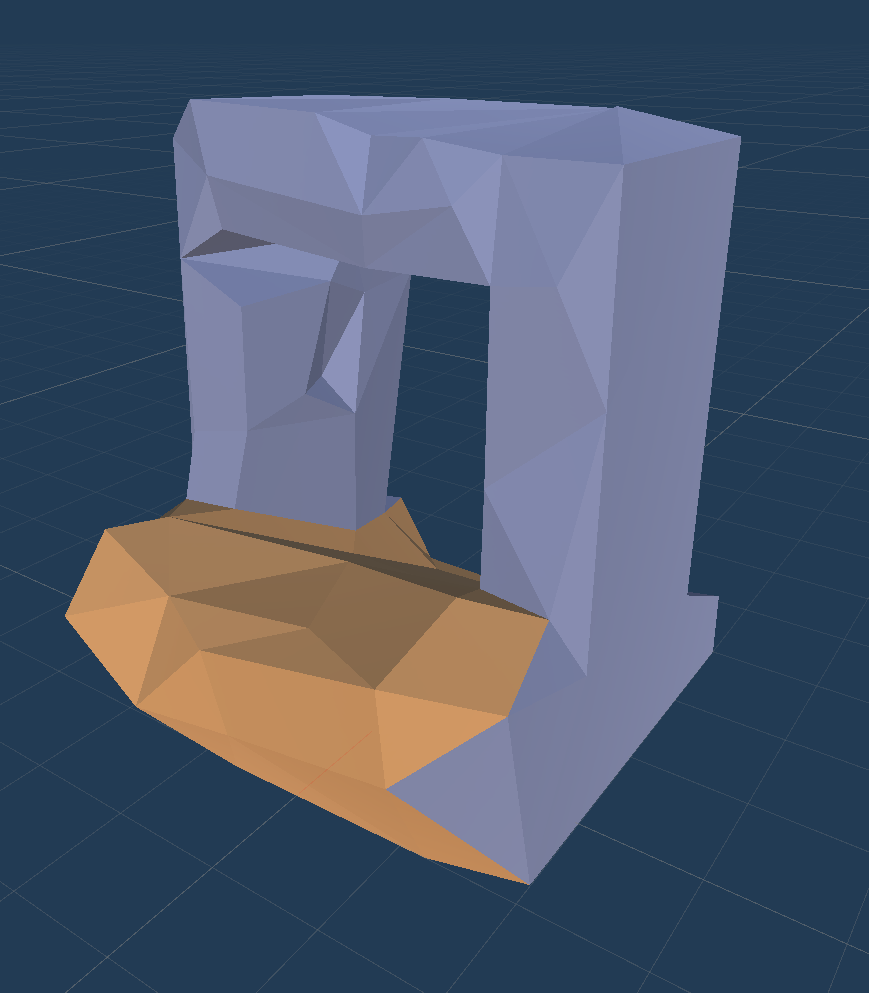
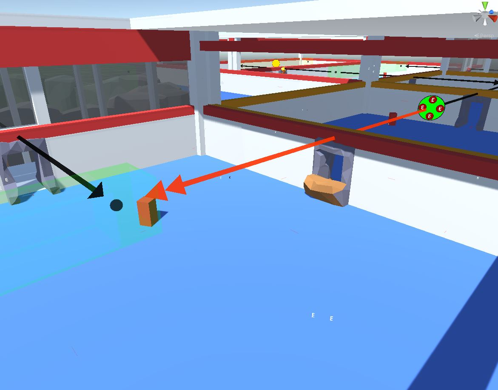
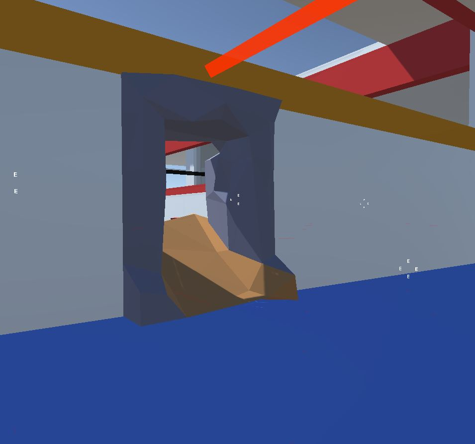

The final node of your flow graph design should always be the `Finalize Graph` node.  This node does the following:
* Strategically promote some doors to `one-way` doors.  This is done to keep the player from bypassing locked doors
  by entering from another nearby door. This may also be done to keep the player from entering another 
  path from the opposite direction. It will always create a playable level
* Remove unused links from the layout graph 

## Add Finalize Node

Open the flow graph we designed earlier and add a `Finalize Graph` node

Link it before the `Result` node as shown below

Build the graph and have a look at the layout graph

The orange double head arrows indicate one-way doors

We have already specified a one-way door asset in the snap connection prefab [previously](sgf-connections.md#setup-one-way-door-asset)

This one-way door prefab will be used in those locations

## Build the dungeon

Open the scene where we previously [set up](sgf-build-dungeon.md) our dungeon.  Rebuild the dungeon

You should see one-way doors spawn where needed

---

We have now created a fully playable level and this wraps up our dungeon flow design.  Feel free to add more path or play around
with your own design

In the next section, we'll look at how to set up gameplay where we will build a random dungeon at runtime, 
move the player to the spawn room and have the player character (first person, third person etc) move around the map,
pick up keys, open locked doors and more
