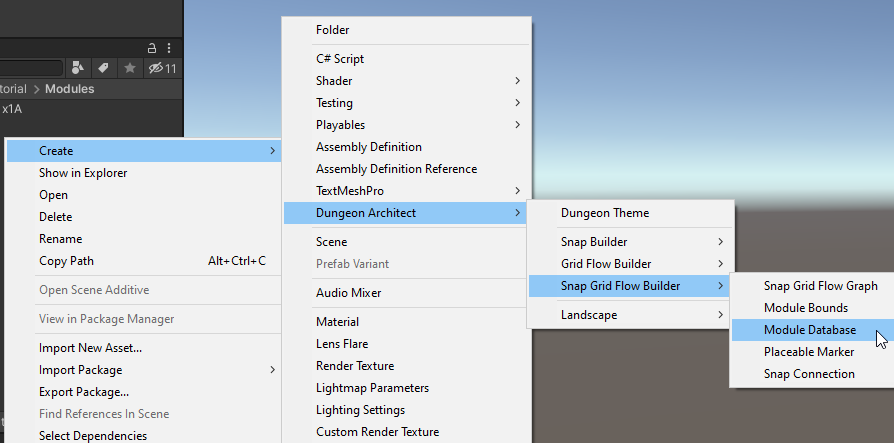
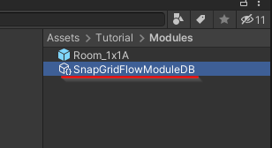
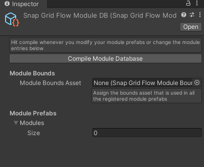
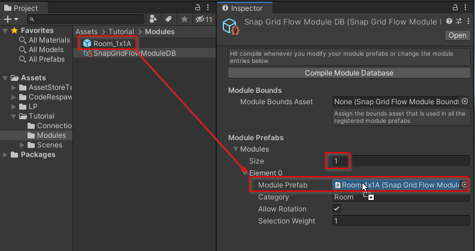
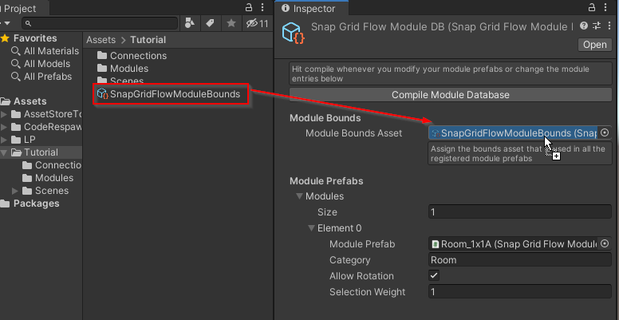
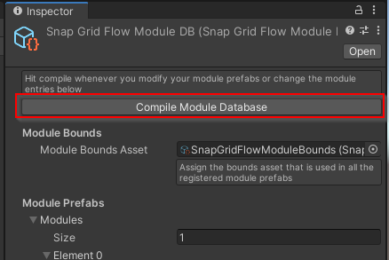

A Module Database is a registry of all the available modules that Dungeon Architect can use to stitch the dungeon

It also contains an acceleration structure with all the necessary information pre-calculated in the editor, so the 
stitching is fast at runtime

You may have different module databases to generate dungeons with different art styles 
(e.g. Sci-Fi spaceships, Medieval castles etc)

## Create a Module Database

We'll create a new module database asset and register the module that we created in the previous sections

1. Move to an appropriate folder and create a module database from the Create menu:

   

   

2. Select the module database and inspect the properties

   

3. Register your modules in the `Modules` array

   

4. You'll also need to provide the bounds asset that is used in all of the registered module prefabs

   

> All the modules registered under this module database should use this same bounds assets

5. Finally, Click `Compile Module Database` whenever you make any changes to either the module or the module database.   This will do some internal calculations in the editor so your dungeons can build fast at runtime

   

   :::warning
   This is an important step.  Do not forget to recompile the module database whenever you make any changes to it or the modules themselves
   :::
