A room is designed in a separate prefab, and it is called a `Module`

All Modules in the Snap Grid Flow builder have a fixed size called the `Chunk Size`. 
Your module size can be in mulitples of this size (e.g. you can create a taller room of size `1x2x1` 
or a bigger room `3x2x3`)  

## Module Bounds

Start by creating a `Snap Grid Flow - Module Bounds` asset.   You will assign the size of your modules 
here and use it while designing the modules

In the Projects tab, navigate to the desired folder and create the `Snap Grid Flow Module Bounds` asset 

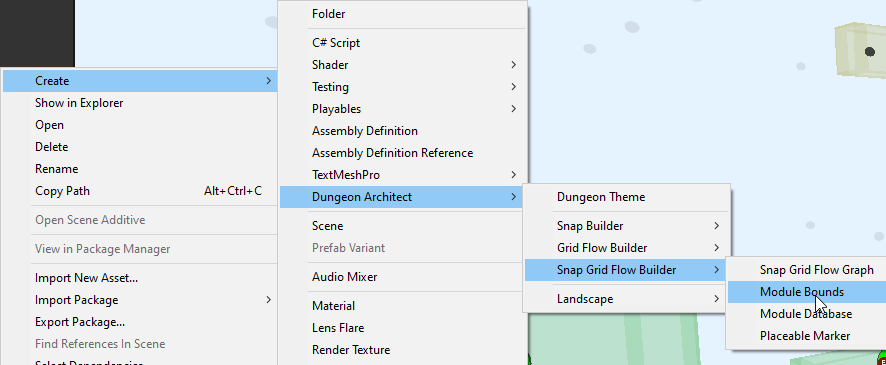

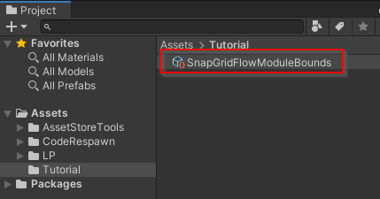

Double click the asset to open the editor
* Set the `Chunk Size` to something like `(40, 20, 40)`.  The `X` and `Z` has to be the same if you want your
  modules to support rotation. In this case, we've provided `40` for both
* Set the `Door Offset Y` to `5`.  

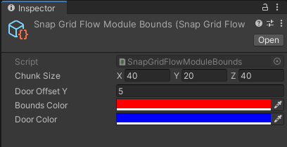

`Door Offset Y` determines how high the door is from the base of the module. It is a good idea to leave some gap, so you have space to create some pits or lower areas 

You'll use this asset on each of the module prefabs you design

## Create a Module

Modules are rooms that are designed and saved into a prefab.  We'll design a new room module prefab

* Create a new scene
* Create an empty game object and name it to `Room_1x1A`

  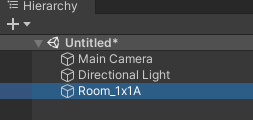

* Reset the prefab transform

  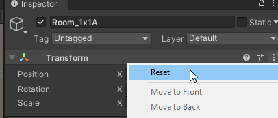

* Add the `Snap Grid Flow Module` component to it

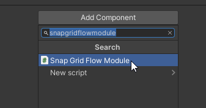

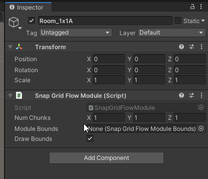

Assign the module bounds asset we created earlier

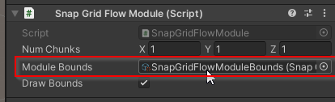

Your module prefab will now provide visual information that will help you design your room

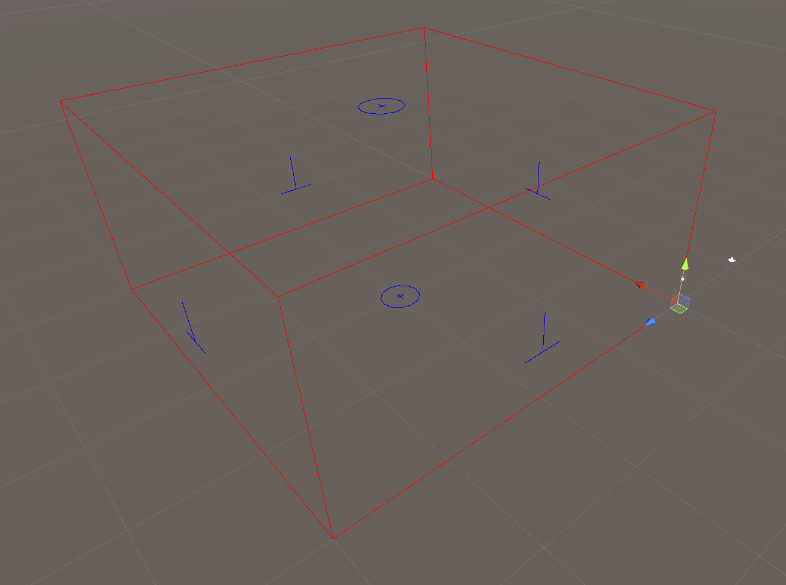

:::note
If you don't see the red lines, make sure the `Gizmos` button is pressed in the Scene View tab's toolbar

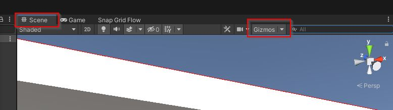
:::

The red wireframe indicates the bounds of your module.  You may fill this up in any way you like.

The blue indicators show the possible locations of the doors

Design your module inside the level bounds. 

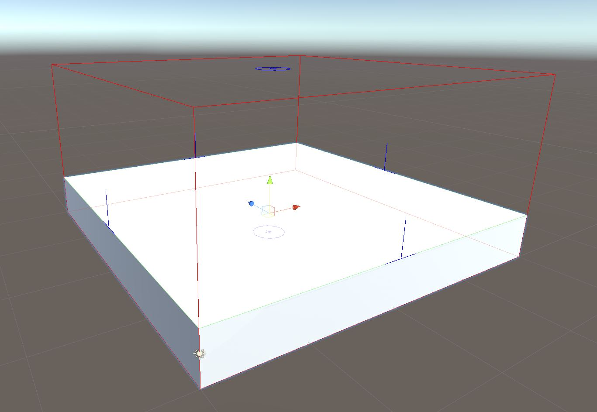

Note how the ground mesh was aligned to a height where it matched the door indicators (blue lines). 
These blue lines were previously configured to be 5 units above the module's base `(DoorOffsetY)`

Go ahead and design the rest of the room in any way you like

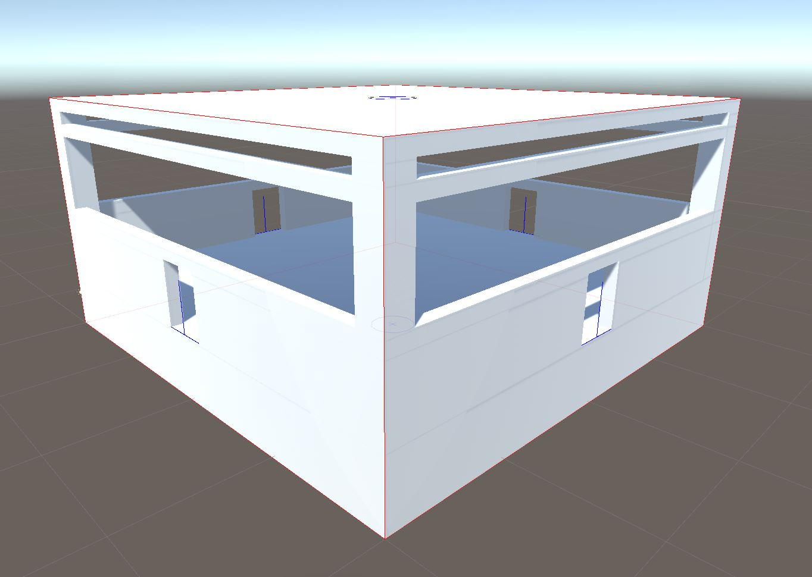

:::note
Make sure all your game objects are inside the module game object

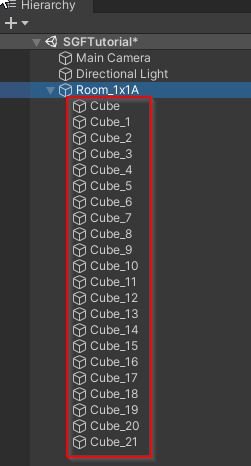
:::

In this simple example, we want to have doors on all the 4 sides.   A gap of `4 wide / 5 high` was left out at the
door openings.    Our door and wall assets will eventually be of this size to fill up the gap

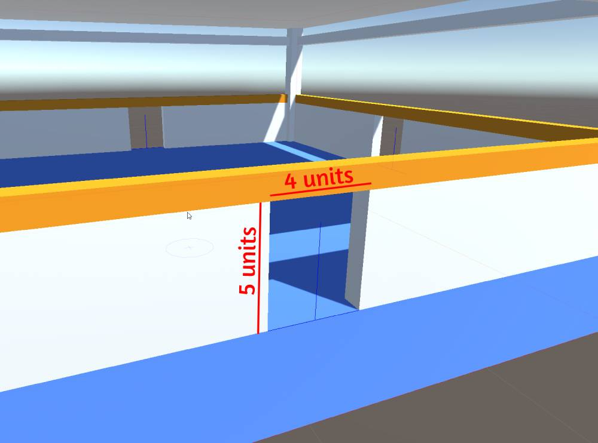

Do this for all the four doors

> While designing the rooms, it is always a good idea to use Grid snapping (`Edit > Grid and Snap Settings`)
>
> 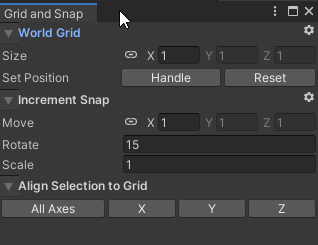
>
> More info on snap settings [here](https://docs.unity3d.com/Manual/GridSnapping.html)

> You can always turn off the module bound visuals (the red box) if it gets in the way.
> Do this by unchecking `Draw Bounds` in the `Snap Grid Flow Module` component
> 
> 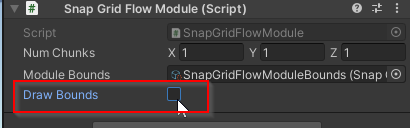

## Save as Prefab

Select the module game object `Room_1x1A` and save it as a prefab in some folder

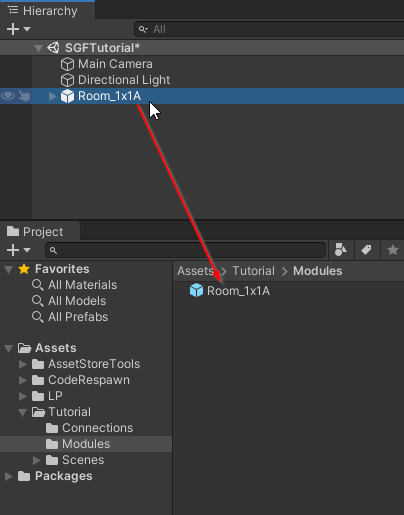

Now that we have it saved as a prefab, delete the module game object from the scene

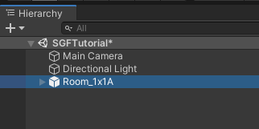

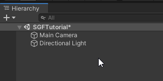

In the next section, we'll create a `Connection` and add it near the door openings
