Control the growth of your flow network using custom scripts. 

## Position Constraints

Use position constraints to control where the node grows.

### Example 1

We want to restrict the main path to the ground floor and have another path grow only on the top floor like this:

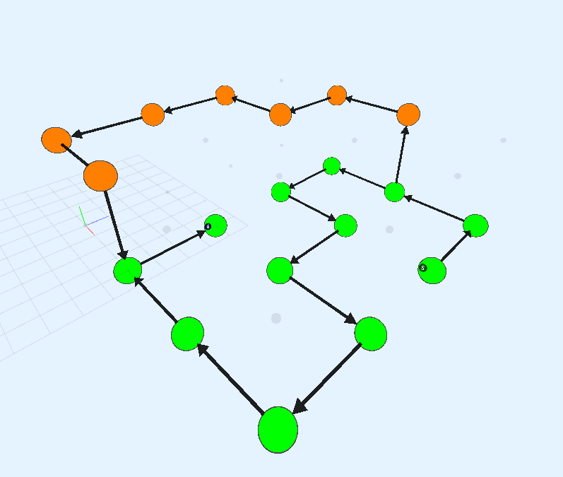


Start by creating a grid and a main path.  Without constraints, it grows anywhere on the grid

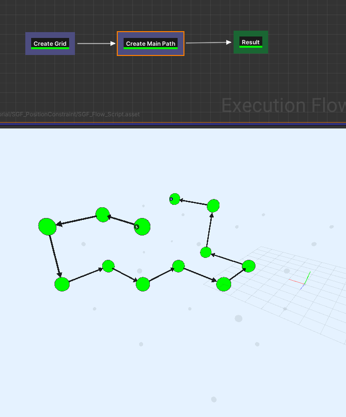


We'll restrict the growth to be only on the ground-floor.  Select the `Create Main Path` node and inspect the properties


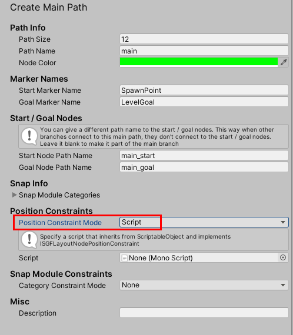

Set the `Position Constraint Mode` to `Script`.  

We can now pass in a script with our own rules and constraints for growing this path

Create a new C# script with any name and set it up like below:

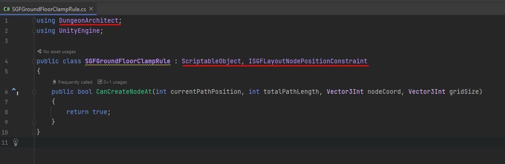

```c#
using DungeonArchitect;
using UnityEngine;

public class SGFGroundFloorClampRule : ScriptableObject, ISGFLayoutNodePositionConstraint
{
    public bool CanCreateNodeAt(int currentPathPosition, int totalPathLength, Vector3Int nodeCoord, Vector3Int gridSize)
    {
        return true;
    }
}
```

You can place your logic here and allow or disallow nodes at certain locations

> Since this is a `ScriptableObject`, Unity requires the filename of the script to be the same as the class name


We want the path to grow only on the ground-floor, so we return true only when the node coordinate's y component is 0

```c#
public bool CanCreateNodeAt(int currentPathPosition, int totalPathLength, Vector3Int nodeCoord, Vector3Int gridSize)
{
    return nodeCoord.y == 0;
}
```

Assign this script to the `Create Main Path` node

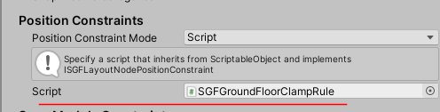

Hit Build

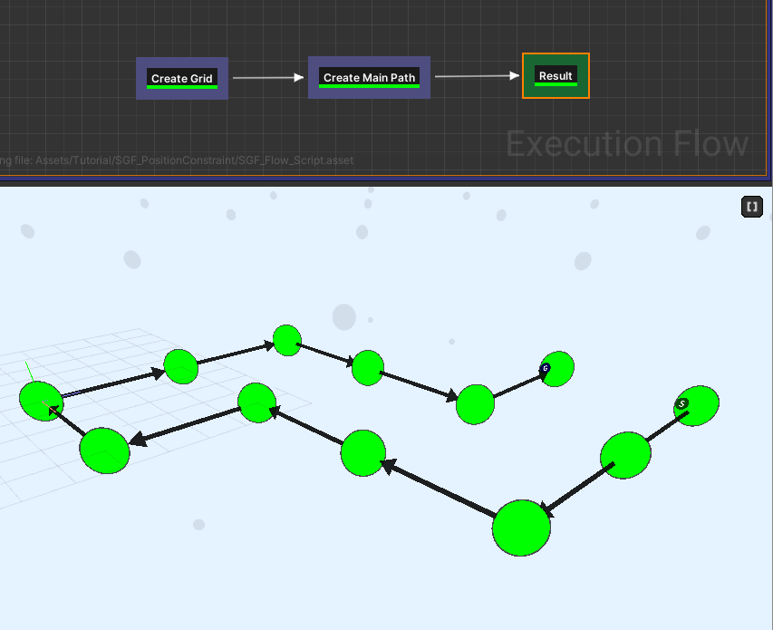


Create another path using the `Create Path` node

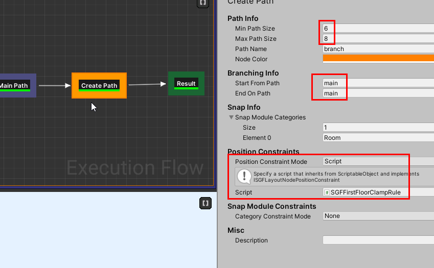

Add another script so this is restricted to the first floor

```c#
public class SGFFirstFloorClampRule : ScriptableObject, ISGFLayoutNodePositionConstraint
{
    public bool CanCreateNodeAt(int currentPathPosition, int totalPathLength, Vector3Int nodeCoord, Vector3Int gridSize)
    {
        return nodeCoord.y == 1;
    }
}
```


### Example 2

Create a Ring like structure like below:

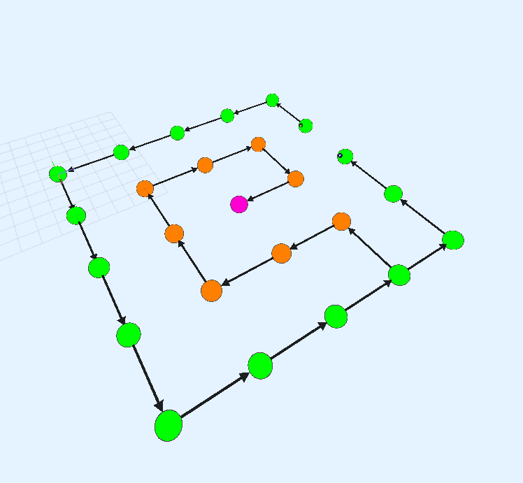


Start by creating a setup as follows:

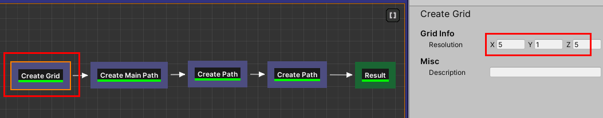

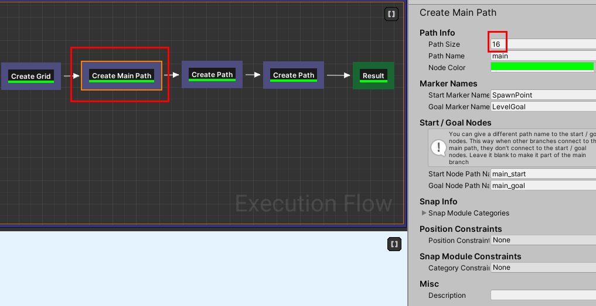

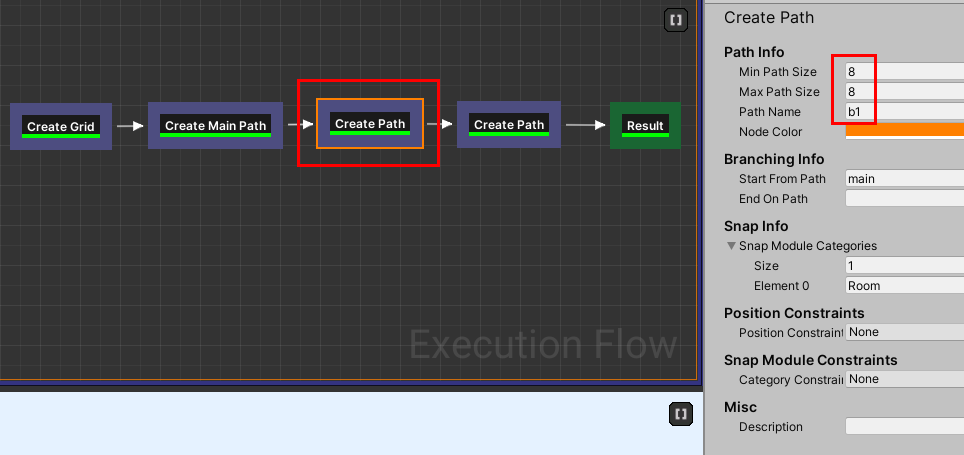

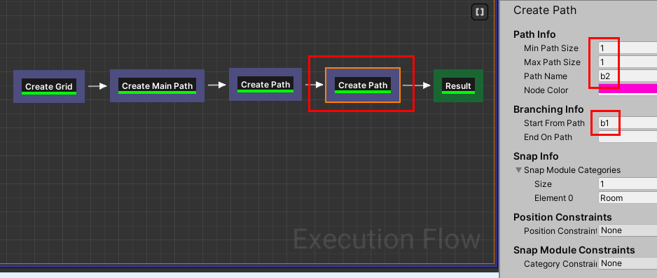

Run it and you see a graph generated like this:

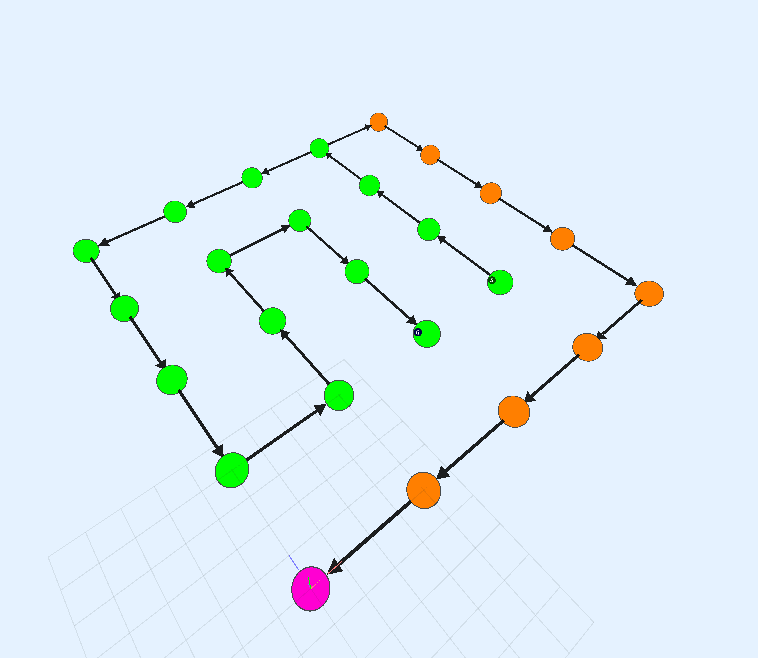

We'll now apply rules so the green path takes up the outer ring, the orange path the middle ring and the purple node in the center

#### Outer Ring

Create a script like below and attach it to the `Create Main Path` node's *Position Constraint*

```c#
using DungeonArchitect;
using UnityEngine;

public class SGFPosConstRingOuter :  ScriptableObject, ISGFLayoutNodePositionConstraint
{
    public bool CanCreateNodeAt(int currentPathPosition, int totalPathLength, Vector3Int nodeCoord, Vector3Int gridSize)
    {
        return nodeCoord.x == 0 || nodeCoord.x == gridSize.x - 1
            || nodeCoord.z == 0 || nodeCoord.z == gridSize.z - 1;
    }
}
```

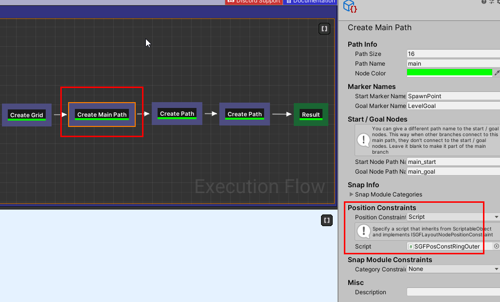

This will restrict the green path to the boundary

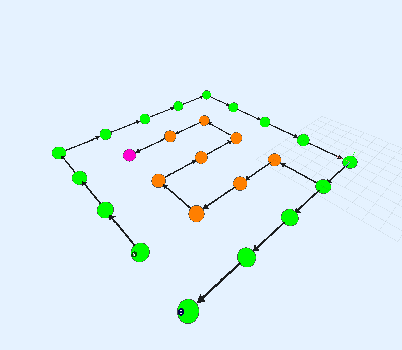


#### Middle Ring

Create another script as below and attach it to the first `Create Path` (orange) node

```c#
using DungeonArchitect;
using UnityEngine;

public class SGFPosConstRingMiddle :  ScriptableObject, ISGFLayoutNodePositionConstraint
{
    public bool CanCreateNodeAt(int currentPathPosition, int totalPathLength, Vector3Int nodeCoord, Vector3Int gridSize)
    {
        return nodeCoord.x == 1 || nodeCoord.x == gridSize.x - 2
            || nodeCoord.z == 1 || nodeCoord.z == gridSize.z - 2;
    }
}
```

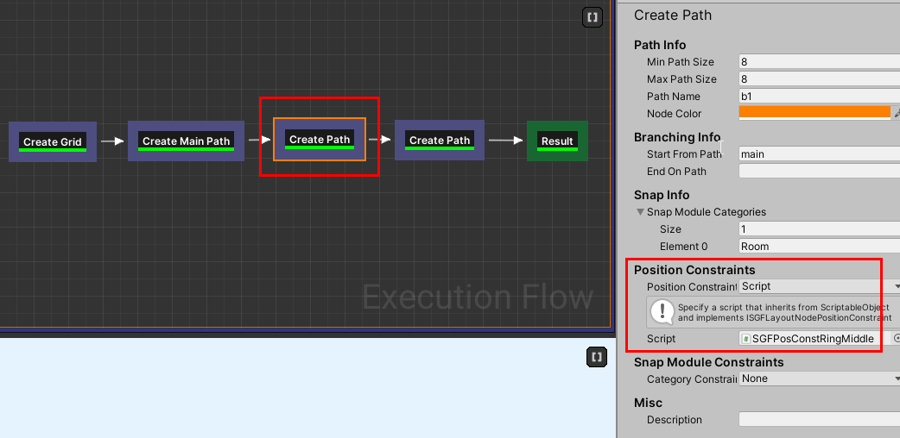


## Snap Module Constraints

Control the room modules that should be used in any of the path nodes.    By default, the room modules are defined in the 
`Snap Modules Categories` array of the *Create Main Path* and *Create Path* nodes.

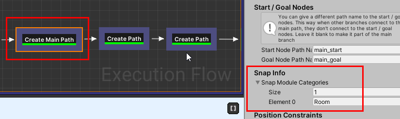


You can have more control on this and provide your own array for any of the nodes in the path using a snap module constraint script

Create a new C# script and set it up like below:

```c#
using DungeonArchitect;
using UnityEngine;

public class MySGFModConstraint : ScriptableObject, ISGFLayoutNodeCategoryConstraint
{
    public string[] GetModuleCategoriesAtNode(int currentPathPosition, int pathLength)
    {
        // Place a boss room in the last node
        if (currentPathPosition == pathLength - 1)
        {
            return new string[] { "Boss" };
        }

        // Use a shop or health room before the boss room
        if (currentPathPosition == pathLength - 2)
        {
            return new string[] { "Shop", "HealthFountain" };
        }
        
        // Use a large room for every alternate node 
        if (currentPathPosition % 2 == 0)
        {
            return new string[] { "RoomLarge" };
        }
        
        // use a normal room
        return new string[] { "Room" };
    }
}
```

Here we make the system spawn a Boss room in the last node of the path.  Before the boss room, we have either a shop 
or a health fountain room.  We show larger rooms on every alternate nodes and show normal rooms otherwise

Of course, you'll need to register your rooms with these names (`Boss`, `Shop`, `HealthFountain` etc.) in the module database,
so it can pick one up from the list

Assign to the `Create Main Path` node

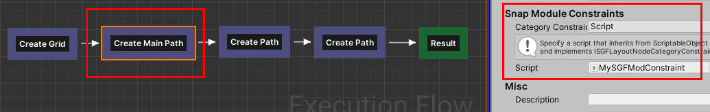
