In this section, we'll add a few key-locks to our dungeon using the flow framework

Open up the flow graph and assign the module database like before

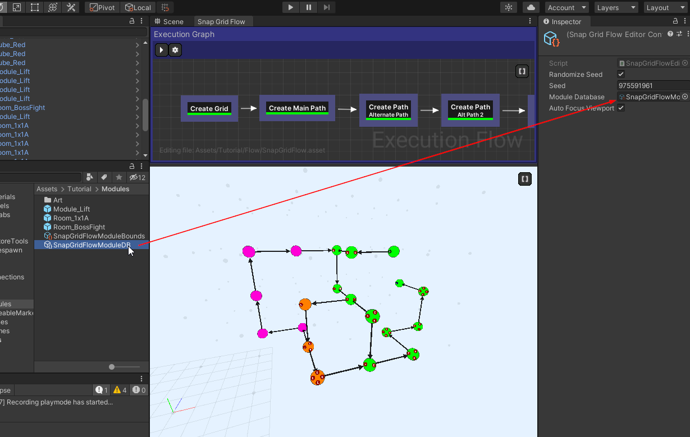

## Create Treasure Room

We'll create a treasure room that is attached to the main path.  We do this by creating a new path (of length 1)
that emits out of the `main` path

Add a new `Create Path` node and link it to the end as shown:

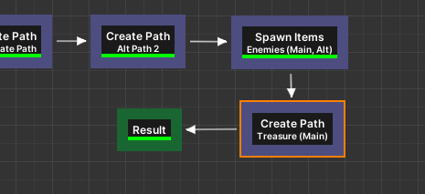

Select the node and inspect the properties

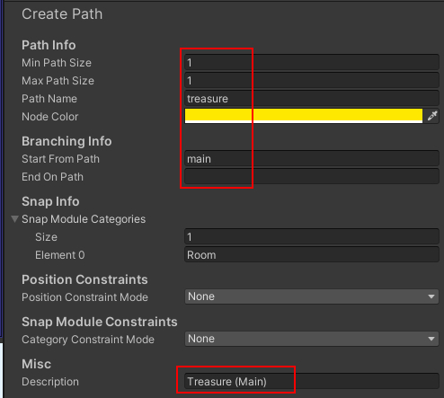

* Set the Min/Max size to `1` since we want a single room to hold the key
* Set the path name to `treasure`.  We'll use this id later to place a key here
* `Start from Path` is set to `main` so this room is connected to the main path
* We want the treasure room to be isolated and don't want it to converge back to another path.
  Leave the `End on Path` parameter blank
* Change the `Node Color` to anything you like

Hit `Build` and you'll see a new treasure room created

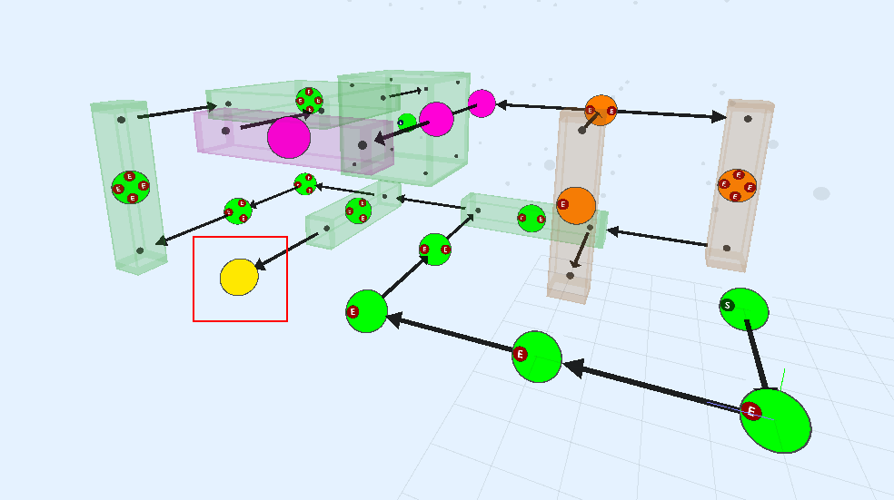

## Treasure Room Key/Lock

We want to lock the `treasure` room and have the key somewhere in the `main` path

Add a new `Create Key/Lock` node and link it to the end like shown below:

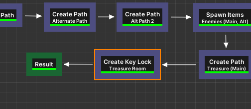

Select the `Create Key/Lock` node and inspect the properties

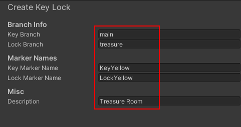

* `Key Path` - Since we want the key to be in the main path, set this to `main`
* `Lock Path` - Since we want to lock the treasure path, set this to `treasure`
* `Key Marker Name` - We'll use the **Theme Editor** to spawn the key prefab.  Set the maker name to anything you like, however 
  you'll need to create a corresponding marker node with the same name in the theme file to spawn the key prefab.
  For this tutorial, set this to `KeyYellow`
* `Lock Marker Name` - We'll use the **Snap Connection** prefab to spawn the locked door prefab. Set the marker name to anything you like,
  however you'll need to create a corresponding mapping in the snap connection to spawn the locked door prefab.
  For this  tutorial, set this to `LockYellow`

Hit `Build` and inspect the layout graph

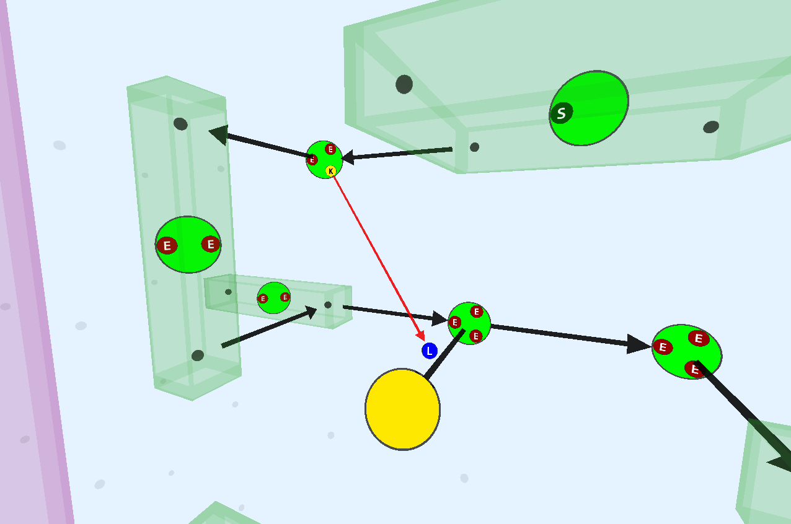

A blue lock item was created on the link that connects to the yellow treasure node. The key was placed somewhere in 
the main path (green).   The red arrow shows the key-lock relationship  

## Main Path Key-Lock

We'll create another key lock for the main path.  The key would be in the `alt` path (orange) and the lock would 
be somewhere in the `main` path (green).

Add a new `Create Key/Lock` node and link it to the end as shown below:

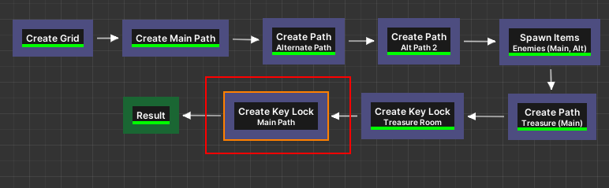

Update the parameters:

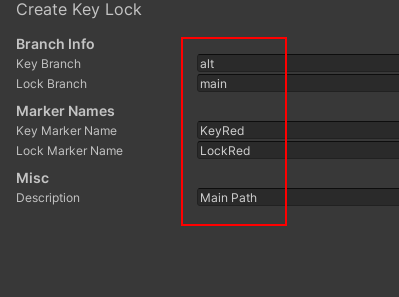

| Parameter        | Value     |
|------------------|-----------|
| Key Path         | alt       |
| Lock Path        | main      |
| Key Marker Name  | KeyRed    |
| Lock Marker Name | LockRed   |
| Description      | Main Path |

Hit `Build` and inspect the layout graph

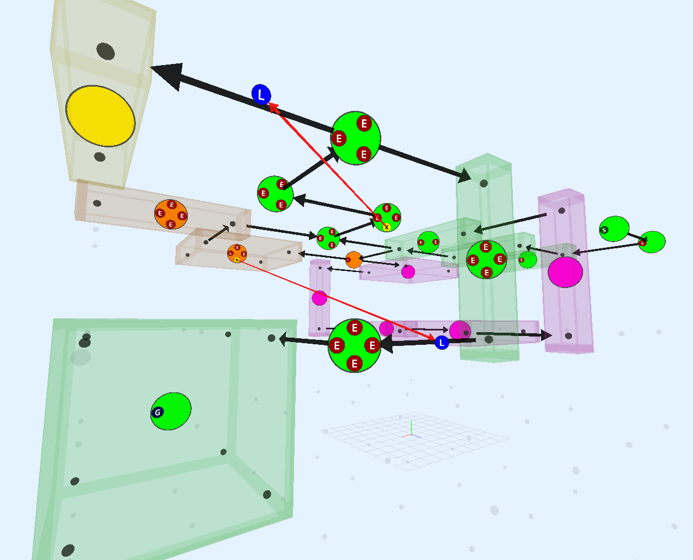

## Spawn Keys

### Setup Theme File

Open up the theme file we created earlier

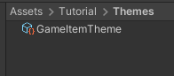

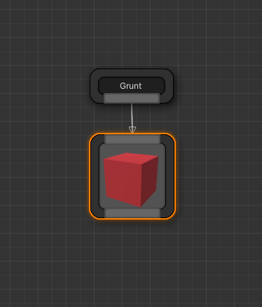

Create a marker node ane rename it to `KeyRed`

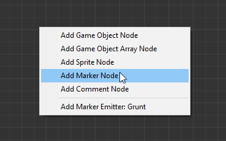

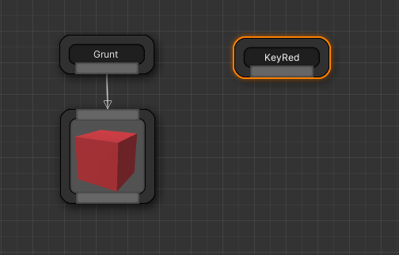

Create another marker node and name it `KeyYellow`

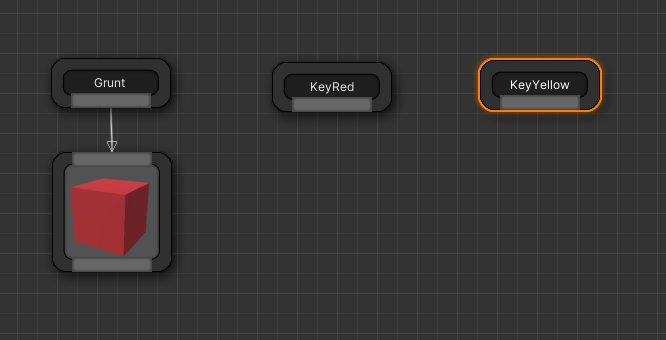

We'll place our key prefabs under these.  

> The maker names are case-sensitive. So make sure you capitalize them correctly

Navigate to `Assets\CodeRespawn\DungeonArchitect_Samples\DemoBuilder_GridFlow\Art\Prefab` and drop in the `KeySkull_Red` and `KeySkull_Yellow` prefabs on to the theme editor and link them up

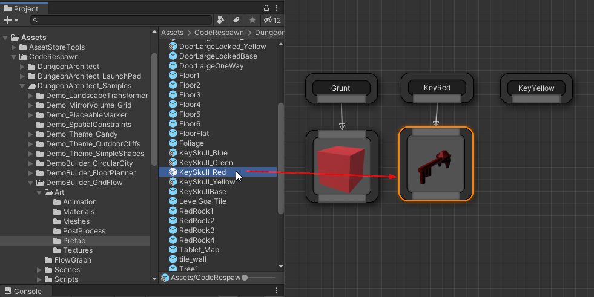

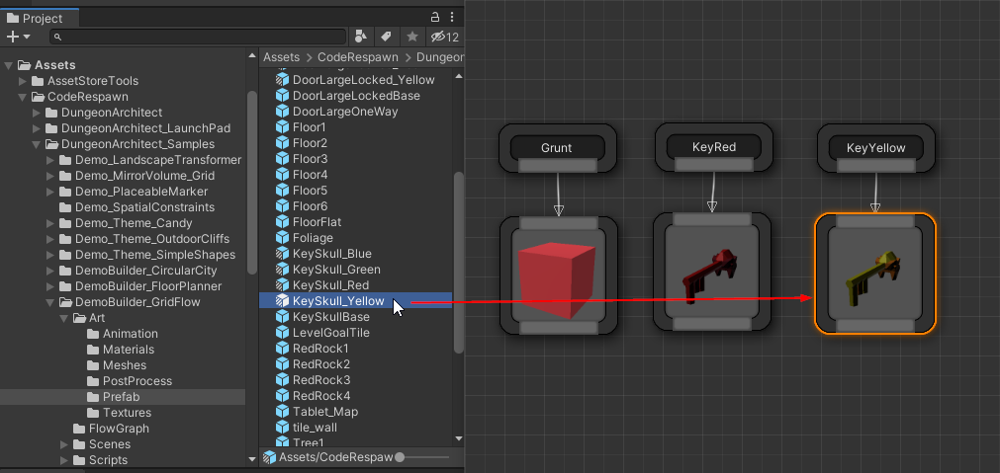

With this mapping, we've defined **what** key prefab to spawn.    Next, we'll create a placeable marker asset
to define **where** to spawn these inside the modules

### Create a Placeable Marker

Create a new placeable marker asset and name it `PM_Keys`

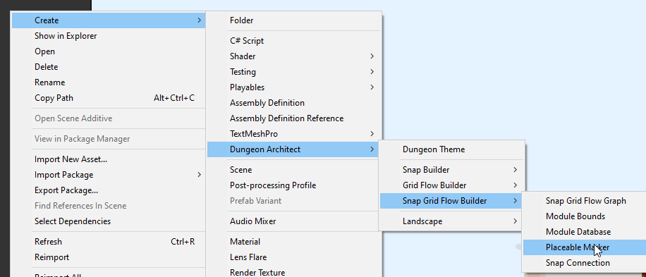

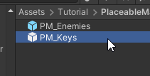

Select the `PM_Keys` asset and inspect the properties

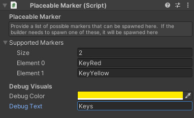

* Add two markers `KeyRed` and `KeyYellow`
* Set the *Debug Color* to yellow
* Set the *Debug Text* to `Keys`

### Place Key Markers

Open up all your room modules and drop in the `PM_Key` placeable marker asset, similar to what we've done with the
enemy placeable marker in the previous section

Drop in at least 2 of these in a room, in case if both the `Red` and the `Yellow` keys spawn in the same room

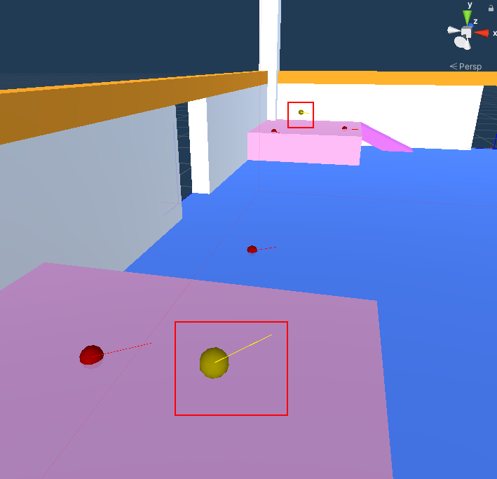

Either move this placeable marker game object up by 1 unit (so the key doesn't spawn buried half into the ground), 
or move the key up in the theme editor by selecting the key nodes and moving it up at Y by 1 unit

Add to the other room modules as well

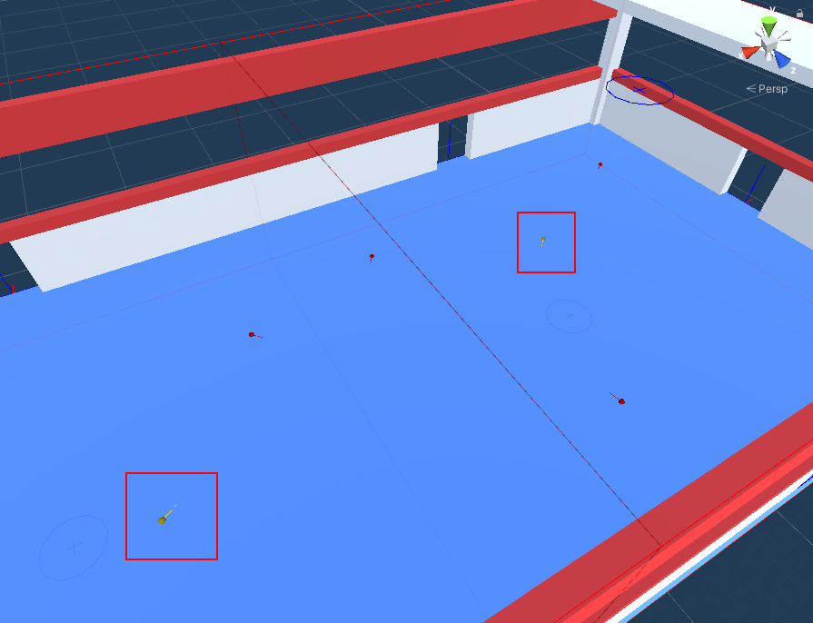

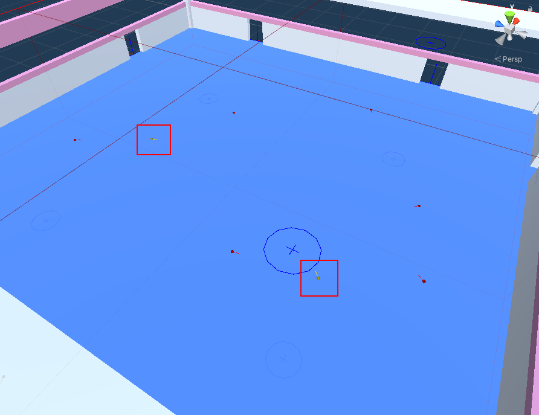

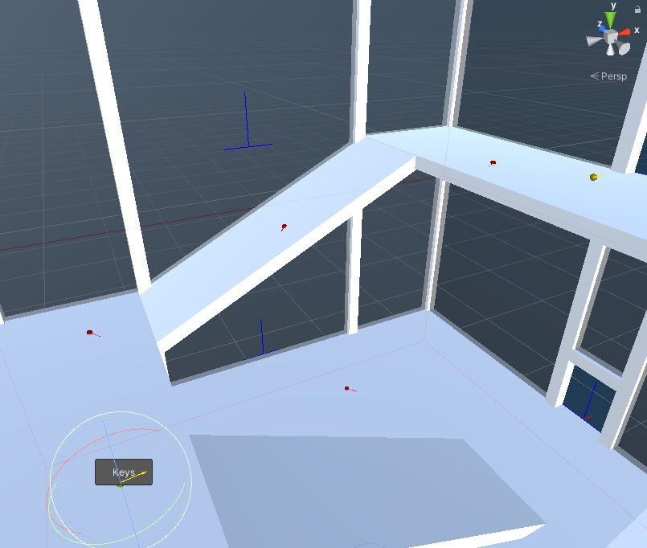

### Recompile module database

Since we've modified the module's markers, we need to rebuild the module database cache

Select the module database and click `Build Module Cache`

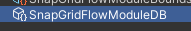

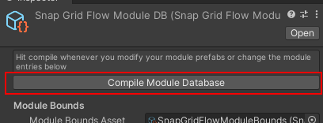

The system now knows where to spawn the keys in the snap module and what prefabs to spawn at those locations

## Spawn Locks

Locks are door prefab with locking support (optionally with different visuals based on your art asset)

We'll setup these locked door prefab in the snap connection

> Keys are mapped in the **Theme** editor. Locks are mapped in the **Snap Connection** prefab, since they deal with doors

### Open Snap Connection Prefab

Open the `Snap Connection` prefab that we created in the [earlier](../snap-flow/snapflow-connections.md) section

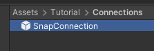

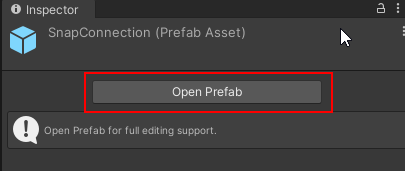

Inspect the properties of the prefab

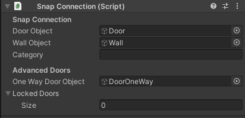

### Setup Locked Door

Similar to the way we've previously setup the one-way door, we'll setup two locked doors

Create an empty game object and rename it to `LockRed`.   Place it along side the `Wall`, `Door` and `DoorOneWay` game objects

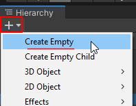

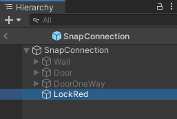

Reset the transform

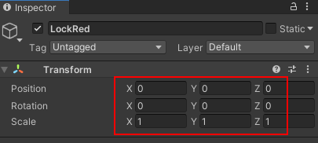

We'll now register this game object as a locked door with the marker name as `LockRed`

Select the root Snap Connection object and inpect the properties

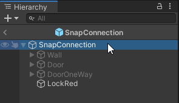

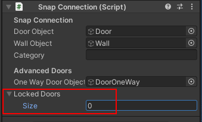

Add a new entry to the *Locked Doors* array and set the marker name to `LockRed` and assign the game object to it

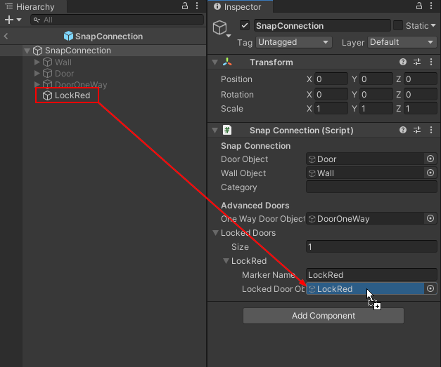

Repeat the same for the yellow lock.  Set the marker name to `LockYellow`, create a new gameobject, reset the transform and assign it

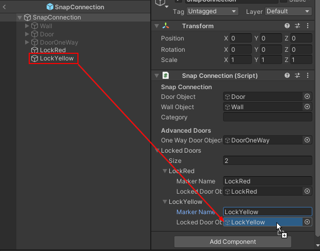

> We used the names `LockRed` and `LockYellow` since this is what we assigned in the *Create Key/Lock* node 
> in the flow graph   

### Assign Lock prefabs

Navigate to `Assets\CodeRespawn\DungeonArchitect_Samples\DemoBuilder_GridFlow\Art\Prefab` and drop in `DoorLargeLocked_Red` prefab as a child of `LockRed` game object

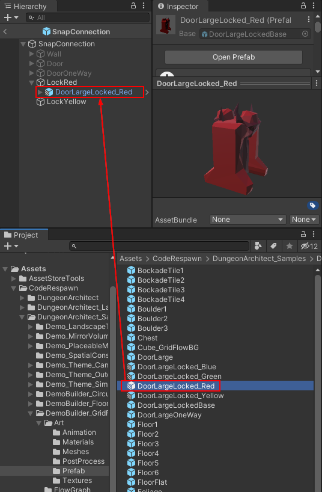

The alignment rules are the same like other doors. Reset the transform of the red door prefab and it should align correctly (red line should face outwards and the origin is in the bottom-center)

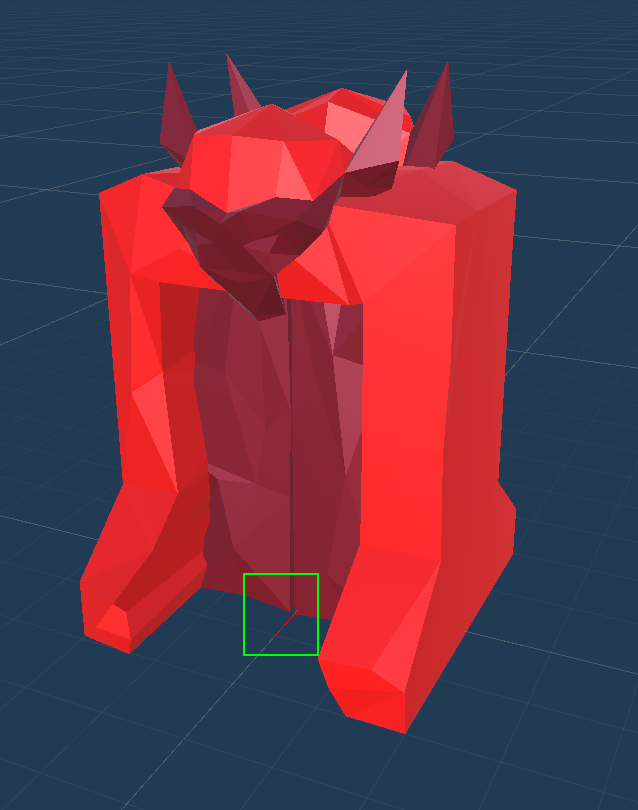

Do the same for the yellow lock.

Hide the `LockRed` game object

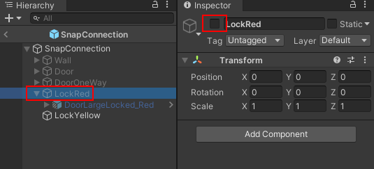

Drop in the `DoorLargeLocked_Yellow` prefab under the `LockYellow` gameobject

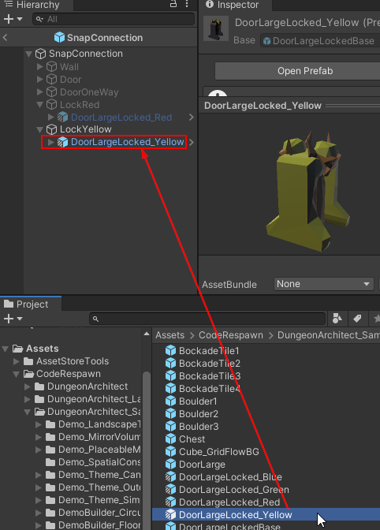

The alignment rules are the same like other doors. Reset the transform of the yellow door prefab and it should align correctly (red line should face outwards and the origin is in the bottom-center)

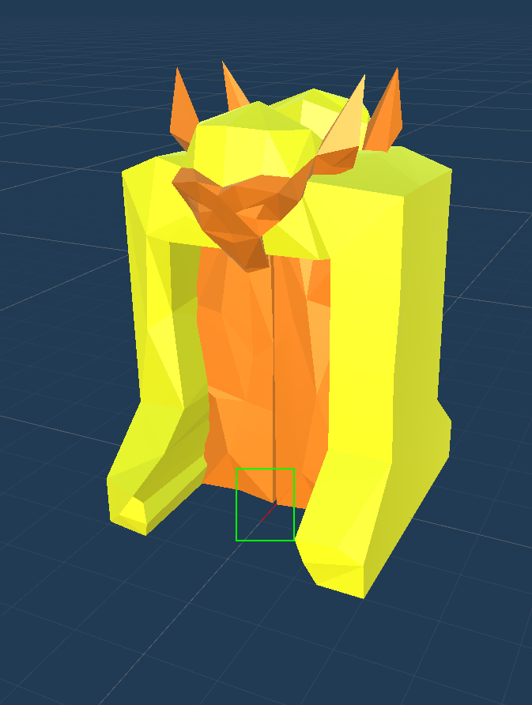

Hide the `LockYellow` game object

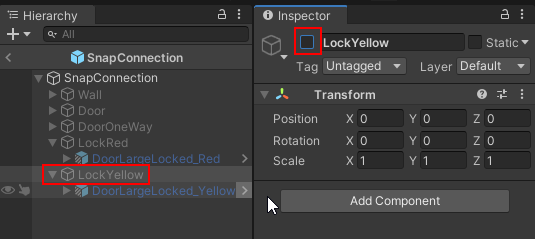

> Make sure you hide the outermost `LockRed` and `LockYellow` game objects and not the `DoorLargeLocked_Red` and `DoorLargeLocked_Yellow` game objects

> There is no difference between the `DoorLargeLocked_Red` and `DoorLargeLocked_Yellow` prefabs other than the visuals and they are both variants of the same parent prefab.  The flow system will automatically supply it with the valid key ids when the dungeon is built and a common logic is used to check if we can open the door.  More on this later

## Build dungeon

Open the scene where we previously [set up](sgf-build-dungeon.md) our dungeon.  Rebuild the dungeon

Red lock guarding the main path:

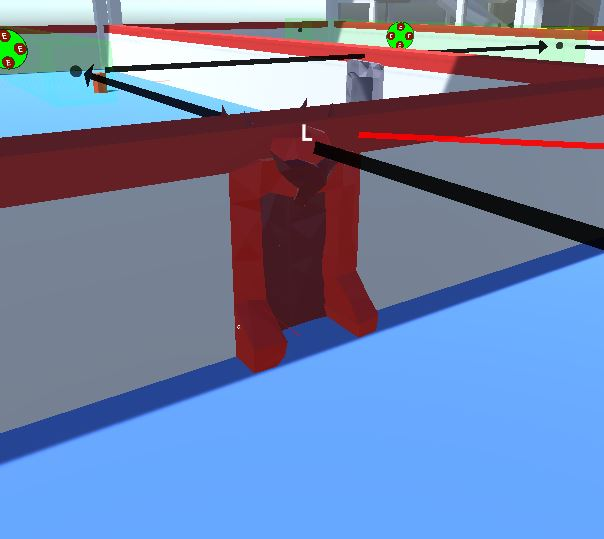

Yellow lock guarding the treasure room:

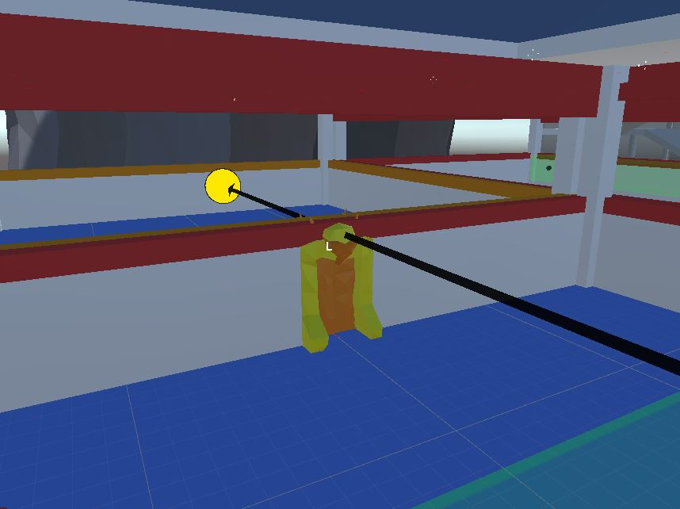

Red Key:

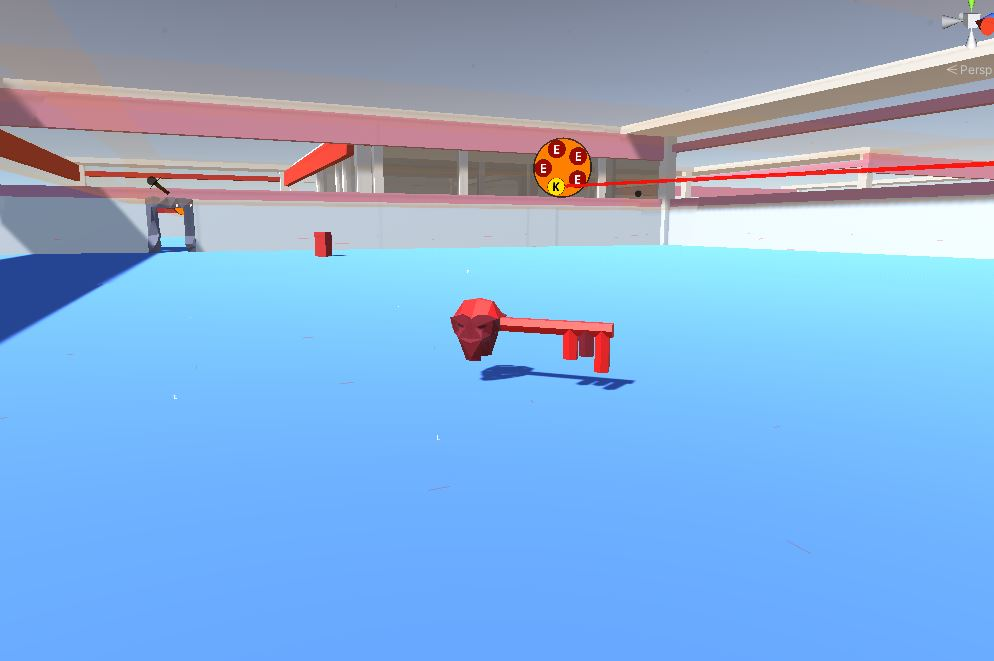

Yellow Key:

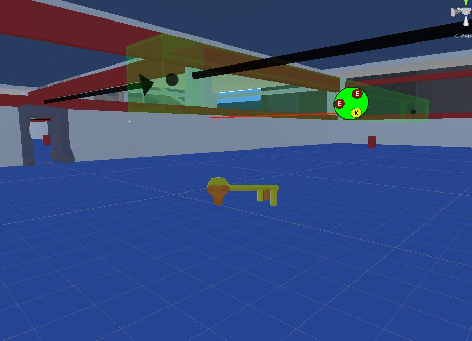

> If your keys are shown half buried into the ground or below the ground, adjust their offset from the theme editor, or move the placeable marker game object up
> 
> 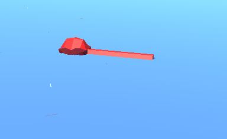
>
