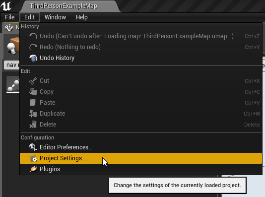
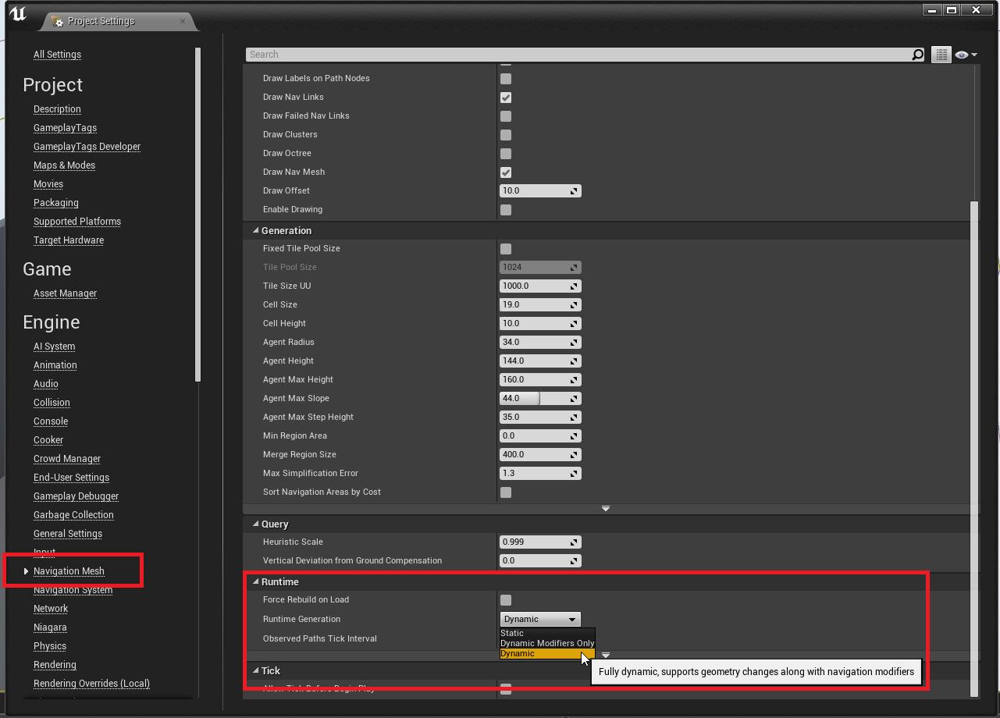
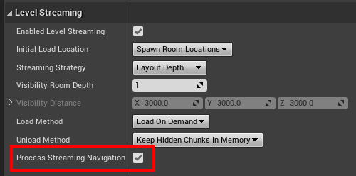
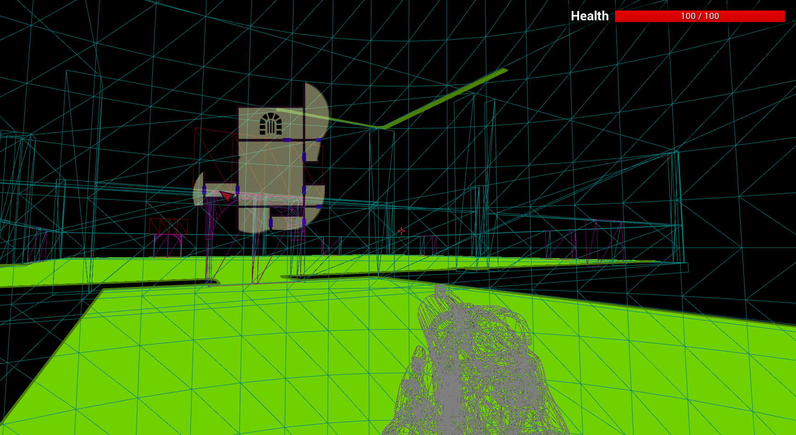

Unreal Engine supports runtime navigation generation.   However, a flag needs to be set in the projects setting.

Navigate to `Edit > Project Settings > Navgation Mesh > Runtime > Dynamic`

This will automatically regenerate the navigation on runtime generated dungeons.  Be sure to have a `Nav Mesh bounds Volume` large enough to wrap the whole dungeon.  There is an example in the quick start guide to automatically wrap the navigation volume around a dungeon after it has been built.

<iframe
    width="100%"
    height="540"
    src="https://www.youtube.com/embed/uowWAVwEiEc"
    frameBorder="0"
    allow="accelerometer; autoplay; clipboard-write; encrypted-media; gyroscope; picture-in-picture"
    allowFullScreen
/>

## Level Streaming

If you want to use runtime navigation with a builder that supports level streaming (like `SnapMap` or `SnapGridFlow`), enable the following flag in the dungeon actor

