Dungeon Architect lets you specify offsets to your visual nodes to move/scale/rotate them from their relative marker locations.

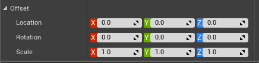

However, if you want a more dynamic way of applying offsets (based on blueprint or C++ logic), you can do so with a *Transform Rule*.  This can be very useful to add variations to your levels for certain props

## Using Transform Rules
To assing an existing rule into the node, Check the **Use Transform Logic** property and select the rule you would like to attach to the node from the dropdown list

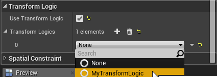

Create a new Transform rule by creating a new blueprint class derived from the appropriate DungeonTransformLogic.  It should match the builder you are targeting

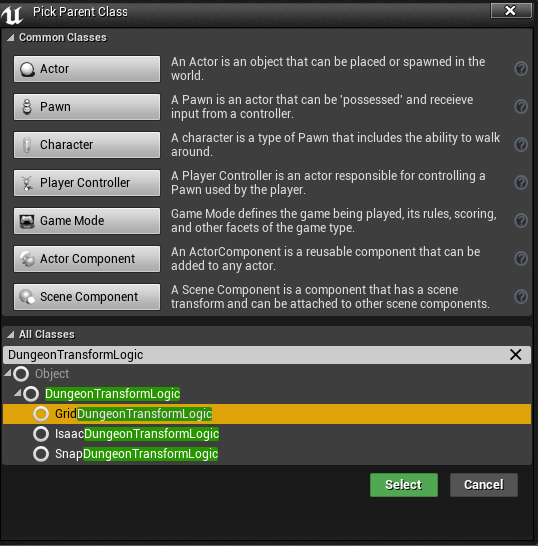

Open up the blueprint and override the **Get Node Offset** function. This function will be called by the engine and the logic you put here will let you decide on the offset that needs to be applied on this node

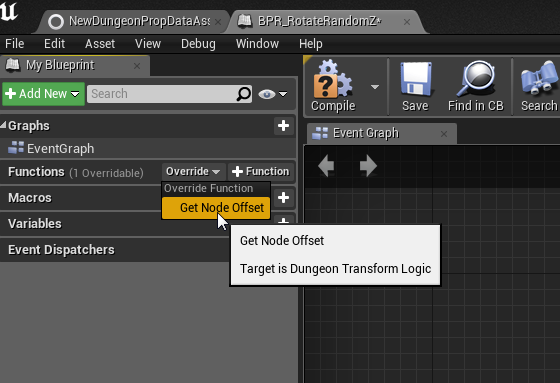

## Example #1

In this example, a single rock mesh is randomly rotated, and slightly scaled and translated to give a nice cave like look

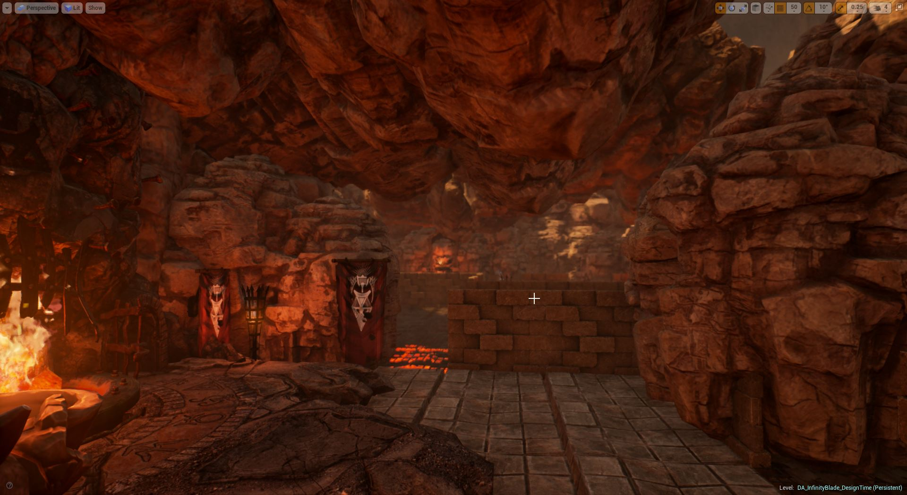

A different transformation rule is applied to ceiling stone meshes for more variations

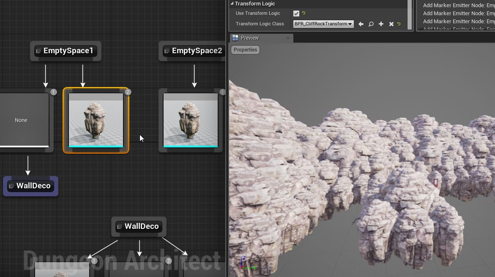

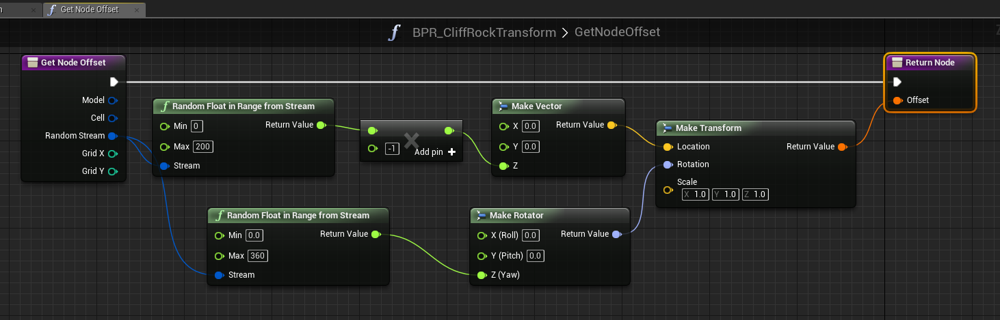

## Example #2

Here is an example where alternate pipes are rotated by 180 degrees to give a visually appealing look

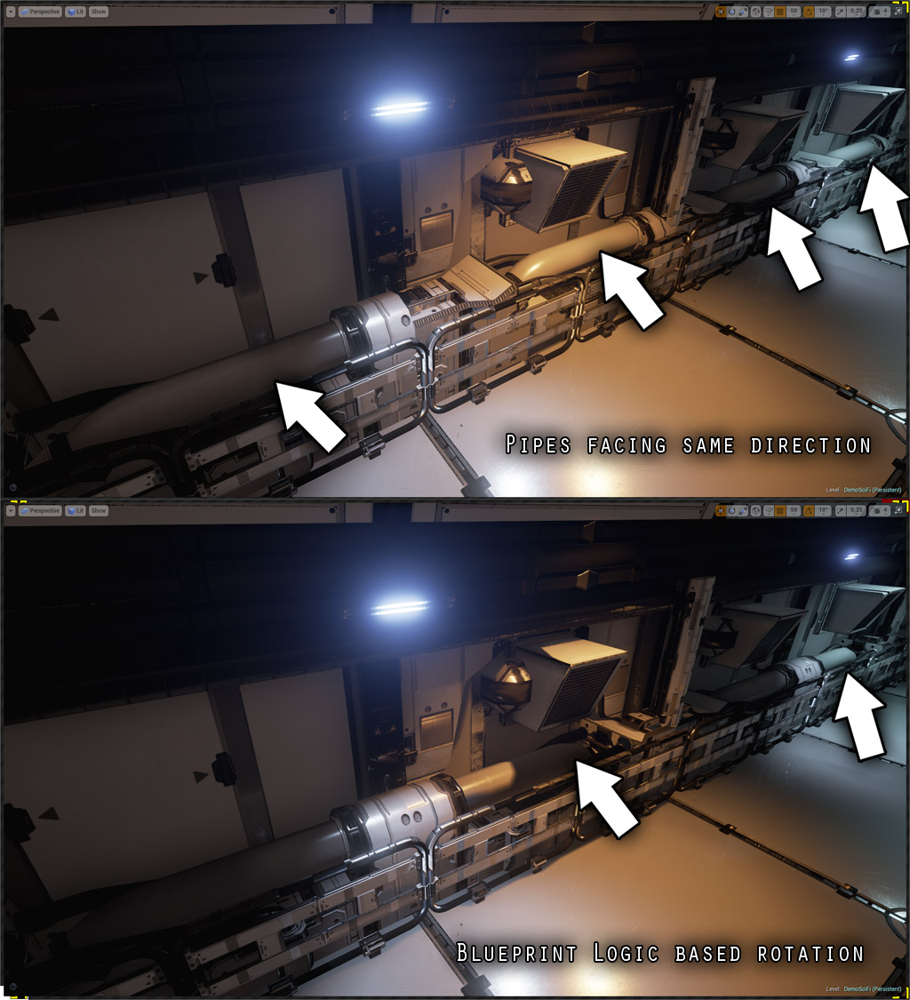

This was done by rotating the mesh node by 180 degrees for every alternate cell (similar to the checker rule logic seen previously)

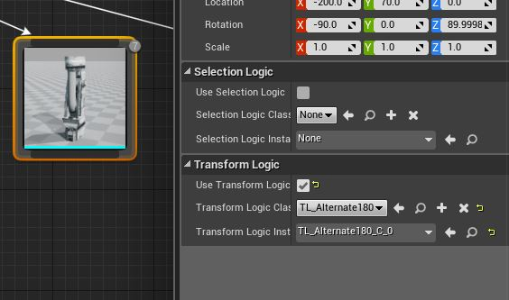

## Example #3

In this example a small random rotation is applied to orange ground tiles.  Useful while creating ruins when laying down broken tile meshes

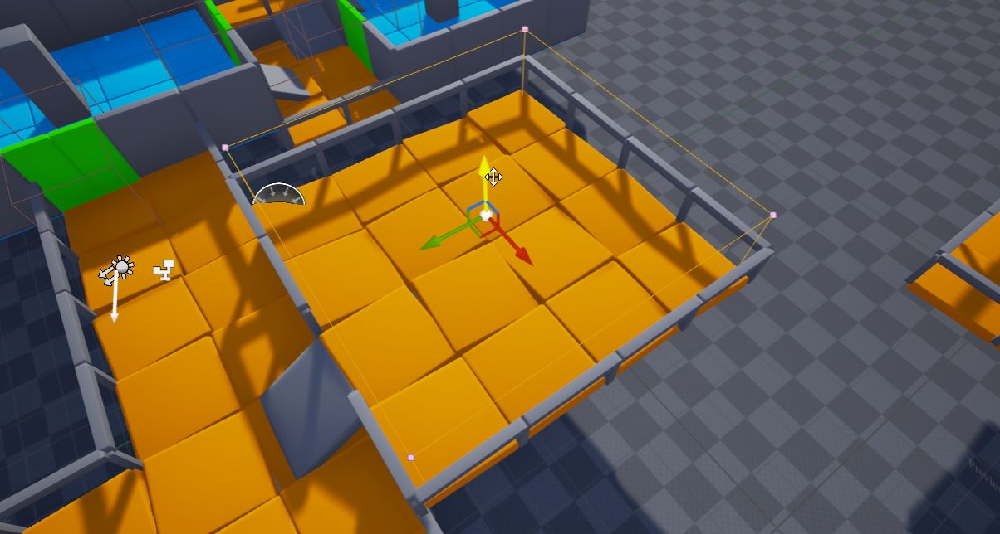

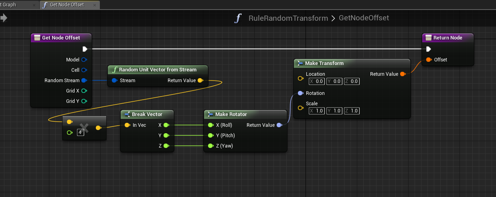
