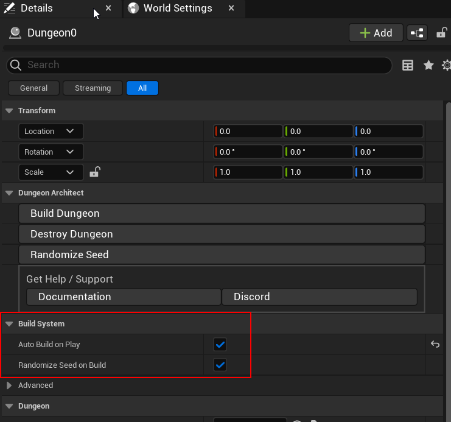
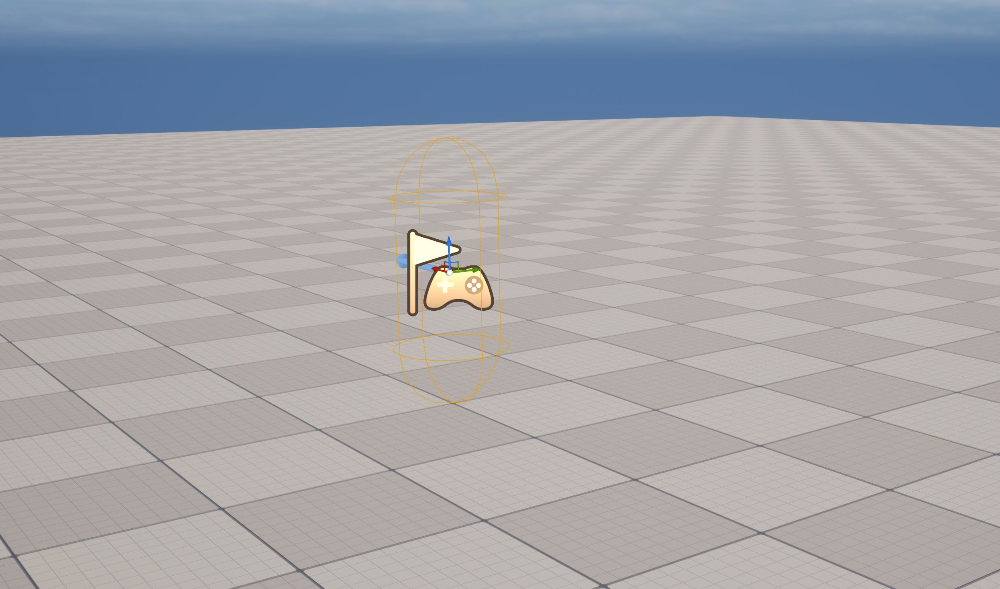
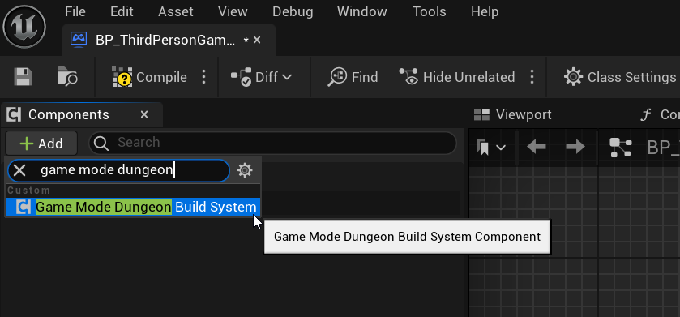
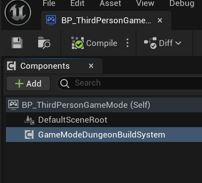
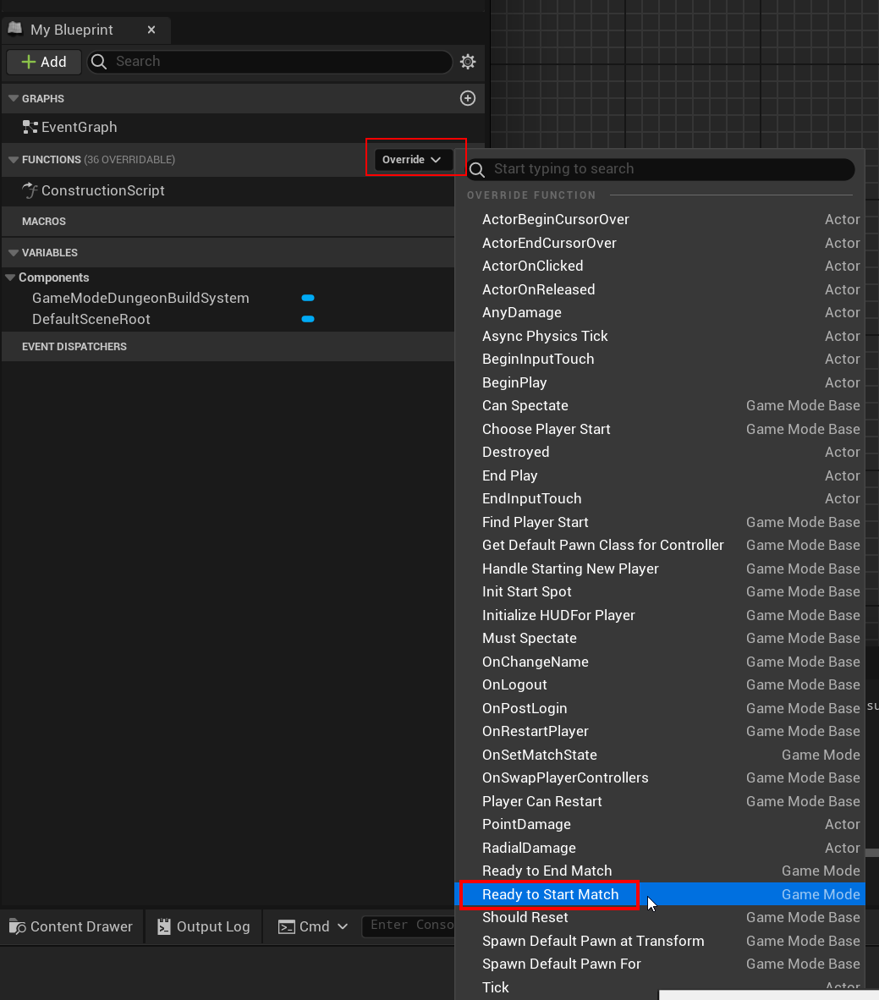
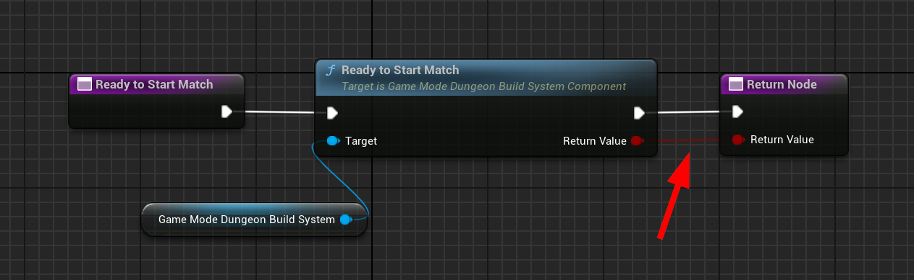
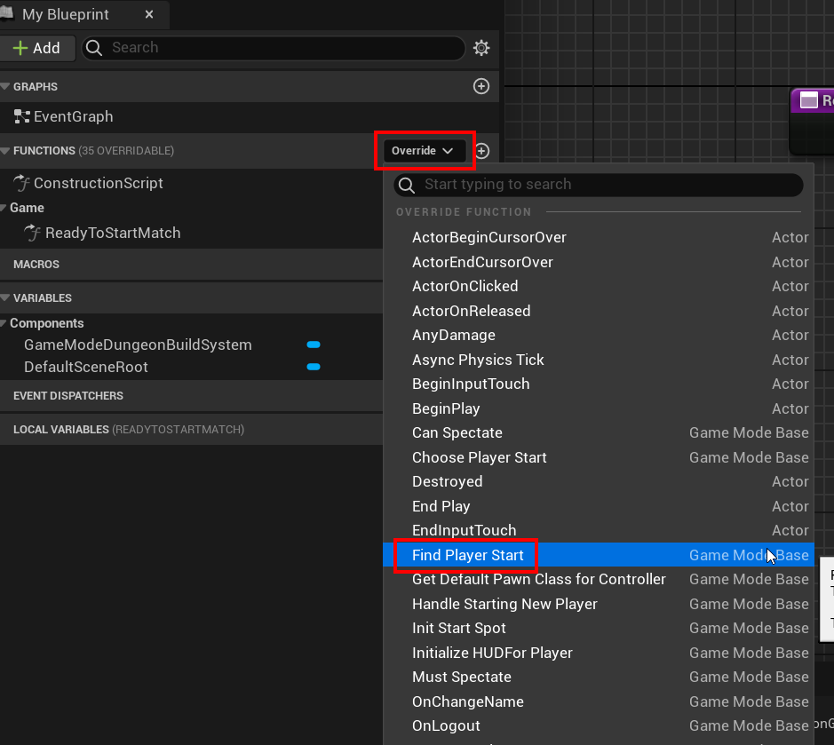
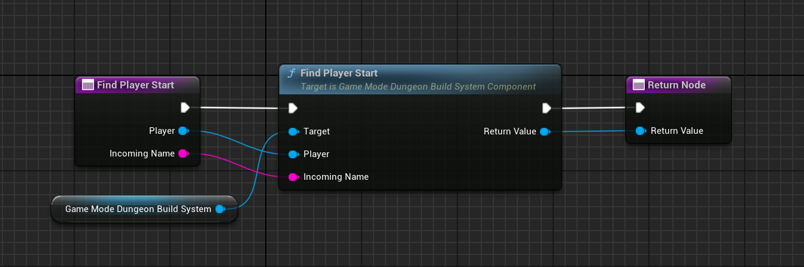

<show-structure />

Build your dungeons at runtime using the automated build system

Select the Dungeon actor and inspect the properties in the Details panel

The build system settings live in the `Build System` category.   The dungeon actor already carries the build
system component, so there is nothing to add here

| Property | Default | Description |
|----------|---------|-------------|
| Participate In Build System | `true` | Lets the build system drive this dungeon.   Uncheck it if you want to build this dungeon yourself from Blueprints |
| Randomize Seed On Build | `false` | Picks a new seed on every build, so you get a different dungeon each time you play.   Leave it off if you want to control the seed yourself, which is what the multiplayer sample does |
| Restart Player On Ready | `true` | Restarts the player once the dungeon is ready, so they respawn at the dungeon's spawn point.   Turn it off if you want to handle the spawn yourself.   This one is under `Advanced` |

This works with multiplayer as well

## Delete existing Player Starts

If you want the dungeon spawned `PlayerStart` actor to be picked up,  you'll need to first delete any player start you already have in the empty scene.  If you don't do this, your player character might
spawn in this location, rather than inside the dungeon

## Game Mode Setup

The build system component generates your dungeon at runtime asynchronously.  While its being built, it stays in spectator
mode.  Once built, it uses the dungeon's desired location to spawn the player in. 

It works with multiplayer, taking care of building the same dungeon on all the connected clients and handle clients joining in late 

For this to work, it needs to work closely with the GameMode.   You attach a component to your existing game
mode, so your class hierarchy stays exactly as it is

:::note
Earlier versions offered a second option, re-parenting your game mode to `DungeonGameMode`.   That class was
removed in version `3.2.0` and the component below is now the only way to set this up.   If you are upgrading
from an older version, re-parent your game mode back to `GameMode` and add the component
:::

### Add Component to your game mode

Open your existing game mode and add the component `Dungeon Build System Game Mode`

> The game mode should subclass from `GameMode` and not `GameModeBase`

Then override the game mode functions below and forward each one to the matching function on the component

#### ReadyToStartMatch

Override the function `ReadyToStartMatch` and call `Ready To Start Match` on the component.   This holds the
match until the dungeon has finished building

#### FindPlayerStart

Override the function `FindPlayerStart` and call `Find Player Start` on the component.   This spawns the player
at the dungeon's spawn point instead of a `PlayerStart` you placed in the level

## Component Reference

### Dungeon Build System Game Mode

| Property | Description |
|----------|-------------|
| Main Dungeon Tag | Finds the dungeon carrying this tag.   Leave it empty and the first dungeon in the level is used |
| On Dungeon Ready | Fired when the dungeon is built and ready for players |

| Function | Description |
|----------|-------------|
| Ready To Start Match | Forward your game mode's `ReadyToStartMatch` here |
| Find Player Start | Forward your game mode's `FindPlayerStart` here |
| Get Default Pawn Class For Controller | Optional.   Forward your game mode's `GetDefaultPawnClassForController` here if you want the build system to keep players in spectator mode until the dungeon is ready |
| Initiate Dungeon Build | Starts the build.   The server starts immediately when ready and clients build in the background |
| Initiate Dungeon Build And Wait For Players | Starts the build and waits for `Expected Player Count` clients to finish before the match starts.   Use this for synchronized competitive starts |

### Dungeon Build System Player Controller

Add this component to your player controller for multiplayer games.   It carries the client build request and
the completion notification back to the server, so clients build the same dungeon as the server and late
joiners catch up
