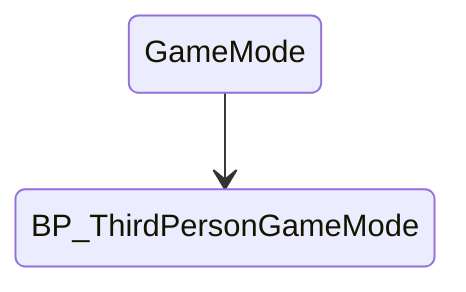
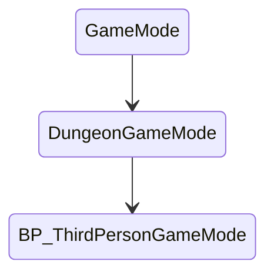
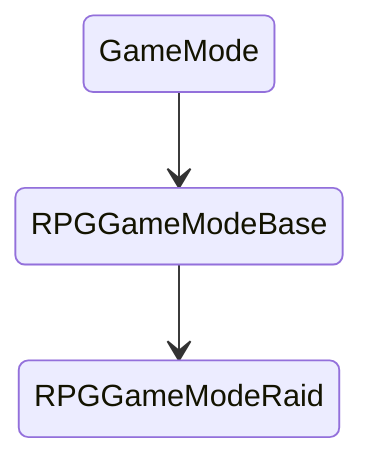
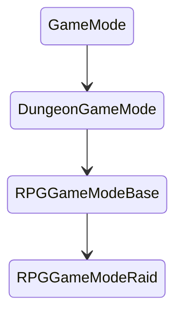

<show-structure />

# Dungeon Build System

Build your dungeons at runtime using the automated build system

Select the Dungeon actor and inspect the properties in the Details panel

If you want your dungeon to build at runtime, enable `Auto Build on Play`

If you want a different dungeon everytime you play, enable `Randomize Seed on Build`

This works with multiplayer as well

## Delete existing Player Starts

If you want the dungeon spawned `PlayerStart` actor to be picked up,  you'll need to first delete any player start you already have in the empty scene.  If you don't do this, your player character might
spawn in this location, rather than inside the dungeon

## Game Mode Setup

The build system component generates your dungeon at runtime asynchronously.  While its being built, it stays in spectator
mode.  Once built, it uses the dungeon's desired location to spawn the player in. 

It works with multiplayer, taking care of building the same dungeon on all the connected clients and handle clients joining in late 

For this to work, it needs to work closely with the GameMode.  You have two options to proceed

* Use `DungeonGameMode` as your game mode, or if you already have a custom game mode, have it subclass from `DungeonGameMode` instead of `GameMode`
* If you don't want to modify your GameMode hierarchy structure, a cleaner approach is to attach a component to your existing GameMode without modifying its hierarchy.  This method is slightly more involved 

We will explore both the options below

### Change Class Hierarchy

In this mode, we will re-parent the game mode class's hierarchy to use `DungeonGameMode` instead of `GameMode`.    

> If you do not want to change the class structure, there's another cleaner method, where you just add a component to an existing game mode class and do some setup on it, refer the next section for more details  

Open up your game mode and if it's parent is `GameMode`, re-parent it to `DungeonGameMode`

In this example, we have a third person game mode.   If we open this, the parent class it `GameMode`.  We will change the parent to `DungeonGameMode`

If you have a chain of game mode classes like this one, find the one that subclasses from GameMode and re-parent it

Click `Class Defaults` and change the `Parent Class`

In the following example, `RPGGameModeRaid` doesn't subclass from GameMode.   Go up the chain and find the class that does.   
Open `RPGGameModeBase` and re-parent it to `DungeonGameMode`

### Add Component to existing game mode

In this method, instead of re-parenting your game mode class,  we will add a component to it instead, without modifying the class structure

Open your existing game mode and add the component `GameModeDungeonBuildSystem`

> The game mode should subclass from `GameMode` and not `GameModeBase`

Override the following methods

#### ReadToStartMatch

Override the function `ReadToStartMatch`

#### FindPlayerStart

Override the function `FindPlayerStart`

