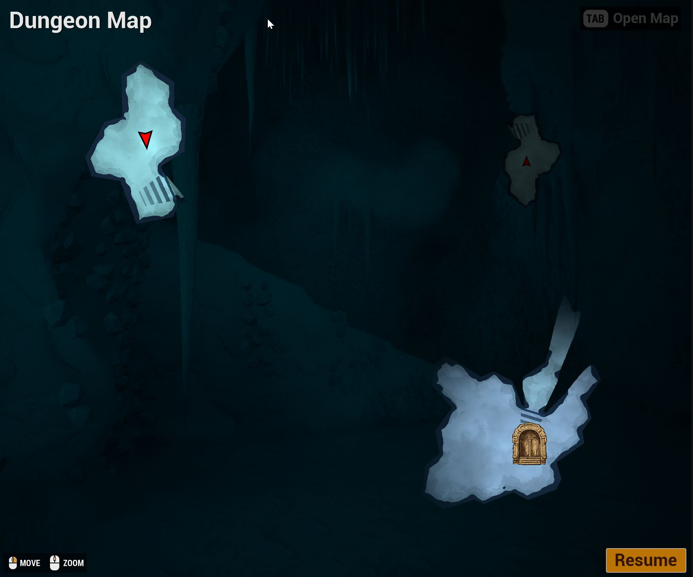

<show-structure />

Any actor can show up on the canvas with an icon and reveal the fog of war around it.  Add the `Dungeon Canvas Item` component to the actor - it works on player pawns, bots and world objects like shrines or watch towers

The [Player Setup](canvas-player-setup.md) page covers the player pawn.  This page covers world object explorers, toggling them at runtime and how exploration is shared between players in multiplayer

## World Object Explorers

A world object can light up the map around it, like a shrine or a watch tower the player discovers

* Add the `Dungeon Canvas Item` component to the actor
* Leave `Item Type` as `World Object`
* Check `Explore Fog Of War`
* Optionally set an `Icon Name` if you also want an icon drawn for it

### Fog of War Settings

The `Fog Of War Settings` on the component control how the item reveals the map

| Property | Default | Description |
|----------|---------|-------------|
| Light Radius | `2000` | How far the item reveals the map around it, in world units |
| Num Shadow Samples | `1` | Number of jittered samples used to soften the shadow edges.  Higher values give softer shadows at a higher cost |
| Shadow Jitter Distance | `30` | How far apart the samples are spread.  Larger values give a wider soft edge |

### Toggle Exploration at Runtime

Use `Fog Of War Explorer Enabled` to turn the exploration on and off while the game runs.  E.g. keep a shrine's
explorer disabled and enable it when the player activates the shrine

:::note
Mark the component as replicated if you toggle this on the server, so the change flows down to the clients
:::

You can also register an actor that has no canvas item component with the `Add Fog Of War Explorer` function
on the dungeon actor's canvas component, passing in its own fog of war settings

## Sharing in Multiplayer

The `Fog Of War Share Mode` setting on the dungeon actor's `Dungeon Canvas` component controls who sees whose
exploration and icons

| Mode | Description |
|------|-------------|
| Free For All | Each player only sees their own exploration.  Other player icons are hidden |
| Team | Players with the same `Team Id` share their exploration and see each other's icons |
| All Players | Everyone shares their exploration and sees everyone's icons |

You always see your own pawn and your own exploration, whatever the mode

### Teams

Set the `Team Id` on the `Dungeon Canvas Item` component.  `-1` means the item belongs to no team

* `Player` items follow the share mode above
* `World Object` items ignore the share mode.  With no team they are visible to everyone.  With a team, only
that team sees their icon and gets their fog of war reveal - e.g. a team's watch tower lights up the map for
that team only

:::note
Mark the component as replicated if you assign teams on the server, so the ids flow down to the clients
:::

### Custom Team Systems

The canvas reads the local player's team from the `Dungeon Canvas Item` component on the possessed pawn.  If
your game has its own team system, override the `Get Local Player Team Id` function on the `Dungeon Canvas`
component and return the team id from there

## Older Projects

Older projects tracked actors with the `DungeonMiniMapTrackedObject` or `DungeonCanvasTrackedObject` component.
These are redirected automatically to the `Dungeon Canvas Item` component when your project loads, no manual
changes needed
