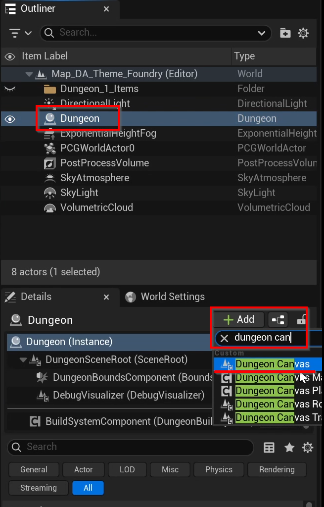
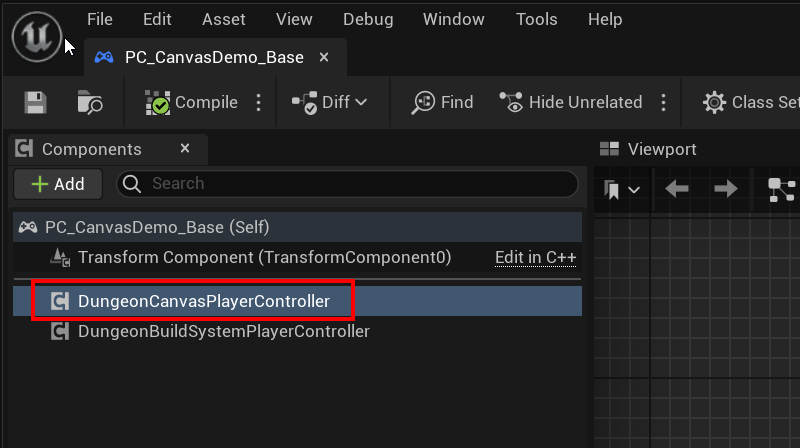
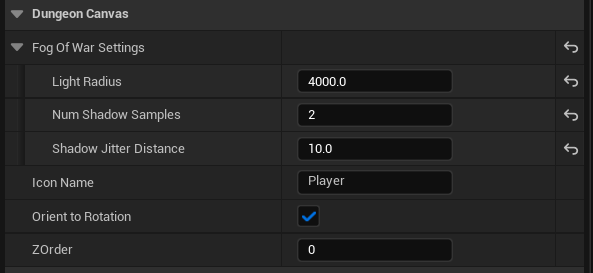
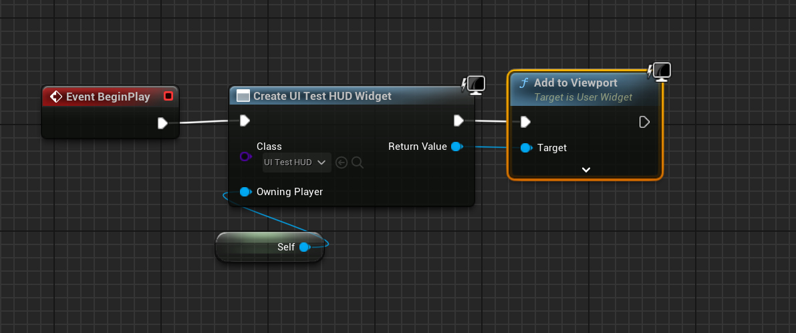

<show-structure />

You'll need a custom player controller to do two things:
* Show your UI with the minimap widget
* Add a component to this class, so it automatically takes care of setting everything up for you

> Note: Check this sample player controller for reference: `DungeonArchitect Content > /Showcase/Legacy/Samples/DA_Canvas_Demo/Common/Blueprints/PlayerControllers/PC_CanvasDemo_Base`

## Add Components

### Dungeon Actor

Select the Dungeon Actor in the scene and add the `DungeonCanvas` component to it

### Player Controller

Open up your Player Controller blueprint and add the `DungeonCanvasPlayerController` component to it

Whenever you possess a character in game, it automatically takes care of the following:
* Setting up that character as a Fog of War explorer
* Add a player icon to the character

When the character is UnPossessed (e.g. in death), it will take care of cleaning up the above changes.

No more setup is required here.  You may select the component and modify the fog of war settings and the icon settings

> Note: The `Icon Name` maps to the icon list registered in the canvas theme asset

## Show UI

Open your player controller and create your UI widget and add to viewport

This will make the UI show up when your game starts. The Dungeon Canvas widget you placed in your UI will auto register itself when it constructs. So there's no more setup required here on the UI side

