<show-structure />

# Canvas Settings

## Preview Panel

The same dungeon canvas asset can be used for different types of dungeons (Grid, GridFlow, SGF, SnapMap, CellFlow etc).

Click the  `Preview Dungeon Settings` button

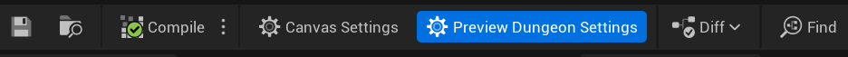

This opens up the preview dungeon settings. Change the builder type from here to visualize how your theme looks with different dungeon types

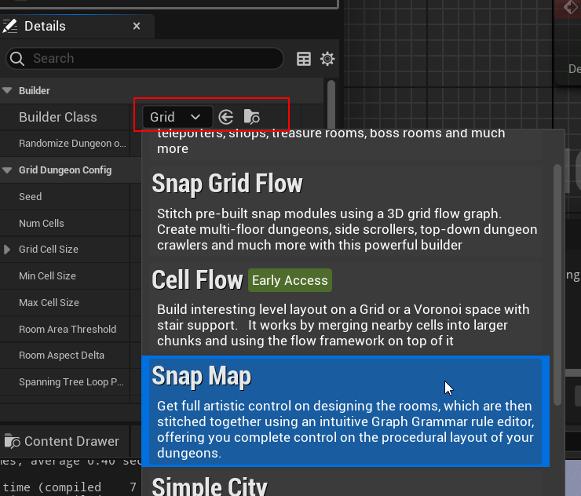

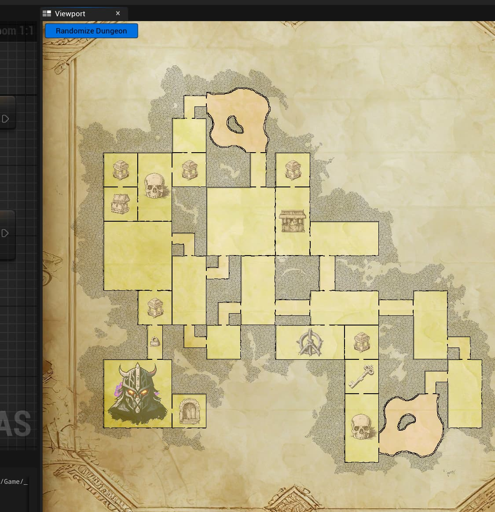

Click the Randomize Dungeon button to see how the dungeon looks with different layouts

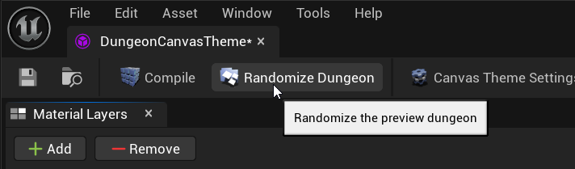

### Layout Draw Margin Percent

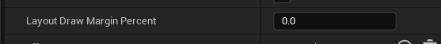

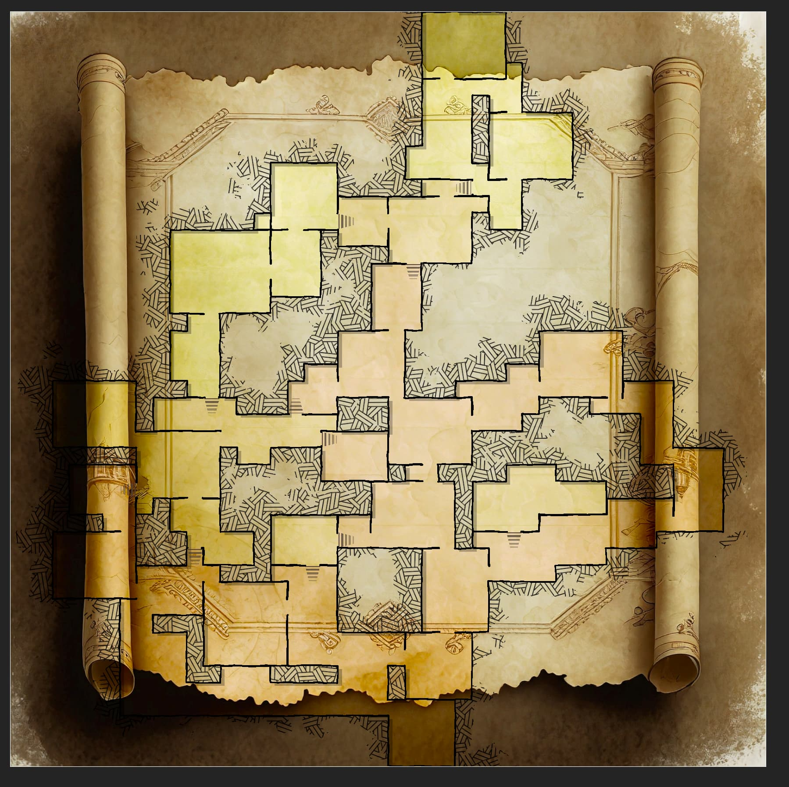

We have a certain background and want the dungeon to fit within it.  So we'll give it a value of 50.  Adjust it according to your needs

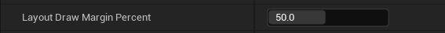

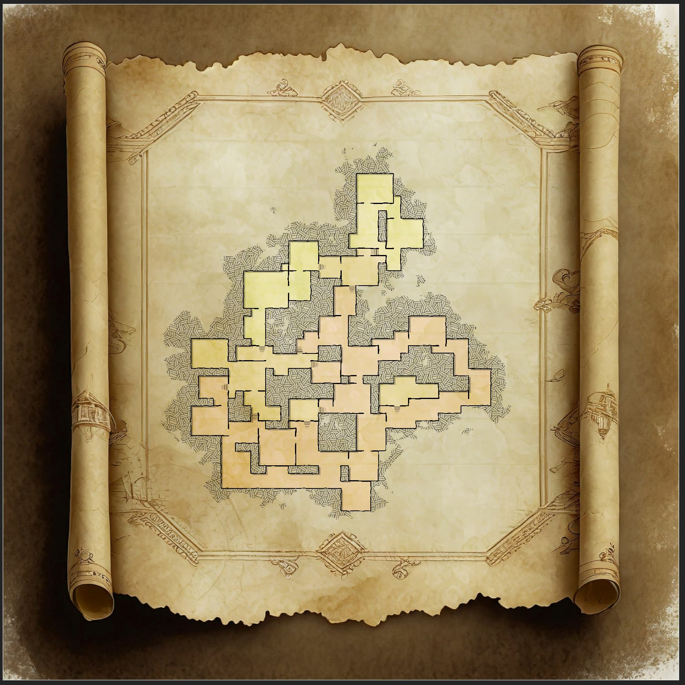

## Dungeon Canvas Settings

Click the `Canvas Settings` icon on the toolbar

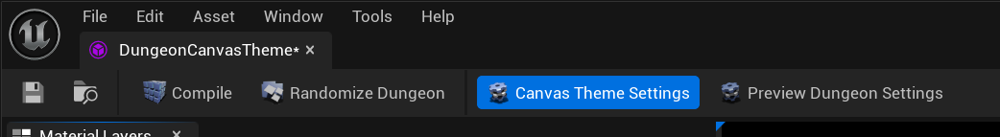

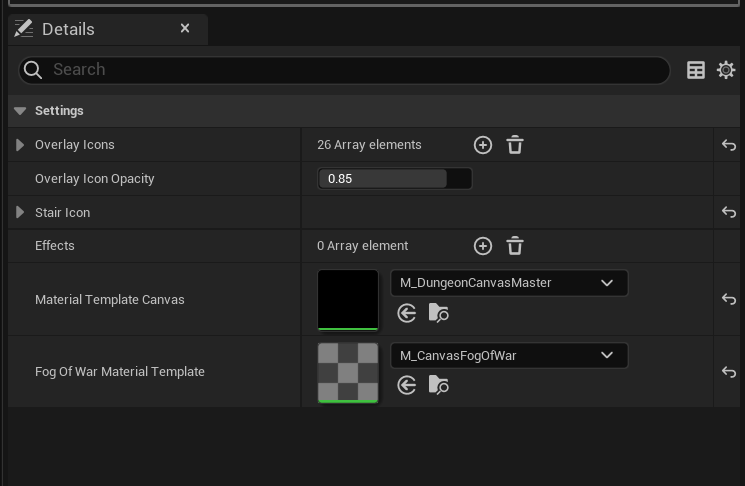

**Effects**: You can extend the system with your own advanced effects on top of it and manage the lifecycle of your custom textures yourself.   We use this to create voronoi maps on top of the dungeon and create an effect like this, where the size of the voronoi cell changes based on how close it is to the dungeon border.  This will be covered in detail in another section

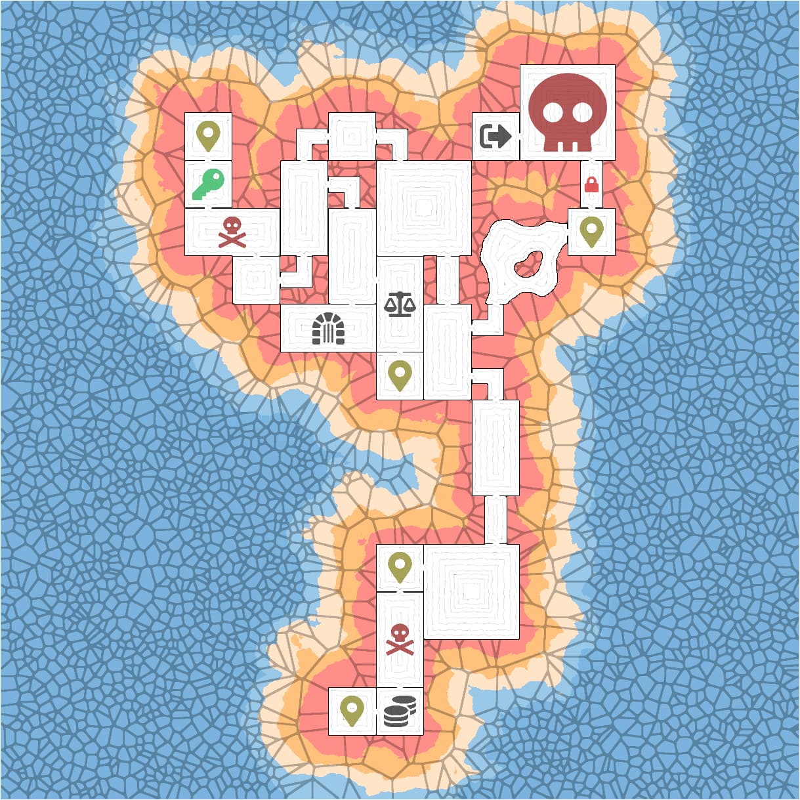

**Material Template Canvas**:   Change the master cavnas material, we won't change this, so leave it to the default value

**Material Template Fog of War**:  Provide your own custom fog of war material. Your custom material can change the color, texture etc.   (see below for a custom implementation)

### Custom fog of war Material

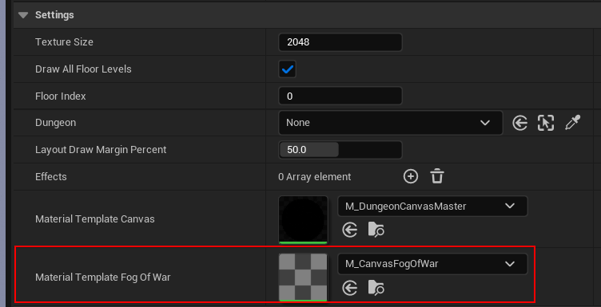

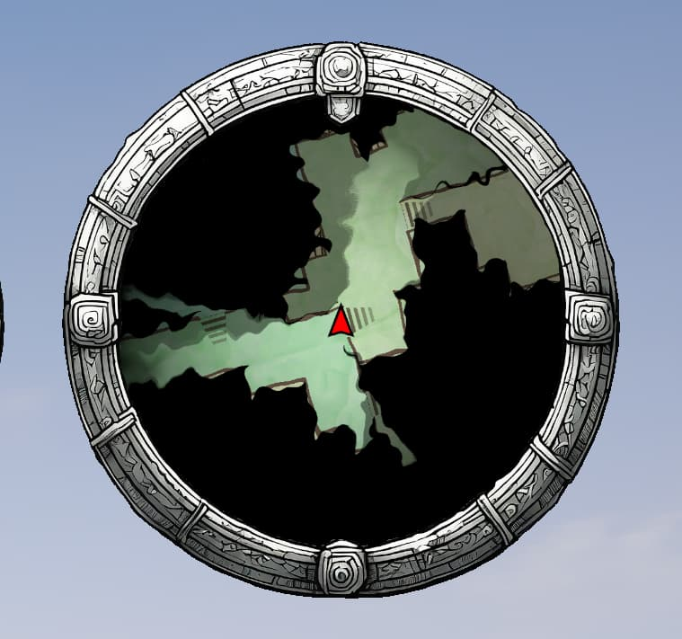

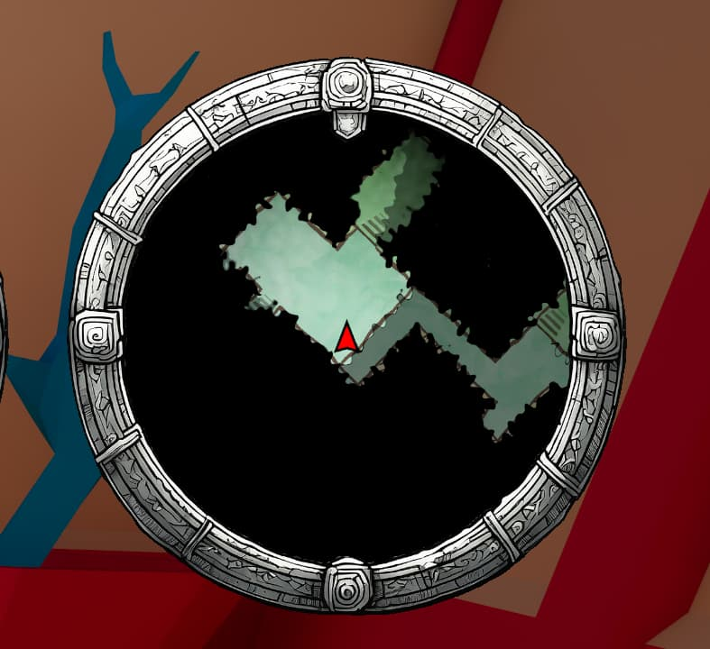

In this example I copied over the template and added a bit of curl noise to the fog of war texture UV

Before: (Original template)

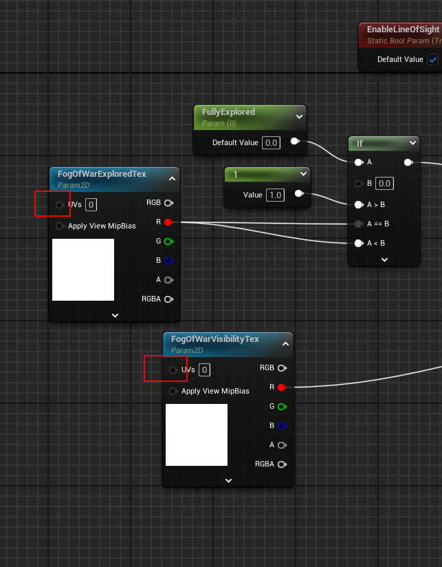

After curl noise:

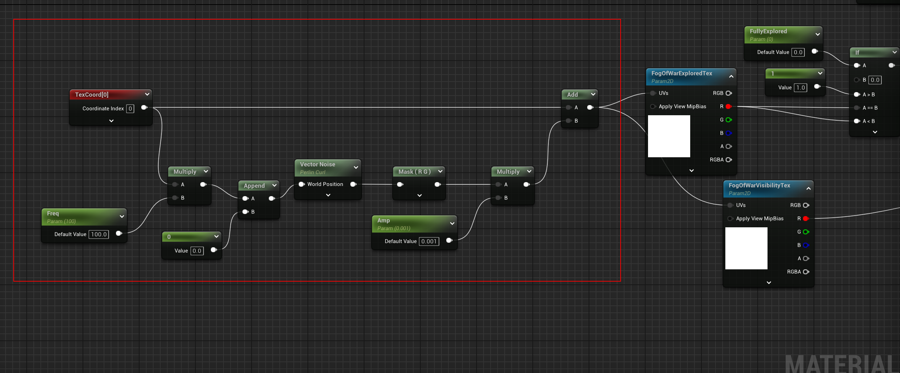

Animate the curl noise by specifying time (instead of 0) in the `Append Vector` node

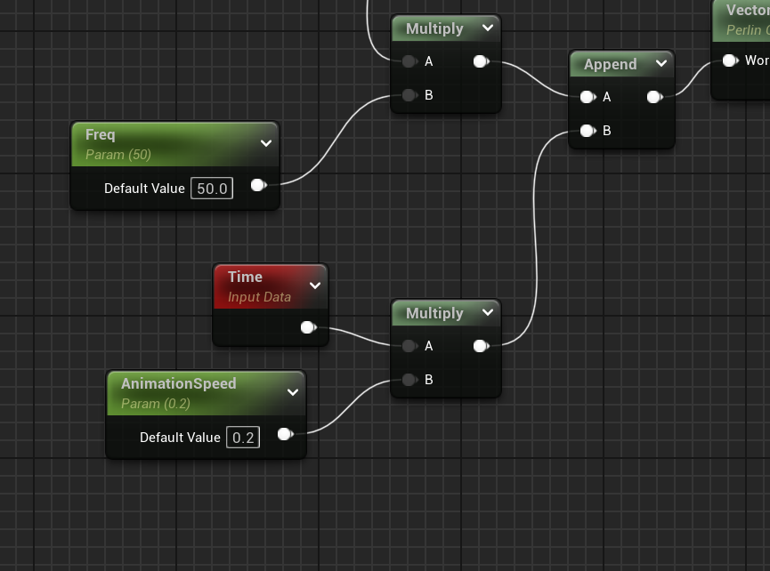

[M_NoisyCanvasFogOfWar.uasset](https://forums.dungeonarchitect.dev/uploads/short-url/iPO6GXGhIPKEPnHG36EOPLPGkeo.uasset) (25.1 KB)

