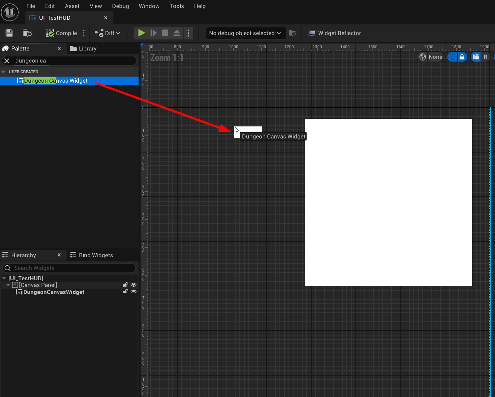
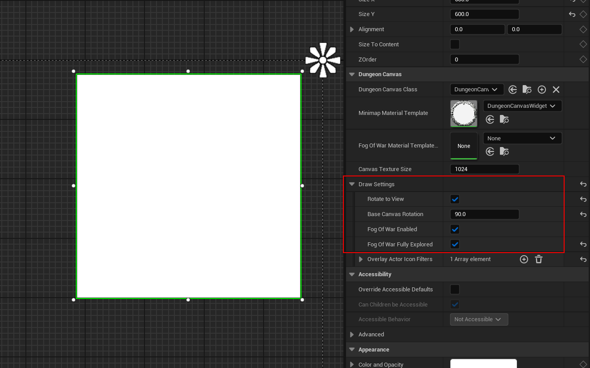
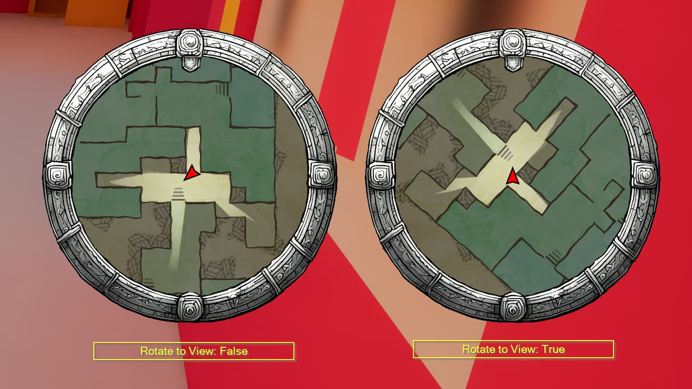
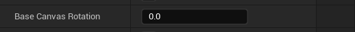
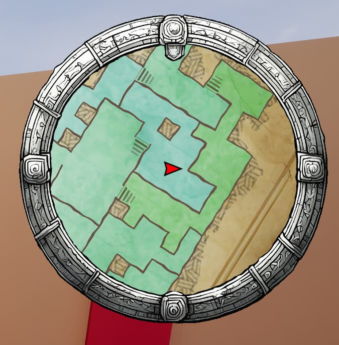
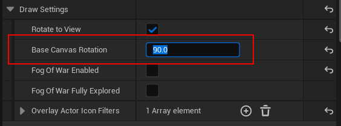
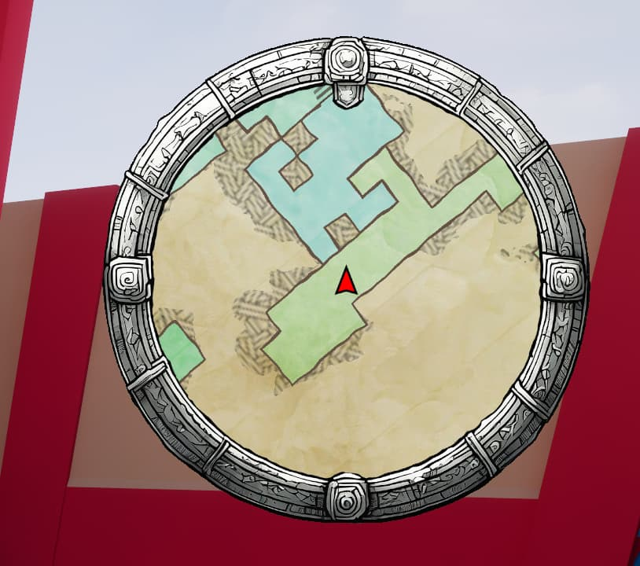
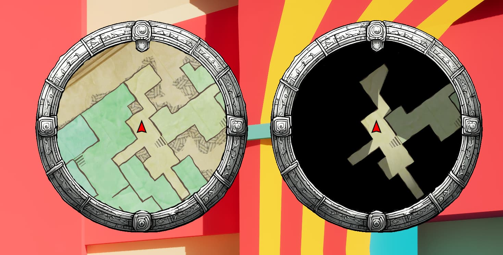
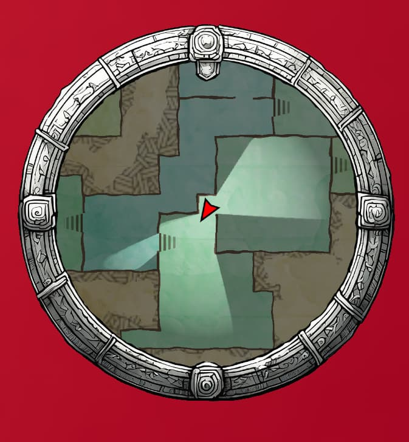
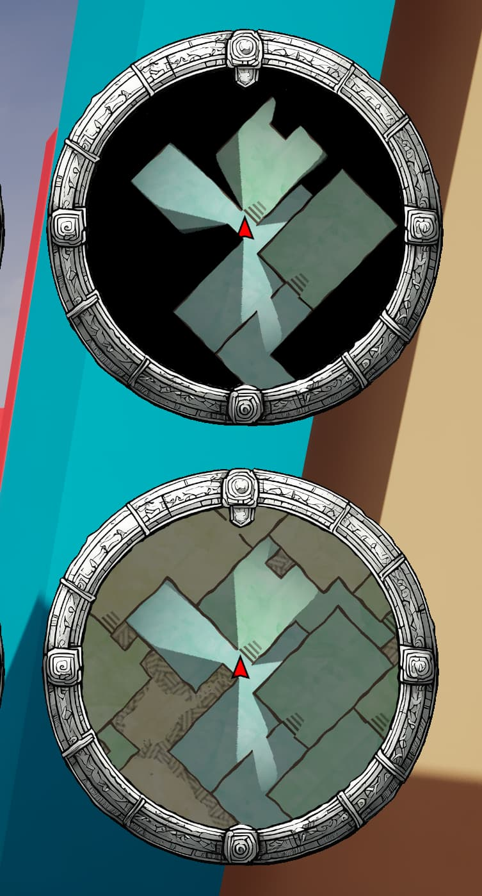

<show-structure />

We need to show the minimap in your screen. Create a new UMG User widget (or open an existing one) and drag drop the `Dungeon Canvas Widget` on to the screen

Turning the minimap into a full screen, pannable and zoomable map

<iframe
    width="100%"
    height="540"
    src="https://www.youtube.com/embed/qmYAaofChWQ"
    frameBorder="0"
    allow="accelerometer; autoplay; clipboard-write; encrypted-media; gyroscope; picture-in-picture"
    allowFullScreen
/>

Select the widget and check the details panel .  Expand the `Draw Setttings`:

You can control various settings from here:

---

**`Rotate to View`**:    This will rotate the minimap and the player icon will be fixed.  uncheck to keep the view fixed and have the player icon rotate

---
**`Base Canvas Rotation`**: You may want the whole view to be rotated by a certain amount.    Unreal defaults to the character facing the X direction. so if this is 0, it looks like this with the `rotate to view` flag enabled (red player arrow always faces right and everything rotates around it):

If you want the arrow to face up (while the world rotates around it, rotate the whole view by 90

---

**`Fog of War Enabled`**: Check this to enable Fog of War. If you have this enabled, you need to setup your player to be a fog of war "explorer" so parts of the map can be made visible as you explore (more on that later below). You can have multiple explorers.

---

**`Fog of War Fully Explored`**:  Enable this if you want the whole map explored. You may still enable fog of war to show the visible areas.

With and without Fog of War enabled:

> Note: You can configure NPC icons to show up only on the visible (bright) areas
