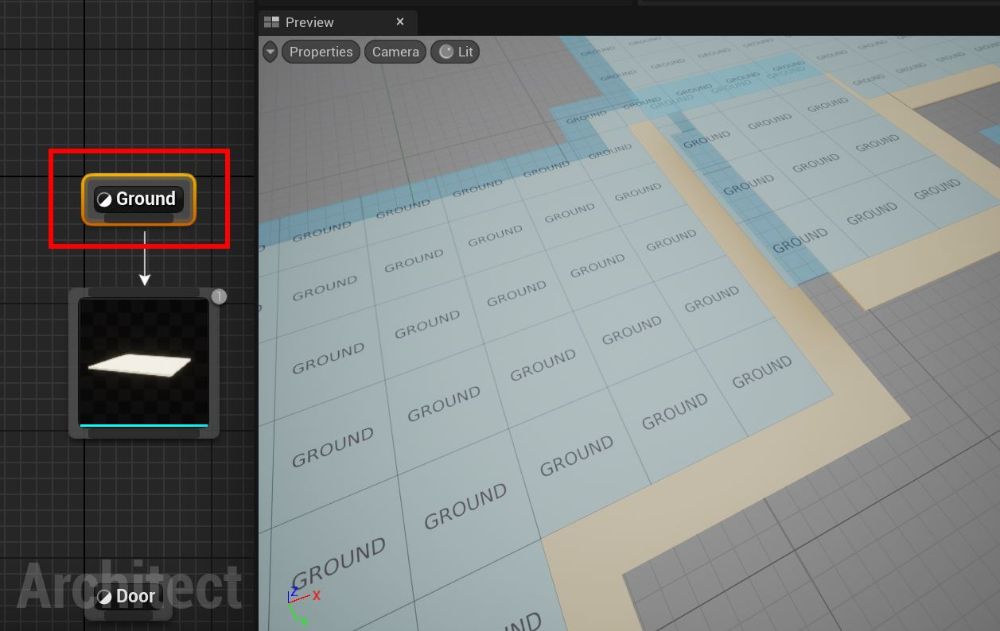
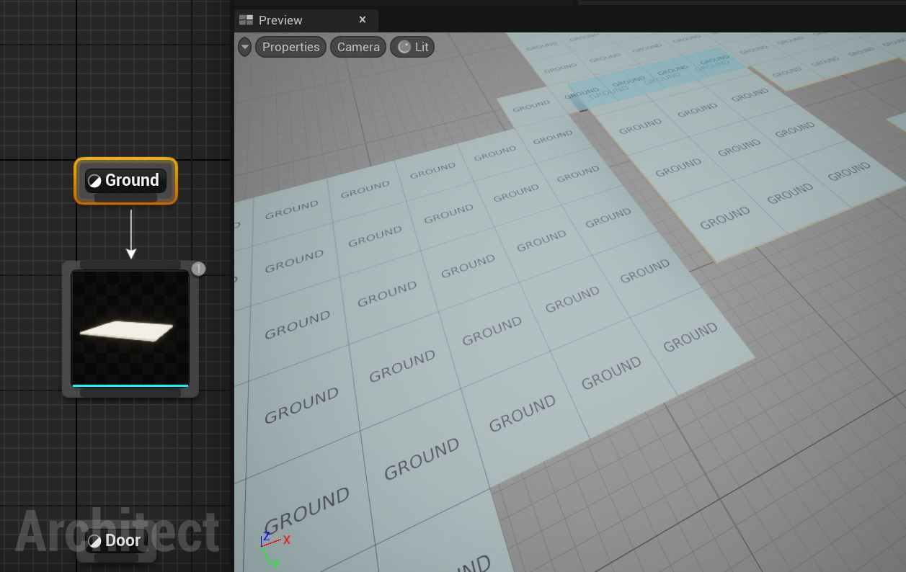
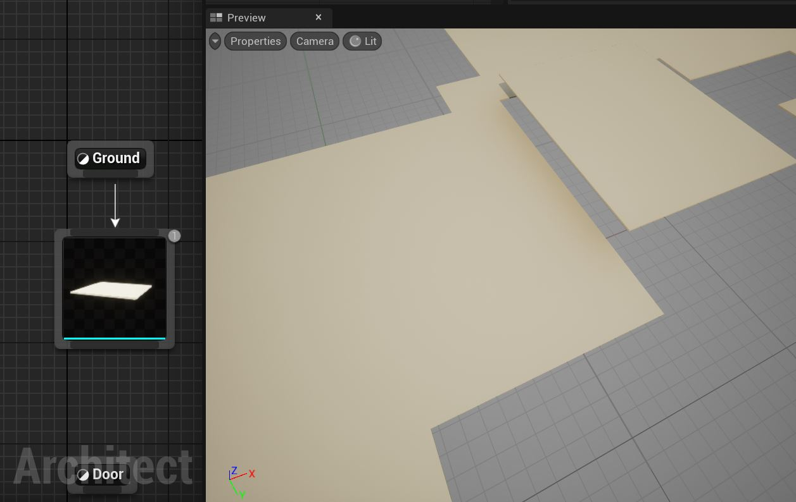
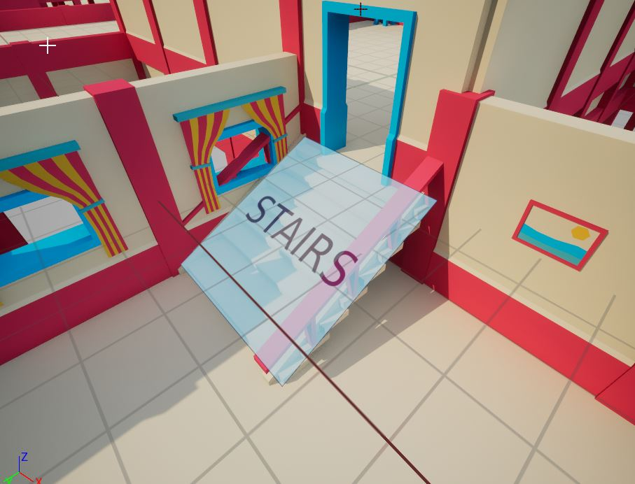
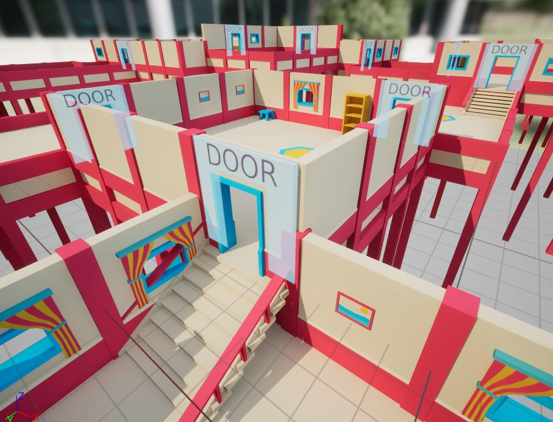
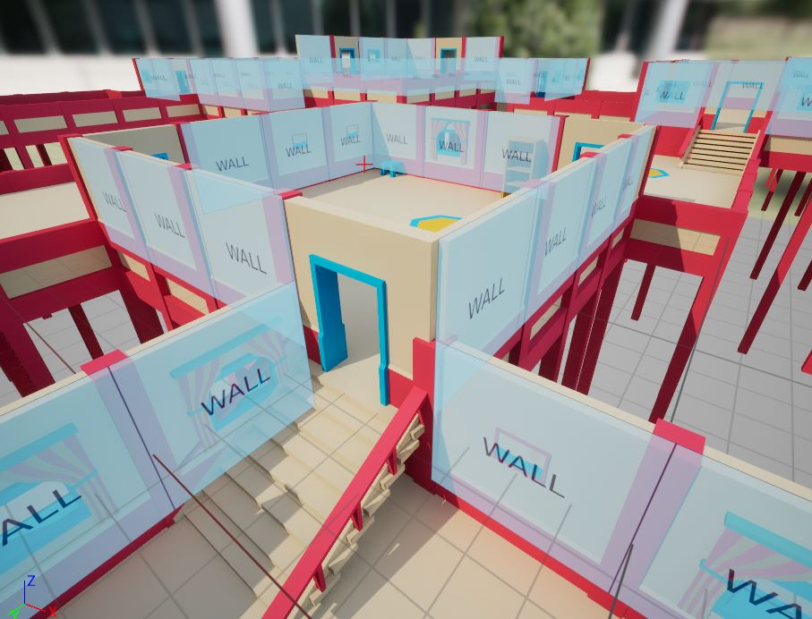
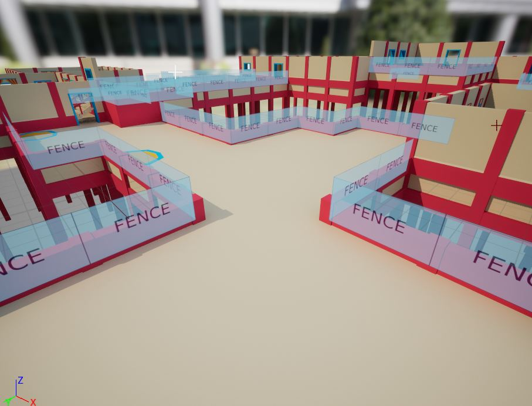

# Alignment Guides

Dungeon Architect can adapt to any modular asset regardless of the mesh pivot position.  If the pivots are off, you can always adjust them from the Offset section of the node's properties

Sometimes, it is difficult to line up the ground node, as there is no point of reference to compare with.

In that case, select the marker node, and it would show the alignment guides

> The alignment guides show up only for built-in marker nodes and not custom marker nodes
{style="note"}

Here, the ground assets have their pivot on the corner of the mesh, rather than in the center (Synty assets usually have this).   Now we can go ahead an adjust the transform of the ground mesh.
In this example, it was corrected by setting the offset to (-200, -200, 0)

Deselect the marker node to remove the alignment guides from the preview viewport

It is important to first align the ground mesh and then use that as a reference to align your walls and fences.  If the ground is not aligned correctly, the rest will also not align (since you will be using an incorrect point of reference for aligning the rest)

