A theme file lets you map the different assets (meshes, blueprints, lights etc) used to populate your dungeon.

<iframe
    width="100%"
    height="540"
    src="https://www.youtube.com/embed/rzY768vzmz8"
    frameBorder="0"
    allow="accelerometer; autoplay; clipboard-write; encrypted-media; gyroscope; picture-in-picture"
    allowFullScreen
/>

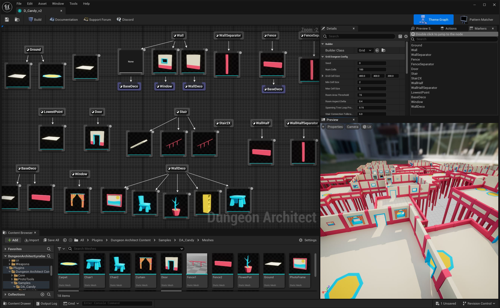

When a dungeon is built, it does not spawn any meshes.  Instead, it scatters invisible points called `Markers` all around the
map (e.g. `Wall`, `Ground`, `Door` etc.) where ever they are expected.

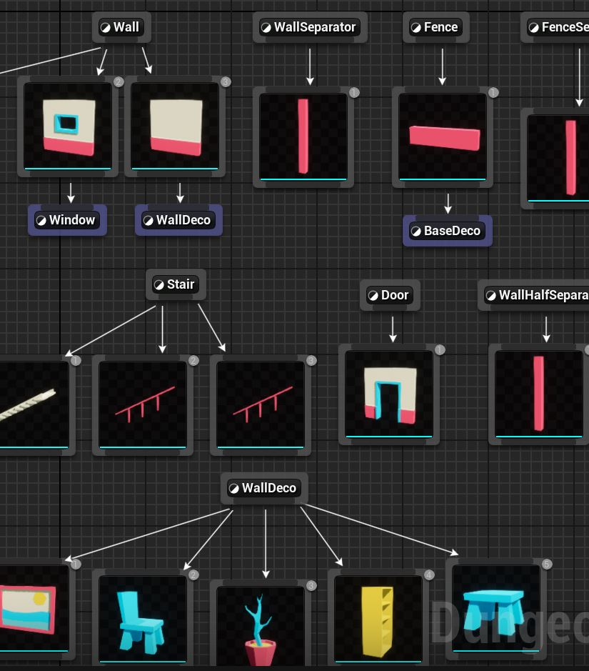

The theme engine then runs and spawns any meshes/blueprints you specify under these markers
   
In the previous section, we created a dungeon with an existing theme file.  In this section, we'll create one ourselves

## Create a Theme File

Right click on the `Content Browser` and choose ``Dungeon Theme``

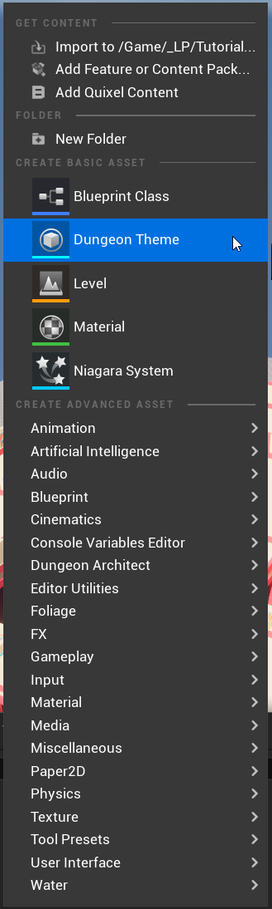

This will create the Dungeon Theme asset.  Double click it to open the Theme Editor

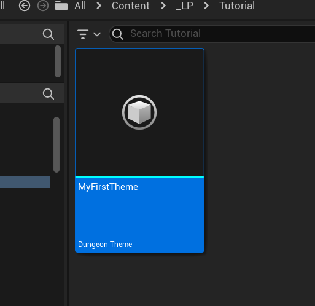
   
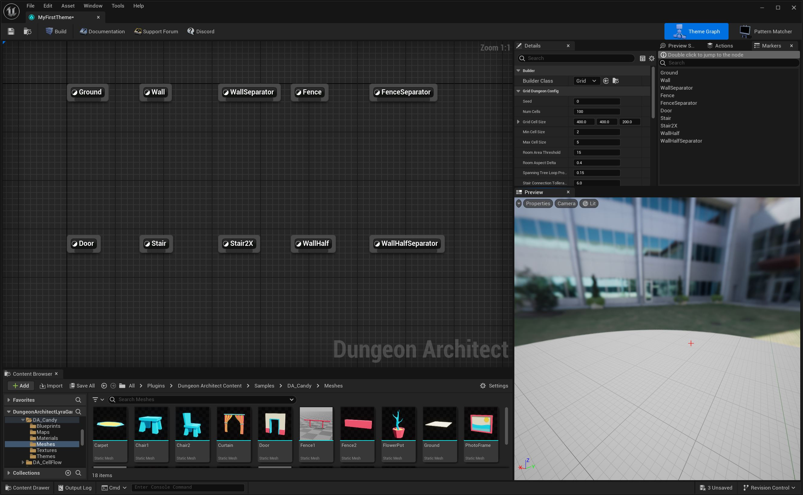

## Assign Grid Size

We'll use modular assets to populate our dungeon. As with any modular assets, they need to have a consistent size, so 
they all fit together nicely.    You'll specify the grid size in the dungeon properties.

With the theme editor open,  click on an empty area of the graph and inspect the details panel

The default grid size is `(400, 400, 200)`.  Leave this to the default for now, but you'll need to set this to the size
of the modular art asset being used in the theme

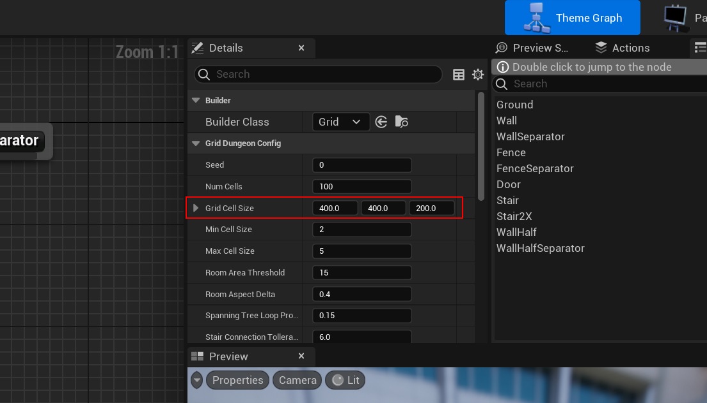

:::note
If you change this, you'll need to set this in the level editor's dungeon actor properties as well while building the dungeon
:::

## Use Sample Assets

In the `Content Browser`, [enable plugin contents](create-first-dungeon.md#show-plugin-content), so we can use sample meshes that come with the plugin to design our theme

:::note
You can use any asset you like, but for this tutorial, lets stick with the sample assets
:::
	

   

Navigate to ``Dungeon Architect Content > Showcase > Samples > Themes > Candy > Meshes``.  This folder contains a set of meshes we can use for our dungeon

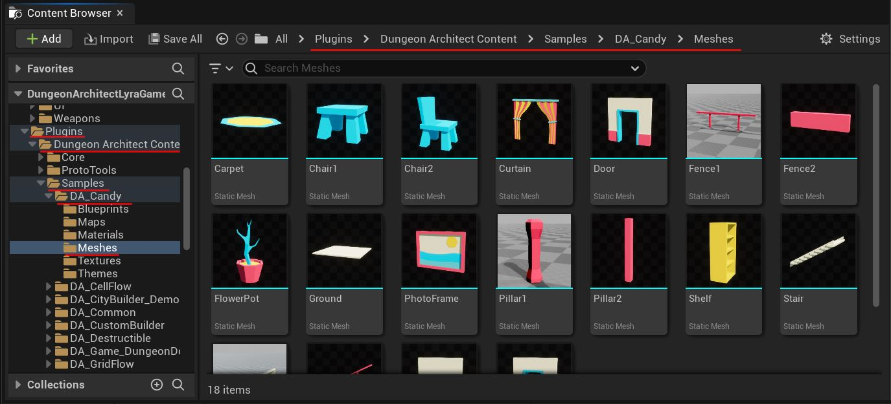

   
## Add Ground Mesh

Drag-drop the ground mesh on to the Theme Editor

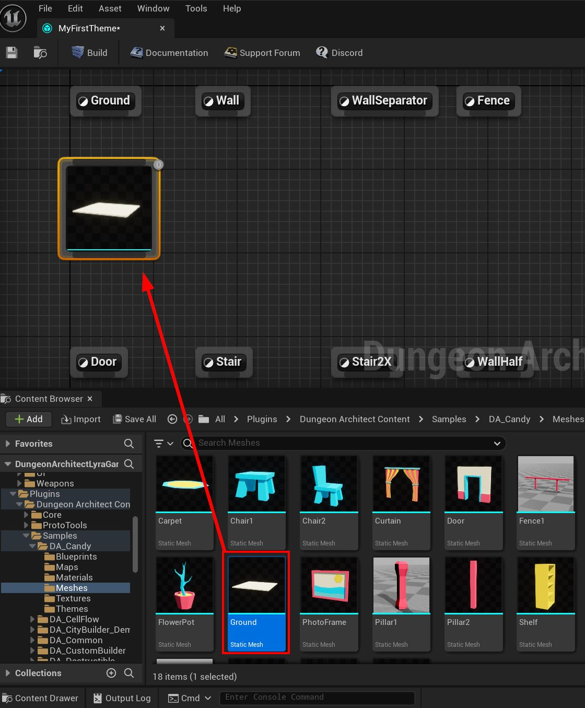

   
Link up the mesh node with the ``Ground`` marker node.  When you do, you should see a live preview on theme editor's Preview Viewport window

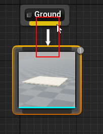

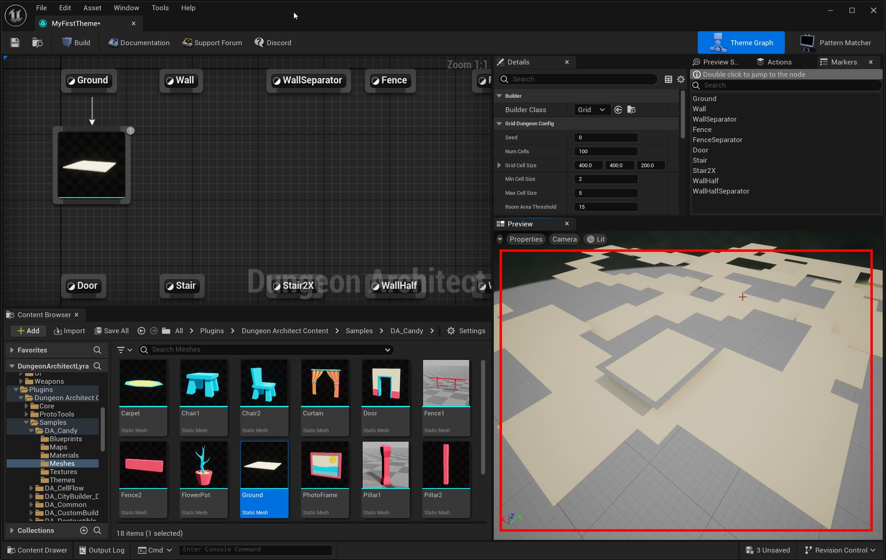

## Add More Meshes

Go ahead and add more meshes under the following markers: **Wall**, **Fence** and **Door**

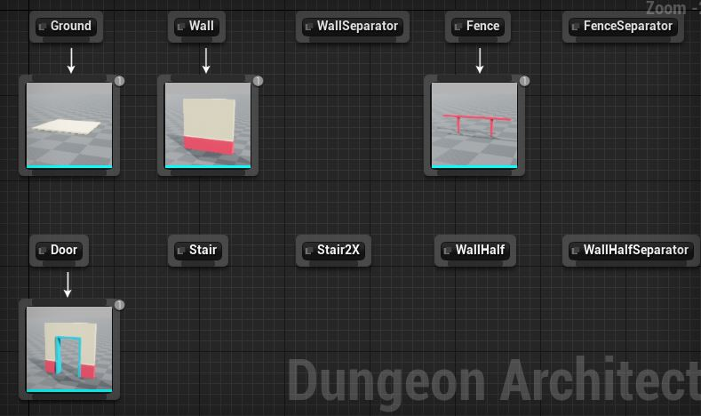

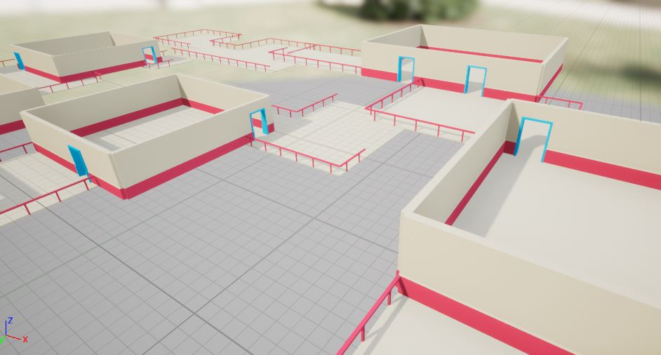

## Add Wall Pillars

Drag drop the ``Pillar2`` mesh to the theme editor and link it to the ``WallSeparator`` marker node

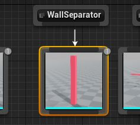

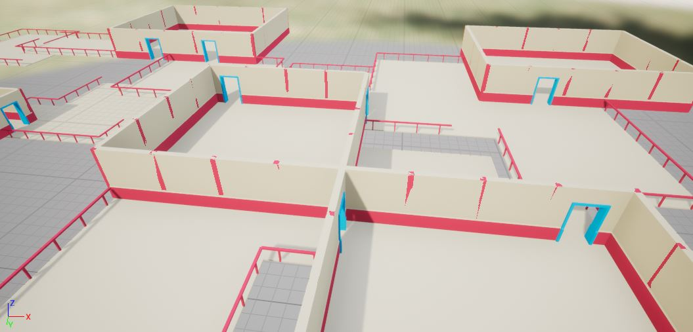

We'll need to make this pillar a bit bigger. Select the node you just dropped and modify the Scale parameter under Offset category

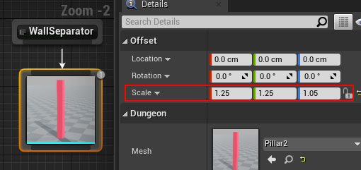
   

The live preview should update automatically to show the new scaled pillars

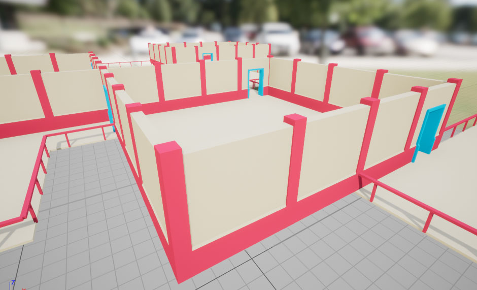

## Add Windows

We have two wall meshes in the samples folder

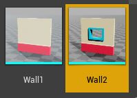

The other one (``Wall2``) has a window. Lets configure the theme to sometimes use this second mesh, so we can have some windows

Drag drop ``Wall2`` mesh on to the theme editor and place it **before** (left of) the existing wall mesh node

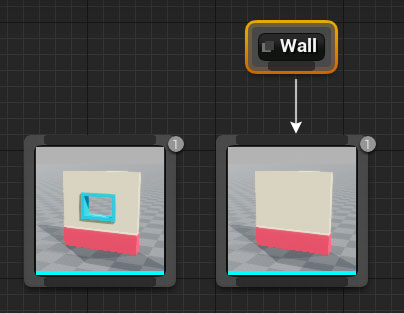

Link them up. The execution index should get updated, indicating their execution order

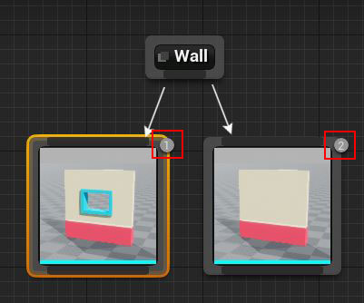

Notice that the first node has been picked up and all the walls have been replaced with the windowed version

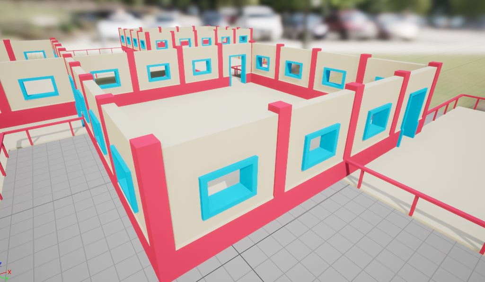

This is because Dungeon Architect starts executing the nodes from left to right. When the condition was satisfied to pick the first node, it stopped execution and never came to the second node. 

There are multiple ways you can control this condition, the simplest being adjusting the probablity of selection.

Select the node you just dropped and change the probability to ``0.5`` (this would mean it gets selected 50% of the time).  The other 50% of the time, it would not be selected and the execution would then move to the next node, and hence selecting the non-windowed wall node

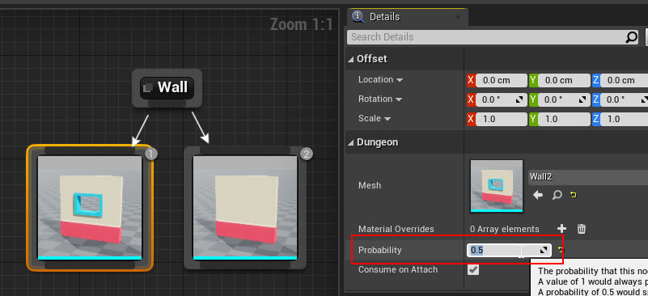
   
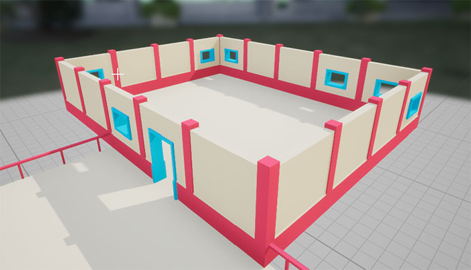

## Add Wall Decorations

There's a photo frame mesh we'd like to attach to every wall.  Drag drop this mesh to the theme editor **before** the two existing wall nodes and link it to the ``Wall`` marker node

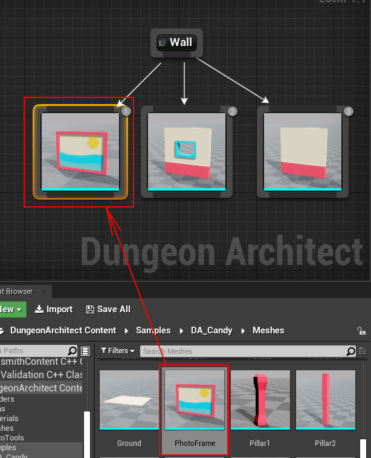
   

This will cause all the walls to disappear and be replaced with this photo frame

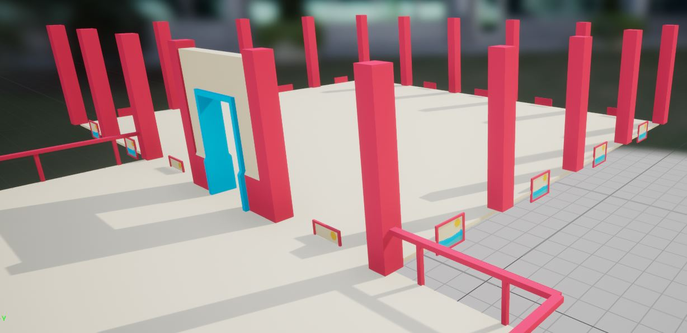
   
This is because once the photo frame node was selected, the execution stopped there and the wall nodes further down the line were not executed.    

Selected the photo frame and uncheck the flag "Consume on Attach".  This will cause the execution to continue further even though this node was selected by the theming engine

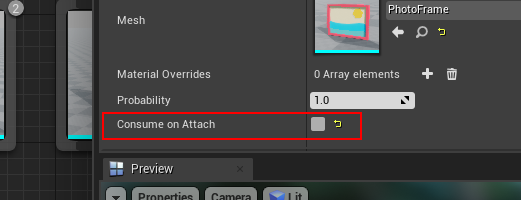
   
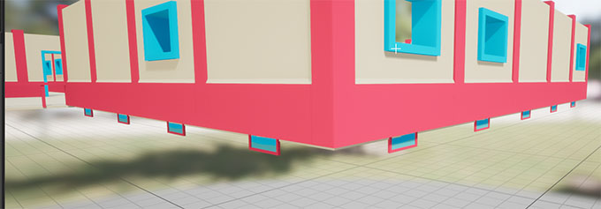
   

Lets adjust the offset of the photo frame (position and rotation) to make it properly align with the inner walls

Select the photo frame node and change the Offset's **Position** to ``(0, -22, 200)`` and **Rotation** to ``(0, 0, 180)``

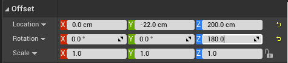
   

The photo frame is aligned now with the walls correctly

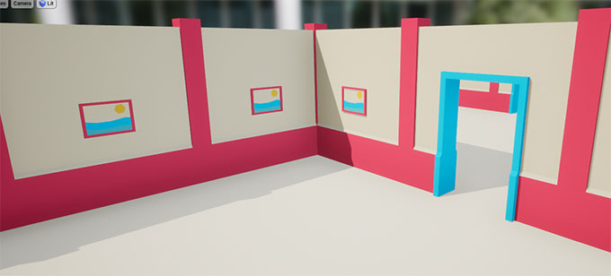
   

## Marker Emitters

We have an issue with the photo frames. They also spawn near windows

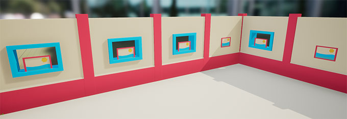
   

``Marker Emitters`` allow you to emit marker names from any of your dropped mesh nodes.  This means, we can define a new marker node (e.g. ``MyWallDeco``) and then emit that marker from the wall node that doesn't have a window (``Wall1`` mesh).  All our wall decorations can now go under this ``MyWallDeco`` marker and it will show up only near solid walls

Right click on an empty area in the theme editor and select ``Add Marker Node``

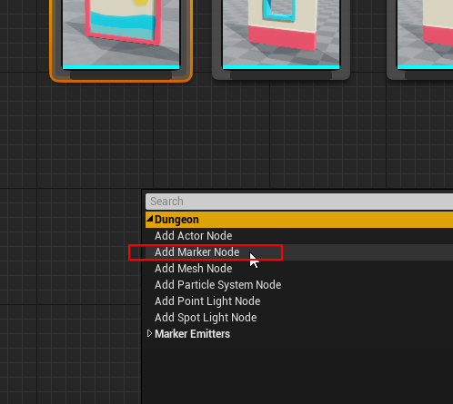
   

Select the newly created marker node and change its name to ``MyWallDeco``

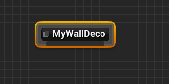
   

Break the link to the photo frame

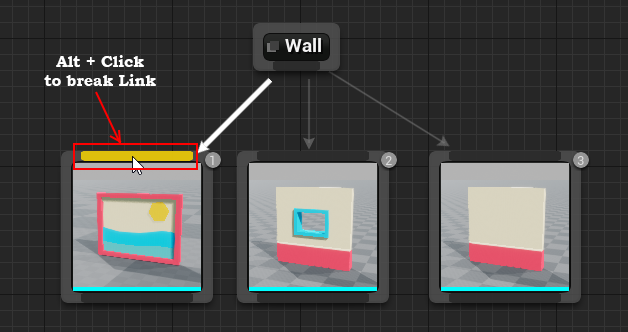
   

Connect this under ``MyWallDeco`` marker node.  All the future wall decorations can also go under this marker

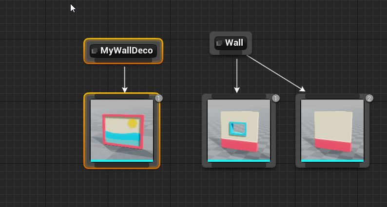
   
   
Now emit this marker from the wall node that doesn't contain a window

Drag a link out of the bottom of the solid wall mesh node and release the mouse in an empty area

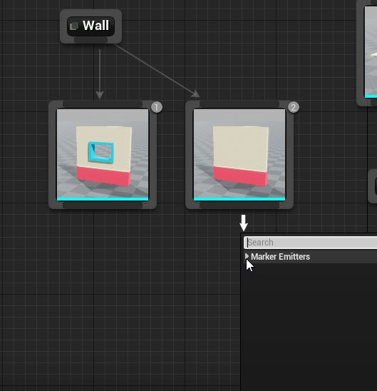
   
Expand the category ``Marker Emitter``  in the context menu and select ``MyWallDeco``

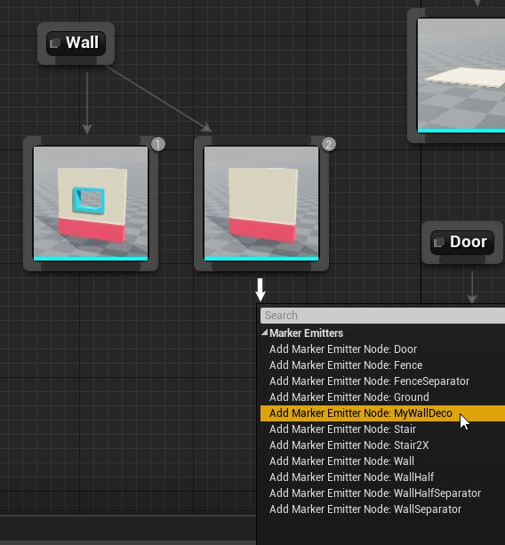

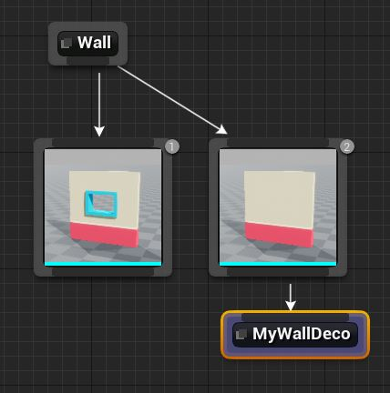

This will cause the marker named ``MyWallDeco`` to be emitted in the scene whenever the solid wall node is selected, in which case it would then process the nodes defined under it.    Now our decorations don't show up near windows

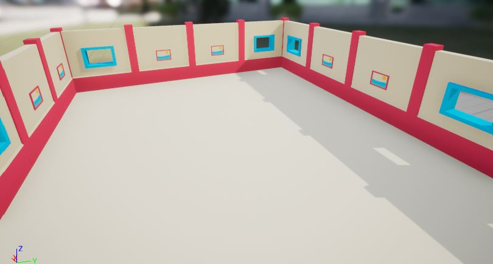

You can follow the same method to create another type of decoration (e.g. MyWindowDeco) and emit it from under the windowed wall node. In this example, I've added a flower pot in the windows

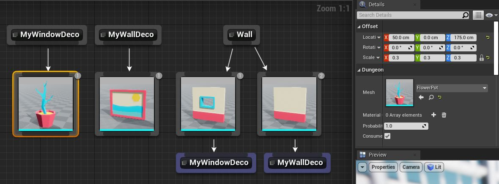
   
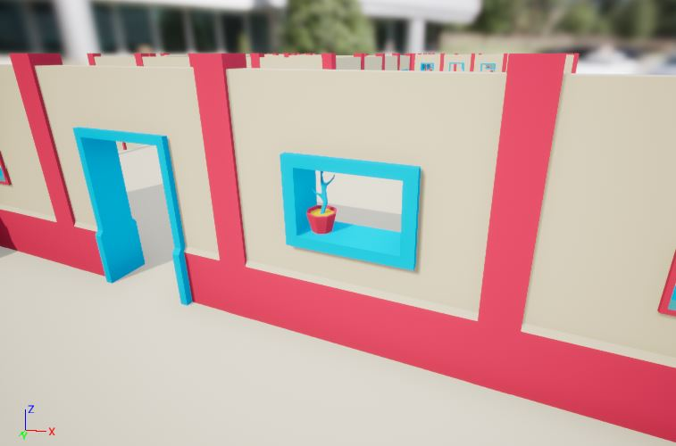

## Recap
In this section we learnt the following:

* *Probablity* - Controls the percentage chance of a node being selected.  A value of 1 means 100% selection chance. A value of 0.25 means 25% selection chance
* *Execution Order* - The theme engine executes all the nodes under a marker node from left to right. If it selects a certain node, it stops executing, unless the ``Consume on Attach`` flag is unchecked
* *Marker Emitters* - You can create complex hierarchies with your own marker nodes, giving you more freedom to decorate your dungeons
