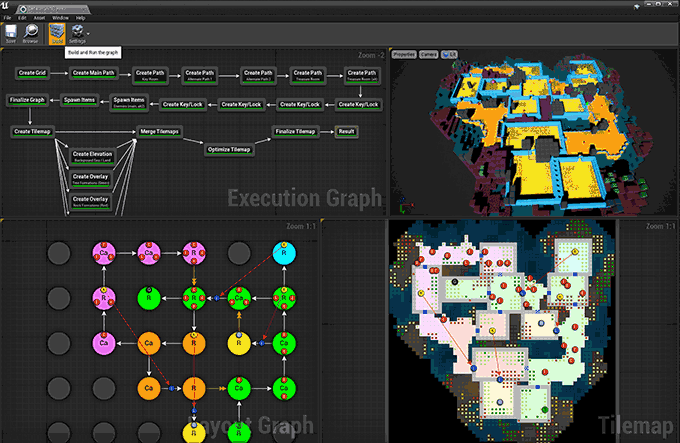

Design procedural level layouts and item placements using the powerful Flow framework and its accompanying toolset

Create cyclic paths, key-locks, teleporters, foliage, trees, elevation maps and much more

> Click the image to play

## Videos

Node-driven paths on a tilemap - cycles, key-locks and item placement

<iframe
    width="100%"
    height="540"
    src="https://www.youtube.com/embed/_fk6lkGI7qg"
    frameBorder="0"
    allow="accelerometer; autoplay; clipboard-write; encrypted-media; gyroscope; picture-in-picture"
    allowFullScreen
/>

The flow framework underneath is shared with Snap Grid Flow and Cell Flow, so this one applies to all three

<iframe
    width="100%"
    height="540"
    src="https://www.youtube.com/embed/nari308uXoc"
    frameBorder="0"
    allow="accelerometer; autoplay; clipboard-write; encrypted-media; gyroscope; picture-in-picture"
    allowFullScreen
/>
