# Create a Grid Flow Dungeon

The Grid Flow Builder offers a rich set of tools to control the flow of your dungeons and item placement

## Setup Dungeon Actor

Create a new Level and drop in a dungeon actor

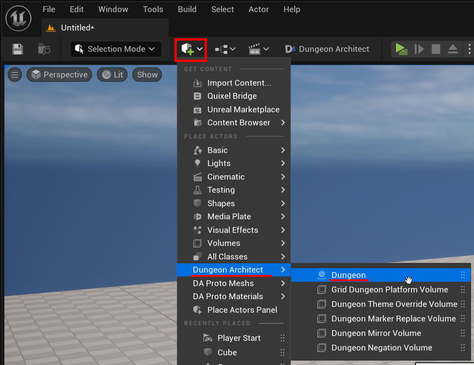

Inspect the properties of the dungeon actor you just dropped.   Set the `Builder Class` to ``GridFlowBuilder``

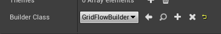

## Setup Theme

Click the ``+`` icon next to the Themes array to create a new theme entry.

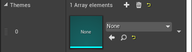

Here we'll assign an existing theme from the samples folder.  For this, we'll need to enable `Show Engine Content` and `Show Plugin Content` from the view options

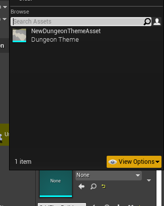

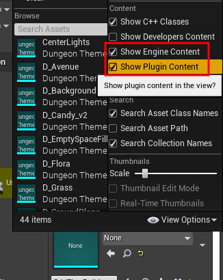

We'll assign the theme ``T_DefaultGridFlow``.

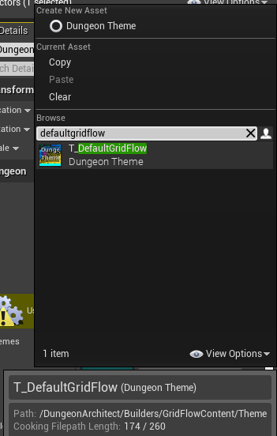

> The above theme file is under `Dungeon Architect Content > Builders > GridFlowContent > Theme` folder 
> 
> 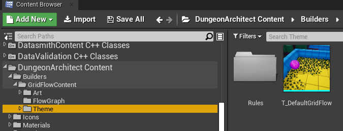

## Setup GridFlow Graph

This builder requires another asset called the `Grid Flow Graph`.   This is a graph that helps you  control the flow of your dungeon. In this section, we'll use an existing graph from the samples folder

Select the Dungeon actor and in the `Grid Flow` setting assign the following asset ``DefaultGridFlow``.  This is in the folder `Dungeon Architect Content > Builders > GridFlowContent > FlowGraph`

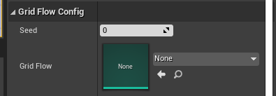

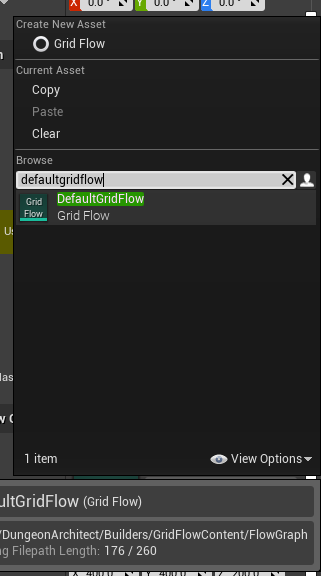

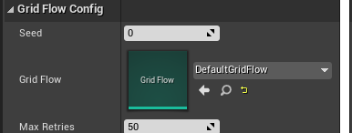

## Build Dungeon

Select the Dungeon actor and click `Build Dungeon` button from the Details panel

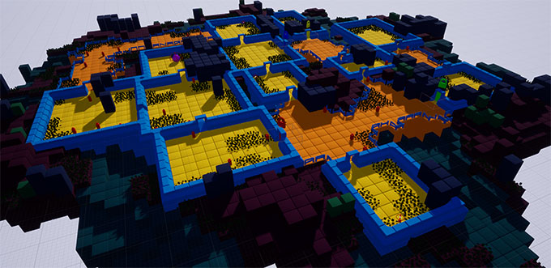

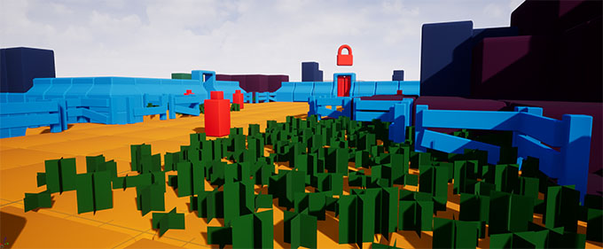
   
