In the previous section, we used an existing Grid Flow graph from the samples folder. In this section, we'll design one ourselves.

## Setup

Close the Grid Flow Editor, if open

Right click on the `Content Browser` and choose `Dungeon Architect > Grid Flow > Grid Flow Graph`.  

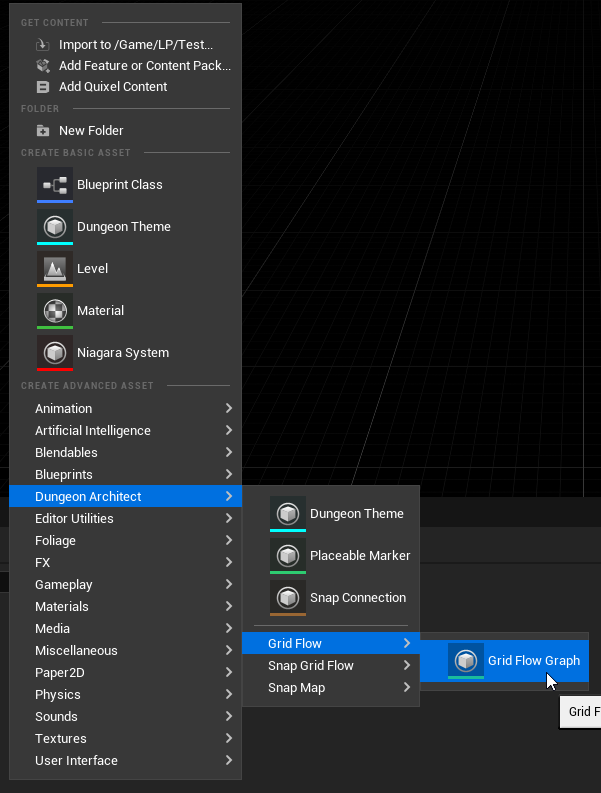

This will create a new Grid Flow asset. Rename it to something appropriate and double click to open it in the `Grid Flow Editor`

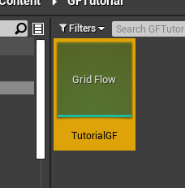

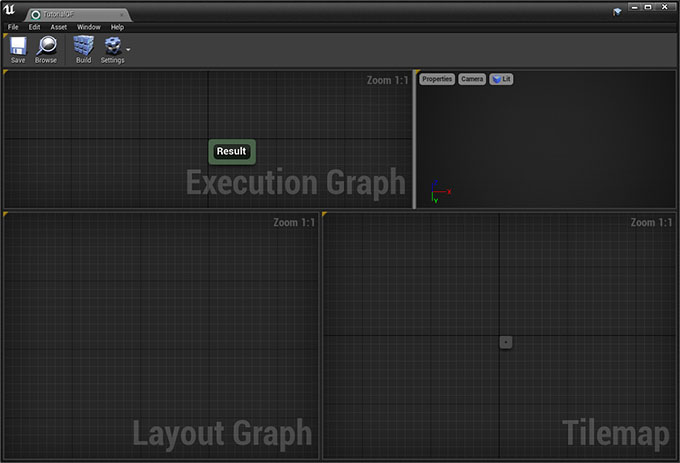

Notice that there is only one node in the Execution graph, the ``Result`` node.   Our final output should be connected to this node

## Create Grid

Right click on an empty area in the Execution Graph and from the context menu select ``Layout Graph > Create Grid``

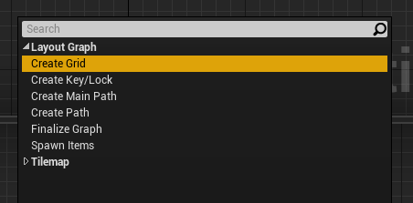

Connect this node to the ``Result`` node and click the ``Build`` button in the toolbar

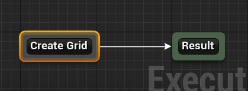

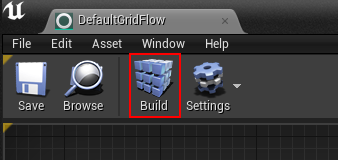

This node creates an initial grid to work with

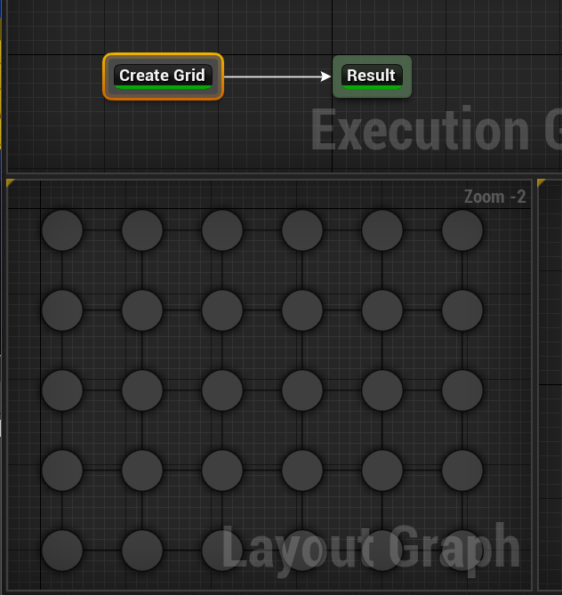

We'll be designing our layout in this grid.   This allows us to work on a higher level abstract graph, making it easier to control the flow.   It will then be transferred over to a tilemap

## Create Main Path

Next, we'll create a main path within this grid. The main path has a spawn point and a goal

Create a new node ``Layout Graph > Create Main Path``

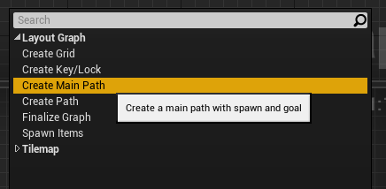

Unlink the ``Create Grid`` node from the ``Result`` node (do this by pressing Alt+LeftClick on the Create Grid Node's border)

Click the Build button. A main path would have been created in the grid

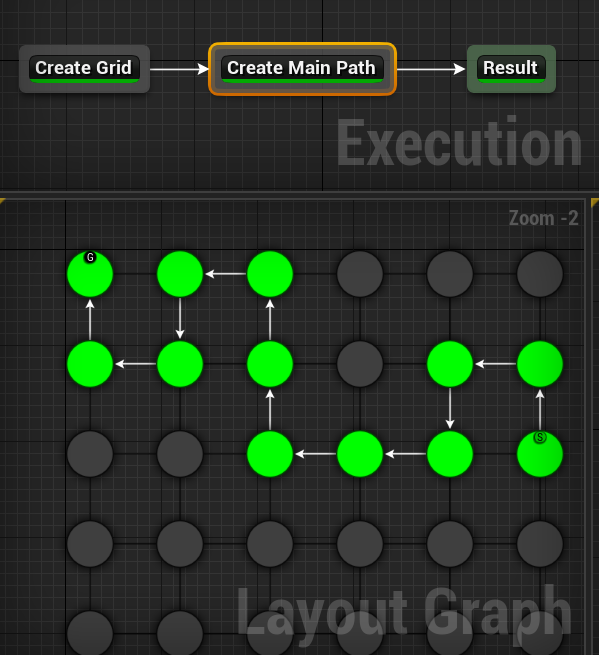

Keep hitting the `Build` button for different result

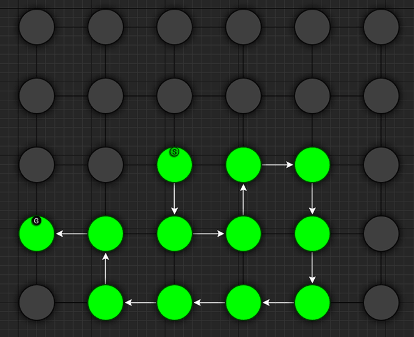

> Click the image to play

:::note
If you do not see random results when you hit `Build`, make sure randomize is enabled.  Enable this by clicking the `Settings` button on the toolbar and choosing `Editor Settings`.  Then enabled `Randomize Seed`
:::

Select the ``Create Main Path`` node and inspect the properties

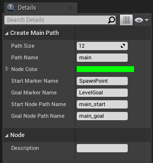

We'll leave everything to default for now

Notice the `Path Name` parameter is set to ``main``   This is the name of the path and we will be referencing this path in the future nodes with this name

You can adjust the size of the path.   ``Start Marker Name`` and ``Goal Marker Name`` lets you specify a name for the markers. You can then create these markers in the theme file and add any object you like.    In the sample theme, there's a marker already created with these names and a Player Start is placed under ``SpawnPoint`` marker and a level goal handler prefab is placed under ``LevelGoal`` marker

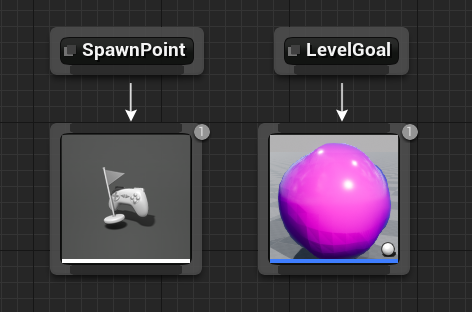

## Create Alternate Path

We'll next create an alternate path branching off the main path so the player has another way of reaching the goal

Create a new node ``Layout Graph > Create Path``

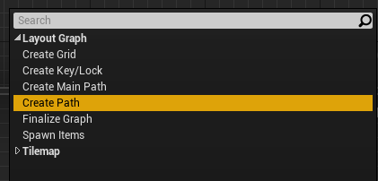

Connect the nodes together like below

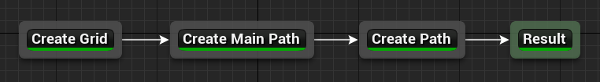

Leave all the properties as default and hit `Build`

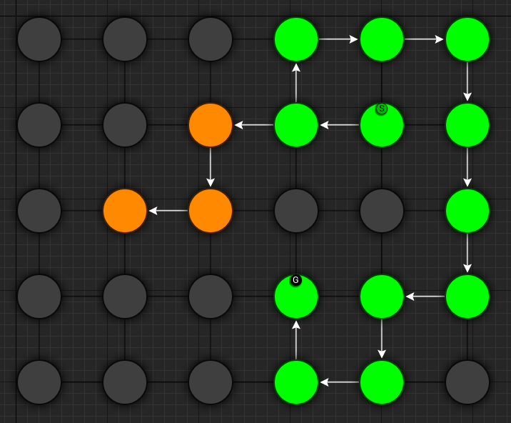

Select the ``Create Path`` node and inspect the properties

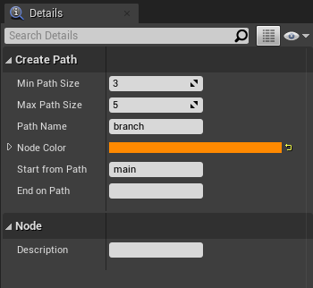

Change the `Path Name` from ``branch`` to ``alt``.  We will be referencing this path as ``alt`` in the future

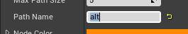

You can specify the paths from which this path should start and end.    The `Start From Path` parameter is set to ``main``, referencing the main path we created in the previous section

The `End On Path` is left empty, so the end of this path doesn't connect back to anything.   We'd like this path to connect back to the main path.

Set the `End On Path` parameter to ``main``

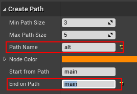

| Property        | Value  |
| --------------- | ------ |
| Min Path Size   | 3      |
| Max Path Size   | 5      |
| Path Name       | alt    |
| Node Color      | orange |
| Start From Path | main   |
| End On Path     | main   |

This will make the alternate path (orange) connect back to the main path (green)

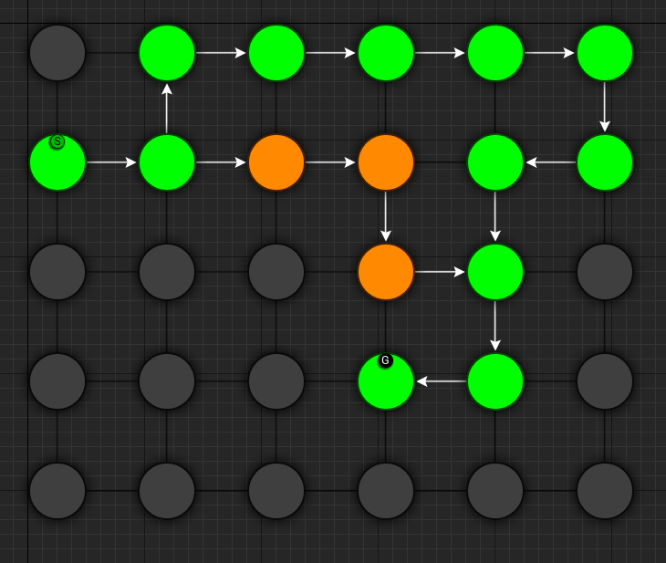

Keep hitting Build for different results

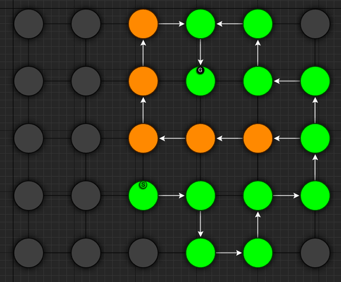

> Click the image to play

Assign a description to the node.  Select the `Create Path` node and set the description property to ``Alternate Path``

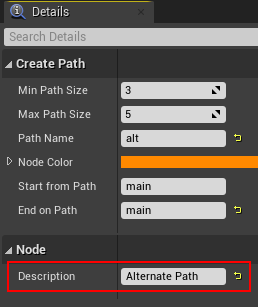

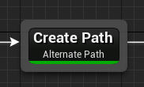

## Create Treasure Room (Main)

We'll add a treasure room connected to the main path

Add a new node ``Layout Graph > Create Path`` and set it up as follows:

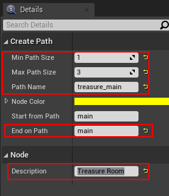

| Property        | Value         |
|-----------------|---------------|
| Min Path Size   | 1             |
| Max Path Size   | 3             |
| Path Name       | treasure_main |
| Node Color      | yellow        |
| Start From Path | main          |
| End On Path     | main          |

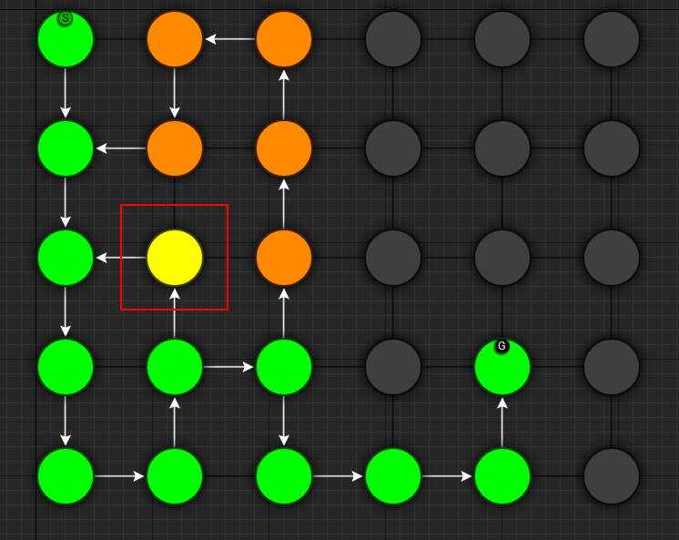

## Create Treasure Room (Alt)

We'll add another treasure room connected to the ``alt`` path but keep the ``End On Path`` parameter empty so it doesn't connect back to anything:

Add a new node ``Layout Graph > Create Path`` and set it up as follows:

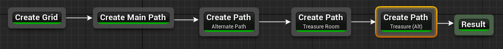

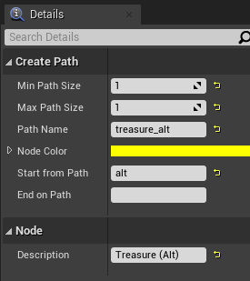

| Property        | Value        |
|-----------------|--------------|
| Min Path Size   | 1            |
| Max Path Size   | 1            |
| Path Name       | treasure_alt |
| Node Color      | yellow       |
| Start From Path | alt          |
| End On Path     |              |

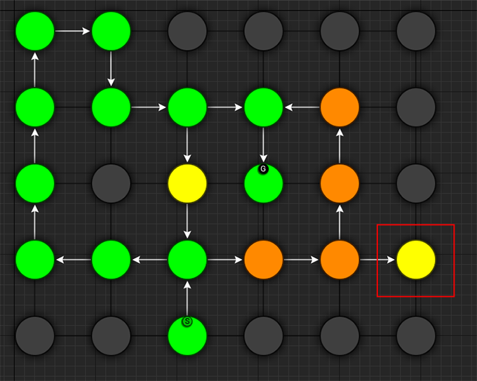

## Create Key Room

We'll create a room connected to the main path which will act as the key room. We'll later configure this room to have a key that opens up a lock in the main path. It will also have a NPC (key guardian) guarding the key

Add a new node ``Layout Graph > Create Path`` and set it up as follows:

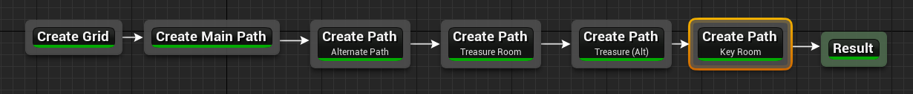

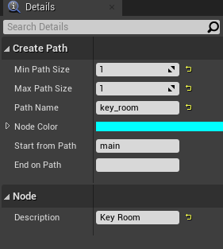

| Property        | Value    |
|-----------------|----------|
| Min Path Size   | 1        |
| Max Path Size   | 1        |
| Path Name       | key_room |
| Node Color      | cyan     |
| Start From Path | main     |
| End On Path     |          |

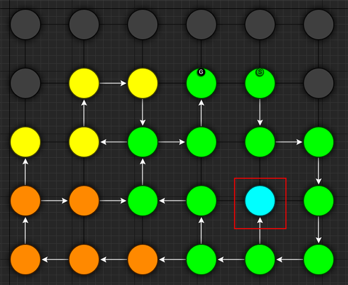

:::note
We've named this path ``key_room``. It will be referenced later on when creating the key locks
:::

## Create Key-Lock (Main)

We'll next create a key-lock system on the main path.  Our key will go on the Key Room we created earlier (``key_room`` path) and the lock will be somewhere in the main branch (``main`` path)

Add a new node ``Layout Graph > Create Key Lock`` and set it up as follows:

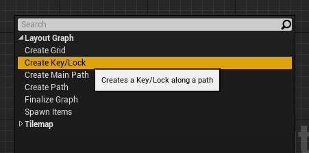

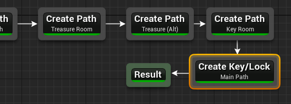

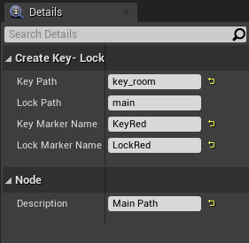

| Property         | Value    |
|------------------|----------|
| Key Path         | key_room |
| Lock Path        | main     |
| Key Marker Name  | KeyRed   |
| Lock Marker Name | LockRed  |

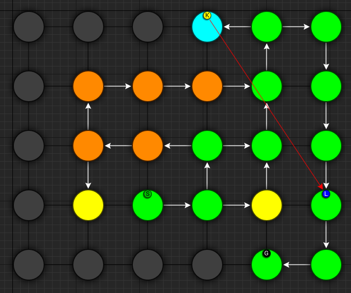

Specify the `Key Path` as ``key_room`` and `Lock Path` as ``main``

Set marker name for the key as ``KeyRed`` and lock as ``LockRed``.    Then in the theme file, you'd create marker nodes with these names and add your key and locked gate prefabs.

The sample theme already has these setup

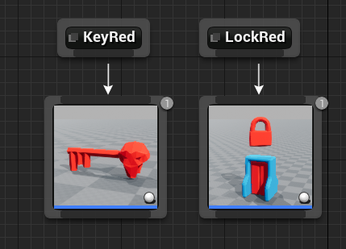

## Create Key-Lock (Treasure Main)

We need a key-lock to guard the treasure room in the main branch

Add a new node ``Layout Graph > Create Key Lock`` and set it up as follows:

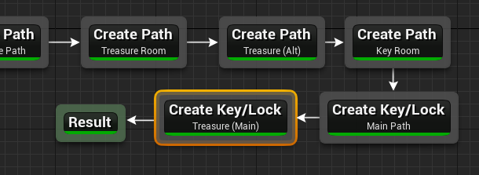

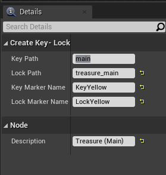

| Property         | Value         |
|------------------|---------------|
| Key Path         | main          |
| Lock Path        | treasure_main |
| Key Marker Name  | KeyYellow     |
| Lock Marker Name | LockYellow    |

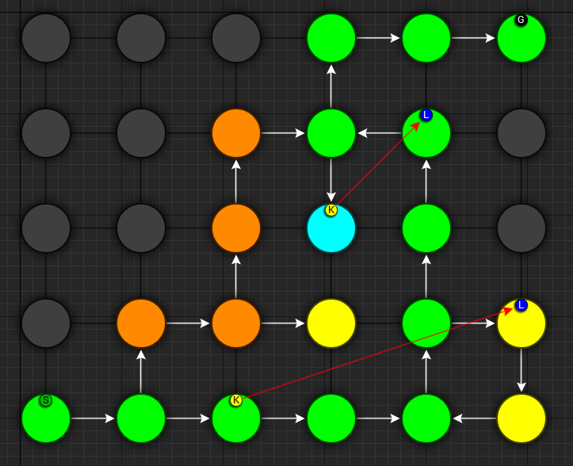

Set marker name for the key as ``KeyYellow`` and lock as ``LockYellow``.    Then in the theme file, you'd create marker nodes with these names and add your key and locked gate prefabs.

The sample theme already has these setup

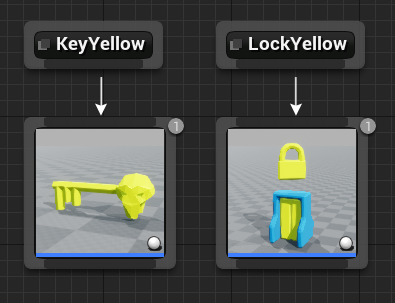

## Spawn Enemies (Main, Alt)

We'll use the ``Spawn Items`` node to spawn enemies on the ``main`` and ``alt`` paths

Create a new node ``Layout Graph > Spawn Items`` and set it up as follows:

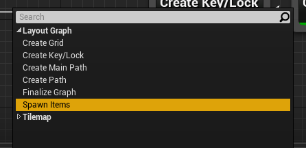

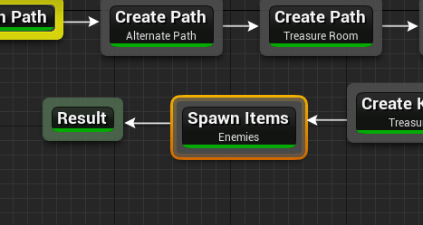

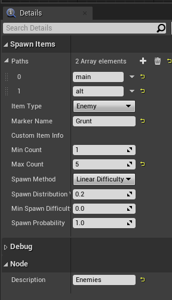

| Property    | Value     |
|-------------|-----------|
| Paths       | main, alt |
| Item Type   | Enemy     |
| Marker Name | Grunt     |
| Min Count   | 1         |
| Max Count   | 5         |

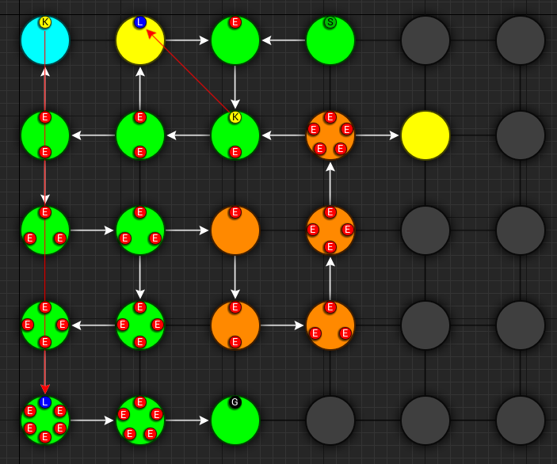

This will spawn enemies in the nodes, gradually increasing the number of enemies based on the difficulty. The difficulty increases as we get closer to the goal. You can control this from the `Spawn Method` properties. Leave it to default for now

We've specified the marker name as ``Grunt`` and an appropriate marker node should be created in the theme file so we can spawn prefabs under it.  The sample theme already has this marker

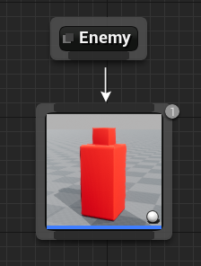

## Spawn Bonus (Treasure Chests)

Spawn treasure chests in your bonus rooms using the `Spawn Items` node

Create a new node ``Layout Graph > Spawn Items`` and set it up as follows:

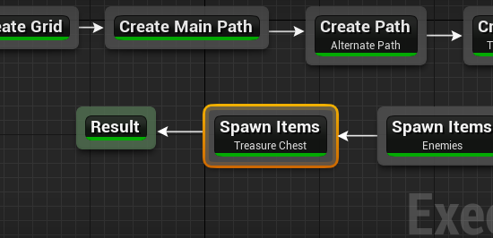

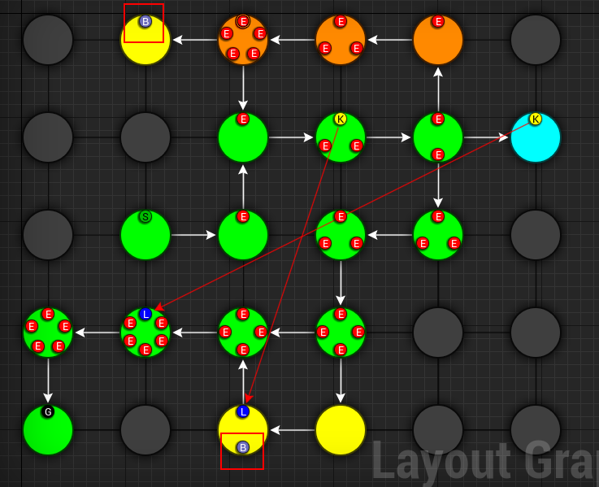

| Property             | Value                       |
|----------------------|-----------------------------|
| Paths                | treasure_main, treasure_alt |
| Item Type            | Treasure                    |
| Marker Name          | Treasure                    |
| Min Count            | 1                           |
| Max Count            | 1                           |
| Min Spawn Difficulty | 1                           |

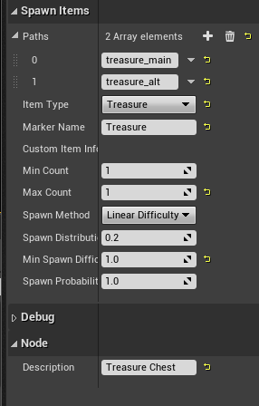

We've specified the marker name as ``Treasure`` and an appropriate marker node should be created in the theme file so we can spawn prefabs the treasure chest under it.

The `Min Spawn Difficulty` is set to ``1``.   The first node in the branch will have a difficulty of ``0`` and the last node ``1``.  Sometimes, the yellow branch may be 3 nodes long.  Since we want the chest to occur only on the last node, we've set this value to ``1``

## Spawn Key Guardian

We'll add an NPC in the Key room guarding the key

Create a new node ``Layout Graph > Spawn Items`` and set it up as follows:

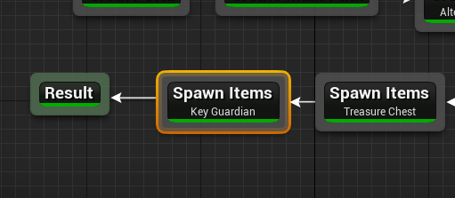

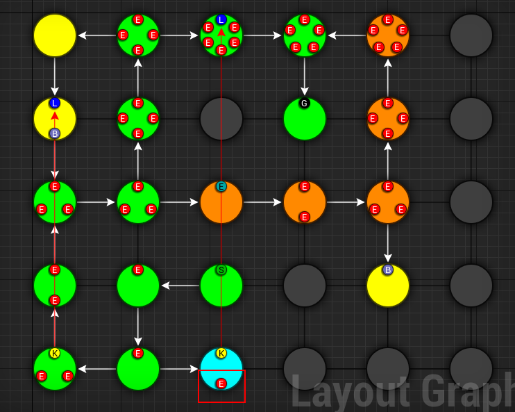

| Property    | Value       |
|-------------|-------------|
| Paths       | key_room    |
| Item Type   | Enemy       |
| Marker Name | KeyGuardian |
| Min Count   | 1           |
| Max Count   | 1           |

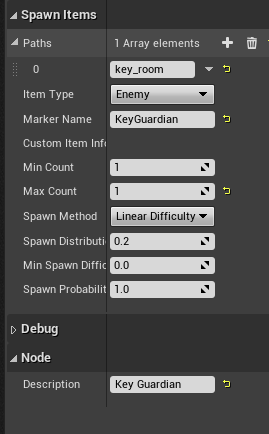

You'll need to create a marker named ``KeyGuardian`` in the theme file and place your NPC prefab under it.   This marker doesn't exist in the sample theme and you'll need to create it yourself if you want to visualize it

## Spawn Health Pack

We'll use the `Spawn Items` node to spawn a few health pickups along the `main` and `alt` paths

This section also shows you how to use the `Custom` Item Type

Create a new node ``Layout Graph > Spawn Items`` and set it up as follows:

| Property                            | Value        |
|-------------------------------------|--------------|
| Paths                               | main, alt    |
| Item Type                           | Custom       |
| Marker Name                         | HealthPickup |
| Min Count                           | 0            |
| Max Count                           | 1            |
| Spawn Method                        | Random Range |
| Spawn Probability                   | 0.4          |
| Custom Item Info > Preview Text     | H            |
| Custom Item Info > Text Color       | Red          |
| Custom Item Info > Background Color | White        |

:::note
You'll need to create a marker named ``HealthPickup`` in your theme file and add your health pack actor. The sample theme doesn't contain this
:::

## Finalize Layout Graph

After we are done designing the layout graph, we'll need to finalize it with the `Finalize Graph` node.    This node does a few things:

* Move the locks from the nodes on to the links
* Create one way doors (so we don't go around locked doors)
* Assign room types (Room, Corridor, Cave)

Create a new node ``Layout Graph > Finalize Graph`` and set it up as follows:

Leave all the properties to default

> Click the image to play

We are now ready to create a tilemap from this

## Create Tilemap

Create a new node ``Tilemap > Initialize Tilemap`` and set it up as follows:

### Cave Thickness

You can control the thickness of the caves from the `Cave Thickness` parameter.   Each node on the layout graph gets converted into rooms in the tilemap.

### Wall Generation Method

Depending on your art assets you might want your wall mesh to take up one full tile (e.g. where the mesh size is 400x400) or sit in the edge of the tile (mesh size 400x10)

* `Wall as Tile`: Use this option if you want your walls to take up one full tile
* `Wall as Edge`: The walls are placed on the dge of the tiles and do not take up one full tile

:::warning
If you face alignment issues with the wall, try setting this value to `Wall as Edge`
:::

### Chunk Size

The parameter `Tilemap Size Per Node` controls how many tiles are used to generate a room from the node. Bump this number up if you want more space in your rooms

If you want a more uniform grid like look on your rooms, bring the `Perturb Amount` close to ``0``

### Padding

`Layout Padding` adds extra tiles around the dungeon layout.   Set this value to ``5`` so we can apply some decorations outside the dungeon bounds

> Click the image to play

### Preview Color Settings
When you select a node on the layout graph, the tiles that belong to the node light up.  This is controlled by the `Color Settings` parameters

## 3D Viewport

After you've initialized a tilemap, you now start to see a dungeon generated in the 3D viewport, representing by the tilemap.

The dungeon uses a default theme and the preview theme can be changed from the settings

## Add Background Elevation

We are going to create overlays and merge them with the original tilemap.   Create the following two nodes:

* Create a node ``Tilemap > Create Elevation``
* Create a node ``Tilemap > Merge Tilemaps``

Link them up like below:

Update the properties:

| Property        | Value                      |
|-----------------|----------------------------|
| Noise Frequency | 0.1                        |
| Num Steps       | 12                         |
| Min Height      | -10                        |
| Max Height      | 10                         |
| Sea Level       | -1                         |
| Land Color      | Brown (HexLinear 291A10FF) |
| Sea Color       | Blue (HexLinear 003C66FF)  |

We've specified the marker name as ``Elevation``.   If you place objects under the specified marker node in the theme editor, they will show up on these tiles at the given height.

:::note
The Min/Max height is logical and will be mulitplied by the dungeon config's Grid Size Y value.  If the GridSize is ``(400, 400, 200)`` in the Dungeon actor's config and the tile height happens to be ``2.5``, the actual placement will be on ``2.5 * 200 = 500 unreal units high``
:::

The sample theme file already contains a marker named 'Elevation' which shows the purple/blue tiles on the scene

There are two nodes attached with material overrides (purple and blue for land and sea tiles).  There's a selector logic on the first node that gets selected if the tile is below sea level.

## Add Grass Overlays

We'll overlay some foliage on our dungeon using a noise parameter. Dungeon Architect always places the overlays in a way that they will not block the main path and the level will be playable.  You can overlay rocks, trees and other blocking objects as well

Create a node ``Tilemap > Create Overlay``

| Property            | Value |
|---------------------|-------|
| Marker Name         | Grass |
| Overlay Blocks Tile | False |

Noise Settings:

| Property                | Value |
|-------------------------|-------|
| Noise Frequency         | 0.15  |
| Noise Max Value         | 1.49  |
| Noise Threshold         | 0.5   |
| Min Dist From Main Path | 1     |

Merge Config:

| Property           | Value                    |
|--------------------|--------------------------|
| Max Height         | 1                        |
| Wall Override Rule | Keep Wall Remove Overlay |

We've specified the marker name as ``Grass``.   You'll need to create this marker in the theme file and assign a mesh there.  The sample theme already contains this

> Click the images to play

## Finalize Tilemap

Finalize the tilemap to complete the grid flow graph

Create a node ``Tilemap > Finalize Tilemap``

Finalize Tilemap node places all the items on to the tilemap (enemies, keys, bonus etc)

## Optimize Tilemap

When the tilemap based level is generated, there are many tiles that the player might never see, as they are far away from the dungeon layout

The `Optimize Tilemap` removes tiles that are away from the specified distance from the dungeon layout bounds

Create a node ``Tilemap > Optimize Tilemap``

Connect it before the `Finalize Tilemap` node like below:

Set the `Discard Distance from Layout` value to ``5``

This will drop any tiles that are 5 tiles away from the nearest layout tile

> Click the images to play
