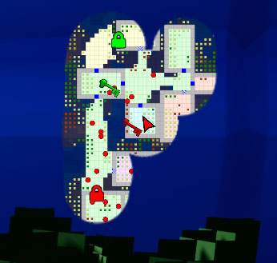
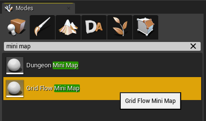
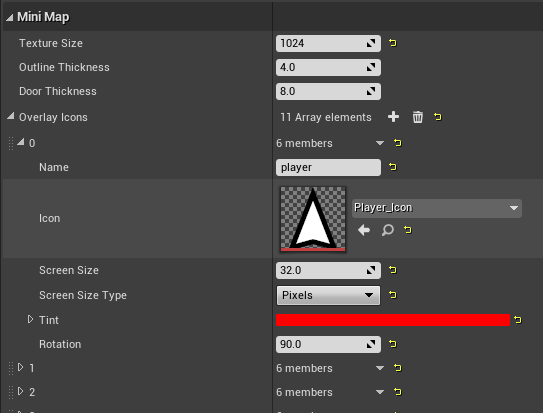
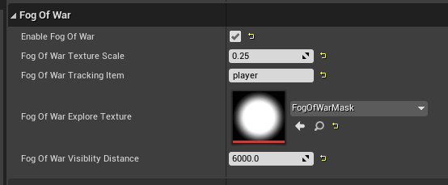
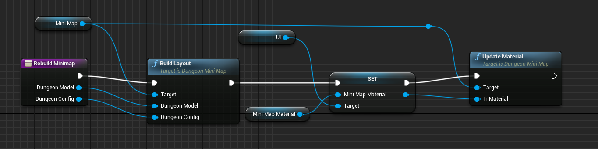
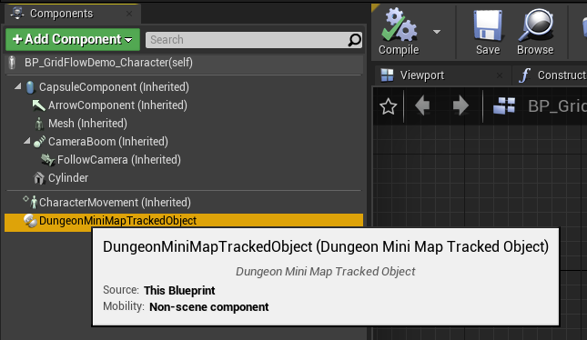
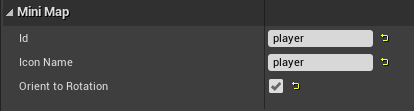
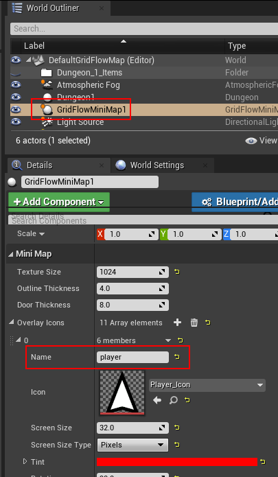

# Mini-Map

## Setup

Display a 2D minimap with fog of war

Drop in a `Grid Flow Mini Map` actor on to the scene and configure it like below

Check the player controller on how to initialize the minimap and show it on the screen ``DungeonArchitect Content > Showcase > Legacy > Samples > DA_GridFlow_Game > Blueprints > BP_GridFlowDemo_PlayerController``

 

Check the HUD widget on how to display this in the screen

``DungeonArchitect Content > Showcase > Legacy > Samples > DA_GridFlow_Game > UI > UI_GridFowDemo_HUD``

## Minimap Tracked Objects

To track an object in the minimap, simple add the ``DungeonMiniMapTrackedObject`` component to it and configure it.

The id maps to the id you specified in the MiniMap actor's icon list

