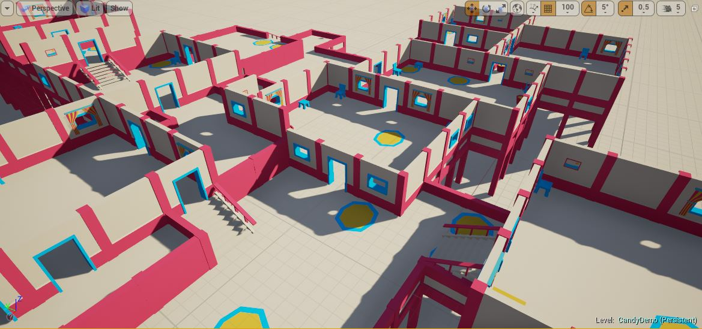

The `Grid Builder` generates a dungeon by scattering rooms across the map and connecting them with corridors.  This builder supports height variations (stairs)

We've used this dungeon builder in the previous section [Create your First Dungeon](getting-started-overview.md) and [Design your First Theme](design-first-theme.md)

In the following sections, we'll explore more on this builder
