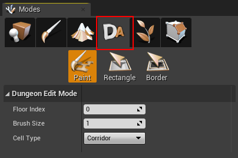
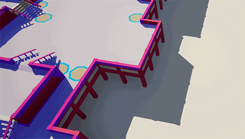

# Paint Mode

You can paint your own dungeon layout on top of the procedural dungeon

Select the Dungeon Edit Mode from the Modes panel.  This will allow you to use the various paint tools to draw over the existing layout

``Left click`` and drag to draw dungeon cells.   ``Shift + Left click`` to delete cells.   ``Scroll wheel`` to move the cursor up/down

> Click the image to play

