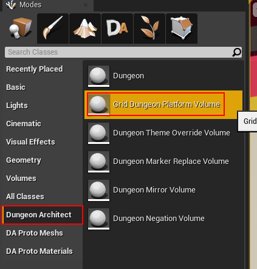
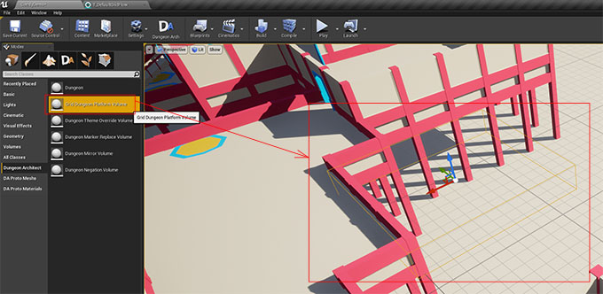
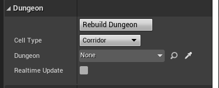
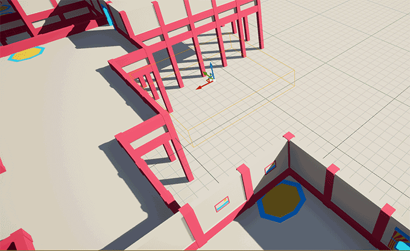

Platform Volumes let you control the placement of the rooms or corridors.   You do this dropping in a ``Grid Dungeon Platform Volume`` on to the scene and resizing  / positioning it on the scene and you room will be built around it.

Select the PlatformVolume game object, set the Dungeon reference and enable ``Realtime Update`` (or press Rebuild Dungeon)

Change the Cell Type from `Corridor` to `Room`

> Click the image to play

Move the `Platform Volume` and scale it to control the position and size of your room. You can have multiple platform volumes in the scene. Check the samples in the Launch Pad for more examples
