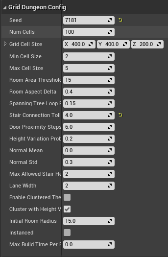

Continuing on the map created in the section [Design your First Theme](../getting-started/design-first-theme.md), open the map and select the `Dungeon` actor and inspect the properties

* Change the ``Seed`` parameter to build a different dungeon layout
* Set the ``Grid Cell Size`` parameter according to your moduler art asset. If the ground mesh is 400x400 and the stair mesh height is 200, set this to ``(400, 400, 200)``
* The dungeon creation method first creates a number of cells (defined by ``NumCells``) and spreads them across the scene.
* The size of these cells is define by the parameters ``Min Cell Size`` and ``Max Cell Size``
* Some of these cells will be promoted to Rooms and the rest will be promoted to Corridors.  If the cell area is large enough (parameter ``Room Area Threshold``), that cell is promoted to a `Room`, otherwise a `Corridor`
* The rooms are connected together with corridors
* Control how much height variation is allowed with ``Height Variation Probability``
* A new Stair will not be created between two tiles if there's another stair nearby that if traversed, takes N steps to reach this cell. This value is controlled by ``Stair Connection Tollerance``.  Bump this number up if you want fewer stairs
* Maximum allowed stair: Determine how high a stair tile can get.  If set to one, the builder will create stairs that go only one level up
* Both Rooms and Corridors have a ``Ground`` marker.   Rooms are surrounded by ``Wall`` markers while the corridors are surrounded by ``Fence`` marker
