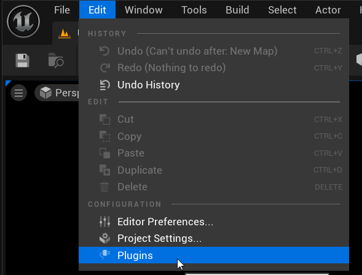
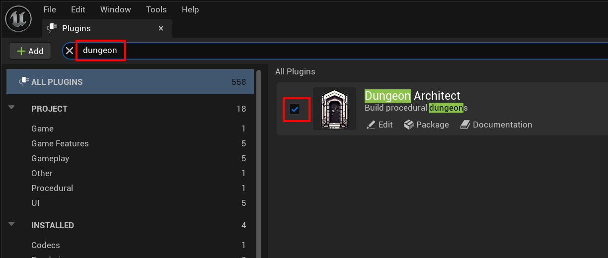

Navigate to `Edit > Plugins` from the main menu

Search for `dungeon`.    Make sure the plugin is enabled by enabling the checkbox 

> The editor needs to be restarted, if you've enabled a previously disabled plugin
