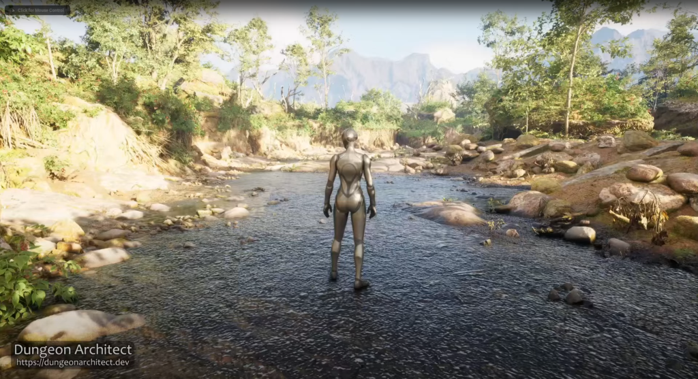

Dungeon Architect works seamlessly with the Unreal Engine's PCG framework.  In this section we explore the different ways in which we can 
combine PCG with the Dungeon Architect toolset

<iframe
    width="100%"
    height="540"
    src="https://www.youtube.com/embed/iplZmwlaSq0"
    frameBorder="0"
    allow="accelerometer; autoplay; clipboard-write; encrypted-media; gyroscope; picture-in-picture"
    allowFullScreen
/>

