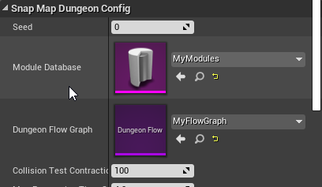
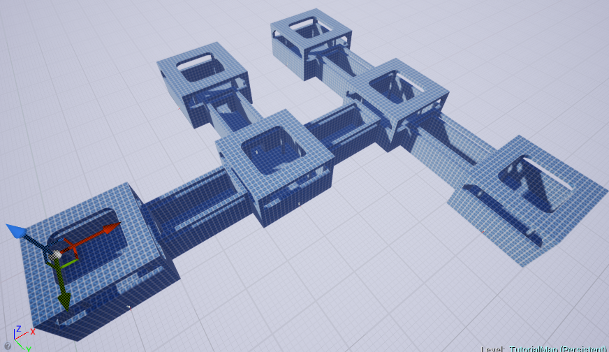
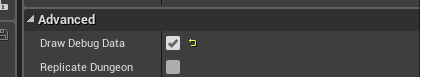
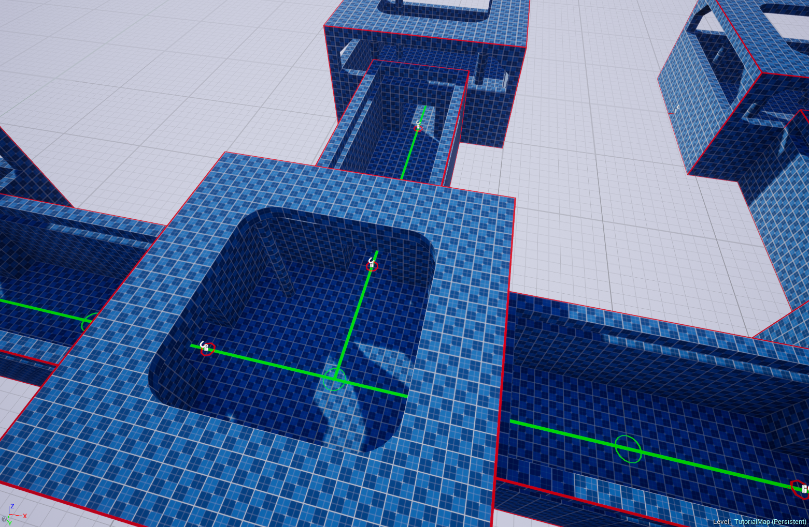

# Build the Dungeon

Assign the **`Module Database`** and **`Dungeon Flow Graph`** assets to the Dungeon Actor

Hit **`Build Dungeon`**.  Click `Randomize` and try other configurations.  Change the Dungeon Flow graph and experiment further

Enable Debug Draw for more visual info

