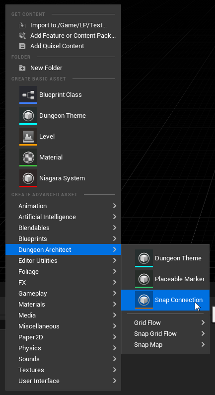
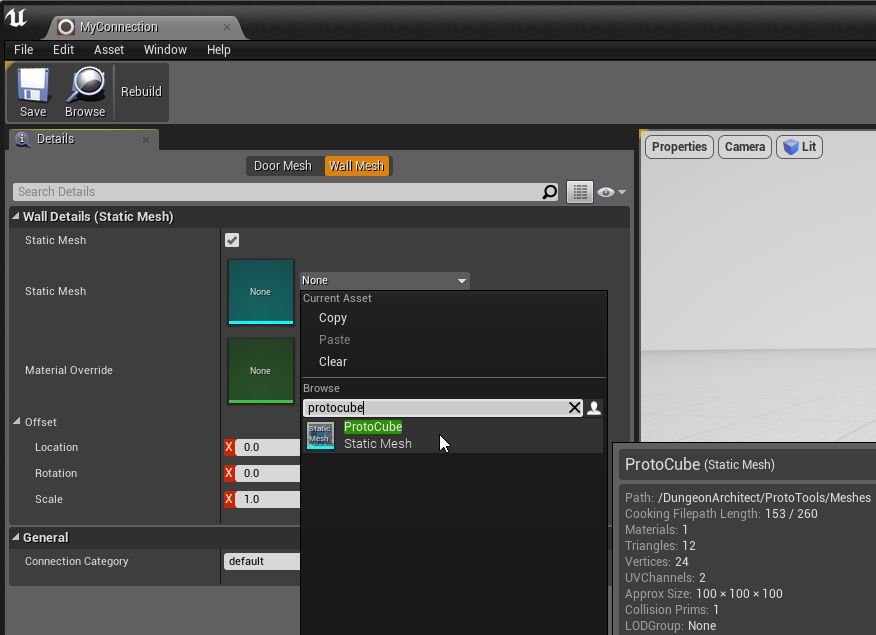
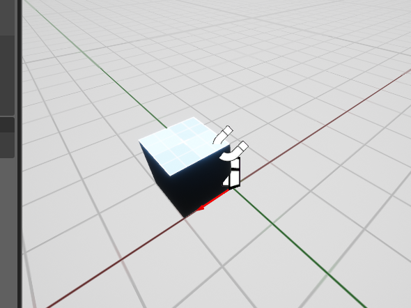
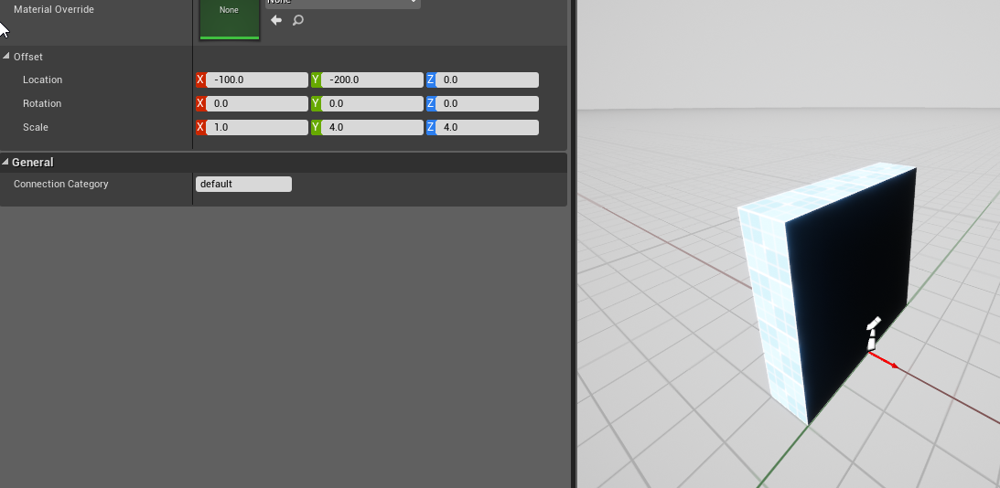
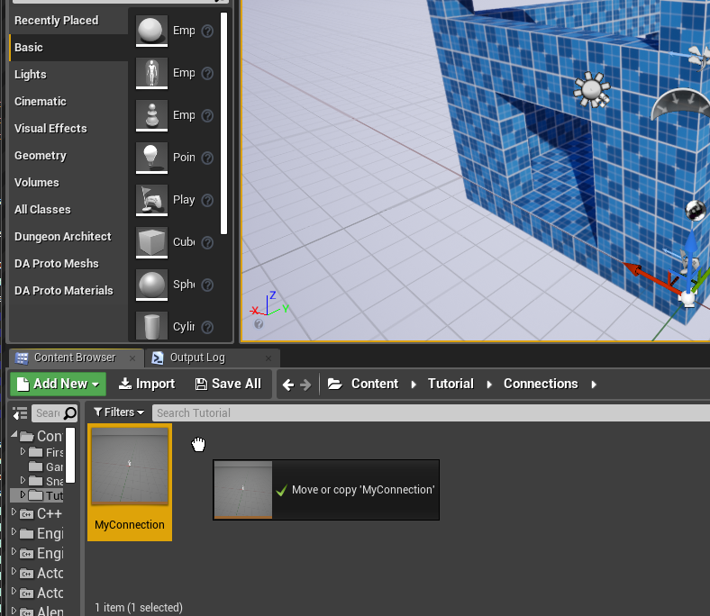
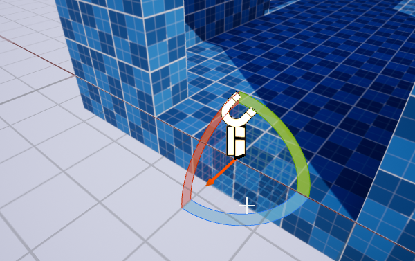
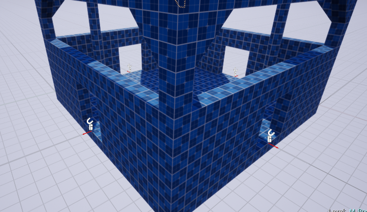

# Connections

A Snap Connection tells DA how to stitch the room modules together.  They are usually the Door Entry / Exits. 
First create a Connection asset and specify the art asset to use for doors and walls.

If DA stitches another module through that connection point, it would place the specified Door mesh (or blueprint).
Otherwise, it would fill up the gap with the specified Wall mesh (or blueprint)

Right click on the content browser and create a connection asset

Double click and open up the editor.  Here you specify the mesh or blueprint to use for the Door and Wall.

Your wall mesh thickness should be the same as the wall thickness you used while designing the module.  (we used a thickness of 100 in the above sample)

Specify the proto cube mesh for the walls

Adjust the size so it is 400x100x400. Always make sure the red arrow points outwards and the wall mesh is behind it (because that is how we are going to align our connection actor later on)

We can specify the door blueprint as well but we'll leave it empty in this example. When designing your door meshes, make sure the thickness is twice the thickness of the walls (since we account for the adjacent room as well and the thickness is aligned such that it is in the middle of the red arrow)

Close the connection editor window

Drag and drop the connection asset on the door opening

Make sure the alignment arrow is pointing outwards and is on the edge of the screen

> It's good practice to design with the snap settings in the editor enabled
{style="note"}

Repeat by drag-dropping on all the door openings.   Do this for all the other modules as well (like the corridor module)

