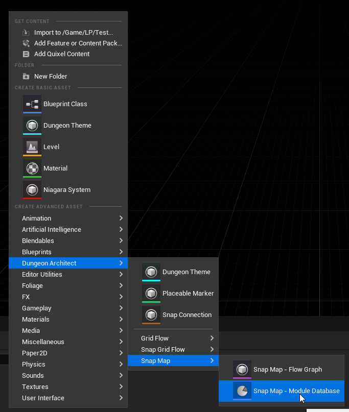
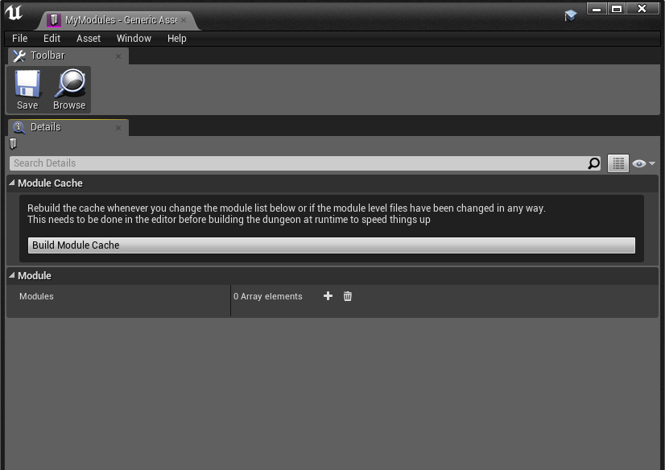

Create a new module database in the Content Browser

Double click to open it.  This is the editor for the module database. Here is where we'll register our module level files when we create them.

Close this editor window
